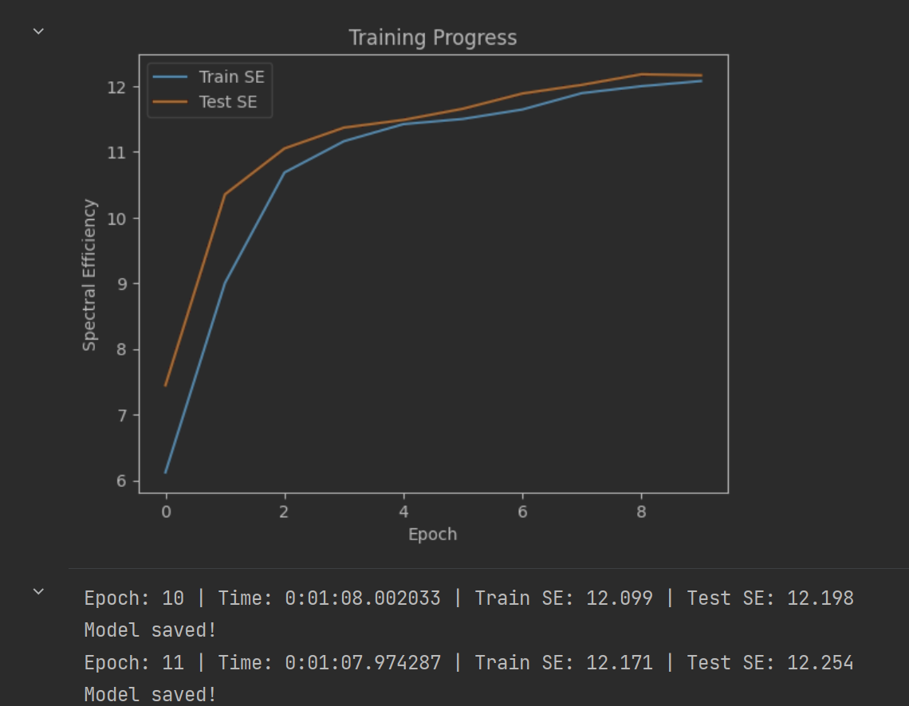
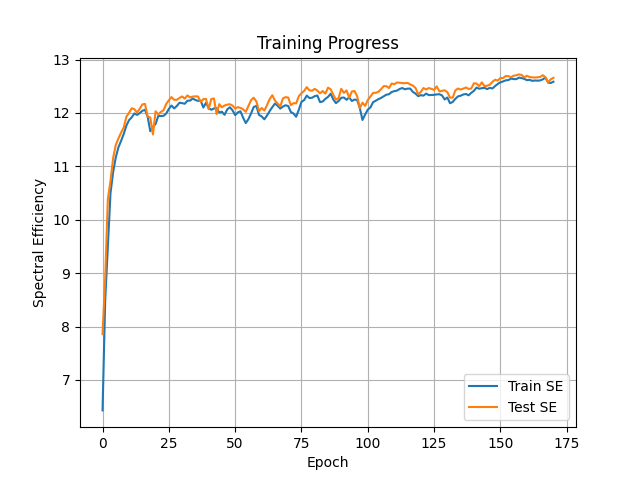
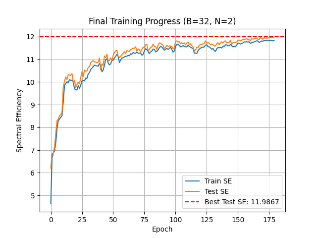
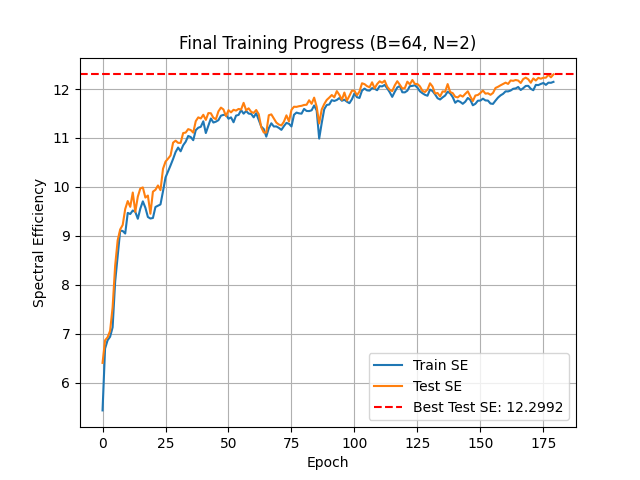

## transformer机制修改记录

### 1.init
使用`Transformer+门控.txt`源代码，运行到epoch=4时Test SE仍为7左右，隧停止。

### 2.添加层数

```python
class DNN_BS_hyb_OFDM(nn.Module):
    def __init__(self, parm_set):
        ...
        self.full_transformer = FullTransformerBlock(
            feature_dim=feature_dim,
            num_heads=4, //把8改为4
            dim_feedforward=feature_dim * 4, # FFN中间层维度, 4倍是常见设置
            num_layers=3, //把2改3
            dropout=0.1
        )
        ...
```
结果：增长显著


```txt
Epoch: 79 | Time: 0:01:11.022755 | Train SE: 12.330 | Test SE: 12.587
The best SE is: 12.625
[ 7.12676351  9.21159353 10.60757976 10.83850009 11.02139657 11.39121189
 11.24558992 11.64600976 11.84085808 11.6913511  11.93024266 12.09318976
 12.03001854 12.01770666 11.89779222 12.10945964 12.19317183 12.17649271
 12.30879583 12.3840904  12.25690188 12.37121866 12.50987923 12.29931056
 12.42041206 12.48363984 12.39395075 12.49491434 12.59197178 12.50903807
 12.62481983 12.19721041 12.3083281  12.38593335 12.38228328 12.25494523
 12.17666302 12.22143826 12.40815835 12.28949869 12.25235896 12.3956496
 12.00135331 12.27884142 12.25185857 12.06858654 12.14730747 12.42199655
 12.39706857 12.39481435 12.28836367 12.47801752 12.53127587 12.48453534
 12.36575978 12.31589029 12.19766934 12.12308714 12.3306102  12.39959886
 12.30120487 12.29308538 12.38722796 12.26678185 12.28242912 12.46262844
 12.30168097 12.30572309 12.21192923 12.37982867 12.48691869 12.38919773
 12.44047031 12.48105645 12.54932139 12.40820775 12.486466   12.51309612
 12.4417146  12.58695462]
```
### 3.增加输入特征维度

```python
class DNN_BS_hyb_OFDM(nn.Module):
    def __init__(self, parm_set):
        ...
        feature_dim = 32 # 原为2 * K * K
        self.repvgg_block = nn.Sequential(
            RepVGGBlock(in_channels=2 * K * K, out_channels=feature_dim, kernel_size=3, stride=1, padding=1),
            nn.BatchNorm2d(feature_dim),
            Mish()
        )
        self.conv = nn.Conv2d(
            in_channels=feature_dim, out_channels=feature_dim, kernel_size=(5, 1), stride=1, padding=(2, 0)
        )
        self.full_transformer = FullTransformerBlock(
            feature_dim=feature_dim,
            num_heads=4,
            dim_feedforward=feature_dim * 4,  # FFN中间层维度, 4倍是常见设置
            num_layers=3,
            dropout=0.1
        )
        ...
```

结果：比2略长




```txt
B=32
The best SE is: 12.723
[ 7.85759108  8.91090024 10.38732958 10.72739844 11.15870781 11.40113642
 11.52517364 11.63351409 11.7291034  11.93044424 12.00497868 12.08895264
 12.06976314 12.00775867 12.07796712 12.16014705 12.17010121 11.93238339
 11.91550248 11.59694242 12.03161559 11.97280431 12.02049732 12.05205693
 12.16887155 12.23740432 12.29869597 12.2462353  12.24684656 12.28160164
 12.30938249 12.2688818  12.32897727 12.29151649 12.30678318 12.31189919
 12.30816107 12.20721374 12.25854075 12.26406476 12.07133334 12.26193426
 12.27118707 11.97870295 12.16450381 12.1059381  12.13974214 12.15629952
 12.16370087 12.13875875 12.0820822  12.10871117 12.09512954 12.0673033
 12.02131073 12.13121285 12.24070115 12.28557947 12.21523497 12.0360745
 12.09299641 12.04547057 12.14544141 12.25844707 12.33306928 12.23293972
 12.17842197 12.12230496 12.27147434 12.29734375 12.28815544 12.14688222
 12.18435442 12.17989175 12.31456838 12.37008727 12.4135505  12.48427749
 12.42493804 12.41668351 12.45229497 12.41783519 12.36795785 12.41090698
 12.36276984 12.47440462 12.44369221 12.33837414 12.24885588 12.28190594
 12.45314255 12.37578917 12.42273419 12.28492095 12.4026746  12.41126671
 12.31185255 12.0925319  12.19236712 12.13298712 12.24269936 12.30785825
 12.37663786 12.37756302 12.39672916 12.44606559 12.50226586 12.50259933
 12.46649237 12.55146477 12.53952456 12.56975954 12.5674942  12.55858524
 12.55839944 12.56233594 12.53556569 12.51292632 12.46838758 12.34853504
 12.39567251 12.46689548 12.43996966 12.46722217 12.45176601 12.4309586
 12.49876995 12.40397551 12.415484   12.42560666 12.38917074 12.2877414
 12.28662233 12.42213686 12.45817182 12.43854265 12.45651286 12.47706747
 12.4502476  12.45702577 12.55576749 12.55107436 12.5029691  12.57297561
 12.50178547 12.51058574 12.5298902  12.5841224  12.62315466 12.6063642
 12.65568652 12.65378566 12.69212384 12.69043226 12.66950943 12.69747274
 12.70557425 12.72256866 12.71238246 12.66714456 12.69632874 12.67343392
 12.66646056 12.66520174 12.66785941 12.6753999  12.7070873  12.66756434
 12.57079716 12.63259408 12.65818658 12.67060785 12.66740601 12.67786152
 12.67345297 12.68082609 12.70142286 12.67879777 12.68224404 12.65003598]

B=64
The best SE is: 8.407
[7.29807136 7.73923364 7.9087443  8.01935232 8.05964386 8.10494772
 8.14821124 8.16756535 8.19458561 8.21196344 8.23088374 8.22697282
 8.24366646 8.25324199 8.26304488 8.26723177 8.27997456 8.27945454
 8.27837098 8.28925807 8.29754086 8.30488696 8.29404869 8.29774668
 8.26839089 8.29892728 8.31019874 8.30600743 8.3046504  8.32029443
 8.32436547 8.3238796  8.32514911 8.32894075 8.33463721 8.32515154
 8.32733746 8.32577891 8.33469117 8.33015103 8.33456659 8.33765063
 8.34114239 8.34338083 8.34776273 8.34040835 8.33738606 8.34561172
 8.35005531 8.3407974  8.3508615  8.35364192 8.35549908 8.35117159
 8.3578346  8.35711453 8.35788295 8.35588591 8.36011291 8.35833025
 8.36087384 8.36416783 8.36174128 8.35916719 8.36053827 8.36378098
 8.366048   8.36390047 8.36450925 8.3645179  8.37096837 8.36584566
 8.36013024 8.35619261 8.3627547  8.36389606 8.35807507 8.3671854
 8.37158959 8.37152674 8.3625839  8.36969113 8.36826808 8.36741095
 8.3683933  8.36335707 8.36436021 8.36544199 8.36554196 8.36790948
 8.37522833 8.35813692 8.36476147 8.35521224 8.36520956 8.36376047
 8.36491175 8.36404233 8.35768774 8.35537479 8.37519181 8.36972303
 8.37886019 8.37273252 8.38072748 8.38291304 8.38206472 8.38951676
 8.3815773  8.38748844 8.391524   8.38433168 8.38510916 8.39134817
 8.38526027 8.38853245 8.38966622 8.38745704 8.38992047 8.3876215
 8.38242698 8.38356926 8.38814194 8.38702564 8.38609915 8.38992295
 8.38520937 8.38560283 8.38414748 8.3905834  8.3890687  8.39169364
 8.38384063 8.37752509 8.37957857 8.38686135 8.38879921 8.38762331
 8.38351946 8.39089291 8.38476911 8.39047556 8.38997321 8.38821123
 8.39138861 8.39239404 8.39039912 8.3869545  8.39119484 8.38461161
 8.38784606 8.39346097 8.39192863 8.39925911 8.39807017 8.40217829
 8.40111892 8.40235453 8.4038857  8.40081336 8.40246582 8.40066037
 8.40086787 8.39591131 8.40082698 8.40010045 8.39992135 8.40425568
 8.40295134 8.40171497 8.40216217 8.40175838 8.40174356 8.39982557
 8.39866323 8.40160084 8.40691395 8.39976454 8.39873147 8.40084734]
```


4.融合TransformerB到门控中






```txt
B = 32
The best SE is: 11.987
[ 6.20545851  6.82857453  6.86577239  7.13029997  7.74807456  8.29505693
  8.37207661  8.51398902  8.56303043  8.66714835  9.77656465 10.03865697
 10.22226939 10.10949812 10.32130709 10.30699768 10.28854742 10.37438376
  9.97522323 10.06351936  9.75346503  9.88644347  9.99223549  9.91898711
 10.19581485 10.45236814 10.22902505 10.52828162 10.47197013 10.4924094
 10.64255319 10.66845458 10.84806302 10.90244544 10.94242902 10.8806335
 10.88399448 10.84698024 10.86951559 11.05794277 10.53714747 10.79768538
 10.73078837 11.14269741 11.07648392 11.21888726 10.90511854 10.95589218
 11.06531086 10.93539941 11.16419618 11.30388861 11.37318799 11.39971046
 11.13469579 11.07738473 11.13884389 11.21148937 11.26444159 11.33577778
 11.25374703 11.38734369 11.35341275 11.3514591  11.42712221 11.45464528
 11.4906137  11.48325539 11.55194237 11.36561735 11.46031995 11.42344651
 11.32170169 11.43504214 11.53892031 11.50271764 11.64266317 11.65125945
 11.37387891 11.43955243 11.52282999 11.54340165 11.67141352 11.56285105
 11.56482024 11.43338106 11.62096746 11.72172985 11.71392519 11.65262396
 11.62079742 11.47408905 11.532408   11.62250102 11.55749886 11.58461268
 11.58697422 11.5596976  11.46603117 11.50725589 11.78550274 11.81074247
 11.75743871 11.77737684 11.67691984 11.7309443  11.68268299 11.72026119
 11.63598232 11.71857708 11.76077507 11.64010019 11.68573873 11.60034149
 11.55259883 11.36530728 11.41987784 11.53437867 11.5234185  11.61887984
 11.65370321 11.65423937 11.68224292 11.70783353 11.81043026 11.70036011
 11.74038029 11.70355918 11.63611794 11.67024195 11.63521707 11.58612547
 11.58710334 11.68856628 11.734163   11.63385255 11.71100237 11.76925907
 11.72542677 11.77903395 11.81477885 11.71952949 11.73009934 11.74251122
 11.84480567 11.65722072 11.73077381 11.75432329 11.73655896 11.76864889
 11.84476709 11.84243605 11.809535   11.84137058 11.8714139  11.86993299
 11.89057589 11.91164932 11.85356767 11.86703682 11.82142467 11.91051872
 11.88931537 11.90768452 11.92526882 11.92799401 11.88193133 11.86845565
 11.96239295 11.92087305 11.88439062 11.96242094 11.914113   11.93996012
 11.93646827 11.94835389 11.95088103 11.96474128 11.95984461 11.98669603]


B = 64
The best SE is: 12.299
[ 6.40203902  6.86404096  6.92550576  7.05766176  7.54018445  8.3876188
  8.9079762   9.12981832  9.22126319  9.54775107  9.71023009  9.5919044
  9.88447559  9.48856268  9.79989192  9.96808093  9.98897245  9.78119035
  9.8228183   9.4512754   9.90264318  9.94027946 10.02901182  9.93273394
 10.36930959 10.51650543 10.57664399 10.6423486  10.90379071 10.94444425
 10.90020752 10.89928856 11.10062189 11.10976074 11.18070724 11.16198535
 11.10872438 11.34322877 11.42112684 11.39838977 11.47375834 11.36851203
 11.50869493 11.50480983 11.41210766 11.38357966 11.54339185 11.62045686
 11.58225565 11.4467427  11.5684032  11.52334445 11.57549527 11.5595001
 11.5933845  11.58050485 11.71781278 11.56593084 11.60595338 11.53310156
 11.51193001 11.57098475 11.48607497 11.21876867 11.11162176 11.11062081
 11.46417232 11.48220849 11.39720845 11.31386898 11.27377095 11.25612528
 11.33268123 11.4621824  11.33842163 11.57429318 11.63850689 11.6354979
 11.64925466 11.6569663  11.67466466 11.67902584 11.77039742 11.69798255
 11.82423847 11.63832867 11.29611726 11.5820024  11.69237542 11.77744026
 11.82489586 11.87738512 11.83174689 11.95765314 11.88155494 11.77857399
 11.92838111 11.76370647 11.86150525 11.96585605 11.96430597 11.87284801
 11.94994104 12.11801546 12.10009749 12.058903   12.03604081 12.13761339
 12.0142251  12.10154073 12.15810323 12.12862651 12.17157297 12.04794939
 11.98505816 11.95762539 12.07493923 12.16013844 12.08806708 12.0105633
 12.02031116 12.15030816 12.09566157 12.18500438 12.10386031 12.10315523
 12.05467684 11.96312535 11.94001801 11.98742409 12.1174206  12.05077748
 11.90932698 11.91878271 11.8490273  11.95125771 11.94463897 12.10134001
 11.93847299 11.9168324  11.84199228 11.82902908 11.87284911 11.84529004
 11.90208416 11.9532439  11.84930041 11.75412643 11.86770387 11.87857585
 11.91884558 11.96903758 11.90623894 11.9131871  11.88211148 11.91940513
 12.0221453  12.04616635 12.07640064 12.10299768 12.13083701 12.10432787
 12.17500658 12.16787398 12.18418941 12.17351146 12.123192   12.20401809
 12.23213151 12.19934502 12.12874813 12.21676388 12.17410657 12.22797475
 12.21137385 12.23107111 12.23214805 12.29154387 12.23952029 12.29923542]
```

5. 超参 维度48 层数4

```txt

Epoch: 0 | Time: 0:01:10.203466 | Train SE: 5.979 | Test SE: 7.075
New best model saved with Test SE: 7.0746
Epoch: 1 | Time: 0:01:10.131829 | Train SE: 7.930 | Test SE: 9.113
New best model saved with Test SE: 9.1128
Epoch: 2 | Time: 0:01:10.291572 | Train SE: 9.726 | Test SE: 10.342
New best model saved with Test SE: 10.3419
Epoch: 3 | Time: 0:01:09.421359 | Train SE: 10.646 | Test SE: 10.803
New best model saved with Test SE: 10.8030
Epoch: 4 | Time: 0:01:09.621685 | Train SE: 10.978 | Test SE: 11.331
New best model saved with Test SE: 11.3310
Epoch: 5 | Time: 0:01:09.798002 | Train SE: 11.278 | Test SE: 10.928
Epoch: 6 | Time: 0:01:10.285984 | Train SE: 11.496 | Test SE: 11.734
New best model saved with Test SE: 11.7344
Epoch: 7 | Time: 0:01:10.098878 | Train SE: 11.722 | Test SE: 11.833
New best model saved with Test SE: 11.8335
Epoch: 8 | Time: 0:01:08.725213 | Train SE: 11.855 | Test SE: 12.032
New best model saved with Test SE: 12.0318
Epoch: 9 | Time: 0:01:08.794342 | Train SE: 11.988 | Test SE: 12.061
New best model saved with Test SE: 12.0615
Epoch: 10 | Time: 0:01:09.146303 | Train SE: 12.097 | Test SE: 12.176

<Figure size 640x480 with 1 Axes>
New best model saved with Test SE: 12.1759
Epoch: 11 | Time: 0:01:11.049455 | Train SE: 12.082 | Test SE: 12.148
Epoch: 12 | Time: 0:01:09.765558 | Train SE: 12.036 | Test SE: 12.196
New best model saved with Test SE: 12.1962
Epoch: 13 | Time: 0:01:09.717739 | Train SE: 12.104 | Test SE: 12.228
New best model saved with Test SE: 12.2282
Epoch: 14 | Time: 0:01:09.997912 | Train SE: 12.188 | Test SE: 12.210
Epoch: 15 | Time: 0:01:11.264984 | Train SE: 12.201 | Test SE: 12.198
Epoch: 16 | Time: 0:01:10.343633 | Train SE: 12.204 | Test SE: 12.356
New best model saved with Test SE: 12.3560
Epoch: 17 | Time: 0:01:09.756171 | Train SE: 12.229 | Test SE: 12.367
New best model saved with Test SE: 12.3669
Epoch: 18 | Time: 0:01:09.967731 | Train SE: 12.132 | Test SE: 12.146
Epoch: 19 | Time: 0:01:09.690392 | Train SE: 12.115 | Test SE: 12.268
Epoch: 20 | Time: 0:01:09.618797 | Train SE: 12.250 | Test SE: 12.464

<Figure size 640x480 with 1 Axes>
New best model saved with Test SE: 12.4640
Epoch: 21 | Time: 0:01:09.988308 | Train SE: 12.397 | Test SE: 12.512
New best model saved with Test SE: 12.5121
Epoch: 22 | Time: 0:01:09.710116 | Train SE: 12.458 | Test SE: 12.522
New best model saved with Test SE: 12.5219
Epoch: 23 | Time: 0:01:09.619540 | Train SE: 12.337 | Test SE: 12.445
Epoch: 24 | Time: 0:01:09.869489 | Train SE: 12.450 | Test SE: 12.577
New best model saved with Test SE: 12.5768
Epoch: 25 | Time: 0:01:09.771648 | Train SE: 12.452 | Test SE: 12.465
Epoch: 26 | Time: 0:01:09.512908 | Train SE: 12.403 | Test SE: 12.480
Epoch: 27 | Time: 0:01:09.497893 | Train SE: 12.433 | Test SE: 12.440
Epoch: 28 | Time: 0:01:09.625291 | Train SE: 12.352 | Test SE: 12.412
Epoch: 29 | Time: 0:01:09.686929 | Train SE: 12.024 | Test SE: 11.776
Epoch: 30 | Time: 0:01:09.510013 | Train SE: 11.637 | Test SE: 11.832

<Figure size 640x480 with 1 Axes>
Epoch: 31 | Time: 0:01:09.963043 | Train SE: 11.926 | Test SE: 12.172
Epoch: 32 | Time: 0:01:09.686246 | Train SE: 12.128 | Test SE: 12.213
Epoch: 33 | Time: 0:01:09.651223 | Train SE: 12.035 | Test SE: 11.952
Epoch: 34 | Time: 0:01:09.545079 | Train SE: 11.960 | Test SE: 12.288
Epoch: 35 | Time: 0:01:09.719763 | Train SE: 12.110 | Test SE: 12.270
Epoch: 36 | Time: 0:01:09.625129 | Train SE: 12.105 | Test SE: 12.385
Epoch: 37 | Time: 0:01:09.845864 | Train SE: 12.173 | Test SE: 12.381
Epoch: 38 | Time: 0:01:09.789554 | Train SE: 12.109 | Test SE: 12.275
Epoch: 39 | Time: 0:01:09.685421 | Train SE: 12.188 | Test SE: 12.326
Epoch: 40 | Time: 0:01:09.568882 | Train SE: 12.210 | Test SE: 12.398

<Figure size 640x480 with 1 Axes>
Epoch: 41 | Time: 0:01:09.836954 | Train SE: 12.203 | Test SE: 12.443
Epoch: 42 | Time: 0:01:09.858359 | Train SE: 12.193 | Test SE: 12.355
Epoch: 43 | Time: 0:01:10.719807 | Train SE: 12.164 | Test SE: 12.320
Epoch: 44 | Time: 0:01:10.940109 | Train SE: 12.164 | Test SE: 12.380
Epoch: 45 | Time: 0:01:10.547123 | Train SE: 12.316 | Test SE: 12.560
Epoch: 46 | Time: 0:01:10.486876 | Train SE: 12.209 | Test SE: 12.233
Epoch: 47 | Time: 0:01:10.290883 | Train SE: 12.039 | Test SE: 12.274
Epoch: 48 | Time: 0:01:10.534297 | Train SE: 12.024 | Test SE: 12.120
Epoch: 49 | Time: 0:01:11.252729 | Train SE: 11.990 | Test SE: 12.090
Epoch: 50 | Time: 0:01:11.323867 | Train SE: 12.070 | Test SE: 12.398

<Figure size 640x480 with 1 Axes>
Epoch: 51 | Time: 0:01:10.718490 | Train SE: 12.184 | Test SE: 12.262
Epoch: 52 | Time: 0:01:10.553263 | Train SE: 12.261 | Test SE: 12.471
Epoch: 53 | Time: 0:01:09.859451 | Train SE: 12.334 | Test SE: 12.541
Epoch: 54 | Time: 0:01:09.671928 | Train SE: 12.317 | Test SE: 12.494
Epoch: 55 | Time: 0:01:09.928826 | Train SE: 12.370 | Test SE: 12.528
Epoch: 56 | Time: 0:01:09.933974 | Train SE: 12.378 | Test SE: 12.524
Epoch: 57 | Time: 0:01:09.860323 | Train SE: 12.310 | Test SE: 12.377
Epoch: 58 | Time: 0:01:09.735544 | Train SE: 12.203 | Test SE: 12.482
Epoch: 59 | Time: 0:01:09.979598 | Train SE: 12.333 | Test SE: 12.568
Epoch: 60 | Time: 0:01:09.748698 | Train SE: 12.410 | Test SE: 12.546

<Figure size 640x480 with 1 Axes>
Epoch: 61 | Time: 0:01:09.918937 | Train SE: 12.375 | Test SE: 12.593
New best model saved with Test SE: 12.5930
Epoch: 62 | Time: 0:01:10.349012 | Train SE: 12.393 | Test SE: 12.584
Epoch: 63 | Time: 0:01:10.004290 | Train SE: 12.492 | Test SE: 12.618
New best model saved with Test SE: 12.6180
Epoch: 64 | Time: 0:01:09.773706 | Train SE: 12.404 | Test SE: 12.633
New best model saved with Test SE: 12.6326
Epoch: 65 | Time: 0:01:09.827135 | Train SE: 12.411 | Test SE: 12.533
Epoch: 66 | Time: 0:01:10.049968 | Train SE: 12.438 | Test SE: 12.653
New best model saved with Test SE: 12.6527
Epoch: 67 | Time: 0:01:09.795760 | Train SE: 12.470 | Test SE: 12.588
Epoch: 68 | Time: 0:01:09.596522 | Train SE: 12.409 | Test SE: 12.597
Epoch: 69 | Time: 0:01:09.845787 | Train SE: 12.288 | Test SE: 12.489
Epoch: 70 | Time: 0:01:10.060836 | Train SE: 12.421 | Test SE: 12.628

<Figure size 640x480 with 1 Axes>
Epoch: 71 | Time: 0:01:10.728041 | Train SE: 12.533 | Test SE: 12.683
New best model saved with Test SE: 12.6829
Epoch: 72 | Time: 0:01:10.811715 | Train SE: 12.487 | Test SE: 12.640
Epoch: 73 | Time: 0:01:10.868495 | Train SE: 12.542 | Test SE: 12.697
New best model saved with Test SE: 12.6969
Epoch: 74 | Time: 0:01:10.864022 | Train SE: 12.494 | Test SE: 12.668
Epoch: 75 | Time: 0:01:10.291677 | Train SE: 12.570 | Test SE: 12.722
New best model saved with Test SE: 12.7222
Epoch: 76 | Time: 0:01:09.207572 | Train SE: 12.462 | Test SE: 12.610
Epoch: 77 | Time: 0:01:09.065308 | Train SE: 12.299 | Test SE: 12.582
Epoch: 78 | Time: 0:01:08.949666 | Train SE: 12.423 | Test SE: 12.501
Epoch: 79 | Time: 0:01:10.035810 | Train SE: 12.459 | Test SE: 12.407
Epoch: 80 | Time: 0:01:10.710619 | Train SE: 12.343 | Test SE: 12.505

<Figure size 640x480 with 1 Axes>
Epoch: 81 | Time: 0:01:10.455144 | Train SE: 12.487 | Test SE: 12.707
Epoch: 82 | Time: 0:01:10.095647 | Train SE: 12.521 | Test SE: 12.610
Epoch: 83 | Time: 0:01:09.888927 | Train SE: 12.374 | Test SE: 12.472
Epoch: 84 | Time: 0:01:09.809564 | Train SE: 12.490 | Test SE: 12.659
Epoch: 85 | Time: 0:01:09.663471 | Train SE: 12.608 | Test SE: 12.772
New best model saved with Test SE: 12.7722
Epoch: 86 | Time: 0:01:09.739853 | Train SE: 12.562 | Test SE: 12.557
Epoch: 87 | Time: 0:01:09.830320 | Train SE: 12.449 | Test SE: 12.655
Epoch: 88 | Time: 0:01:09.962990 | Train SE: 12.508 | Test SE: 12.188
Epoch: 89 | Time: 0:01:09.776901 | Train SE: 12.485 | Test SE: 12.727
Epoch: 90 | Time: 0:01:09.894214 | Train SE: 12.531 | Test SE: 12.635

<Figure size 640x480 with 1 Axes>
Epoch: 91 | Time: 0:01:10.005135 | Train SE: 12.561 | Test SE: 12.665
Epoch: 92 | Time: 0:01:09.665252 | Train SE: 12.490 | Test SE: 12.547
Epoch: 93 | Time: 0:01:09.727046 | Train SE: 12.461 | Test SE: 12.596
Epoch: 94 | Time: 0:01:09.709627 | Train SE: 12.498 | Test SE: 12.608
Epoch: 95 | Time: 0:01:09.767481 | Train SE: 12.582 | Test SE: 12.641
Epoch: 96 | Time: 0:01:09.701612 | Train SE: 12.538 | Test SE: 12.691
Epoch: 97 | Time: 0:01:09.834085 | Train SE: 12.603 | Test SE: 12.682
Epoch: 98 | Time: 0:01:09.825531 | Train SE: 12.581 | Test SE: 12.678
Epoch: 99 | Time: 0:01:09.799028 | Train SE: 12.469 | Test SE: 12.476
Epoch: 100 | Time: 0:01:10.316181 | Train SE: 12.570 | Test SE: 12.738

<Figure size 640x480 with 1 Axes>
Epoch: 101 | Time: 0:01:11.102431 | Train SE: 12.660 | Test SE: 12.693
Epoch: 102 | Time: 0:01:10.276469 | Train SE: 12.555 | Test SE: 12.628
Epoch: 103 | Time: 0:01:10.461101 | Train SE: 12.564 | Test SE: 12.640
Epoch: 104 | Time: 0:01:09.998707 | Train SE: 12.572 | Test SE: 12.647
Epoch: 105 | Time: 0:01:09.783226 | Train SE: 12.581 | Test SE: 12.687
Epoch: 106 | Time: 0:01:09.842836 | Train SE: 12.626 | Test SE: 12.689
Epoch: 107 | Time: 0:01:09.839909 | Train SE: 12.629 | Test SE: 12.701
Epoch: 108 | Time: 0:01:09.614329 | Train SE: 12.643 | Test SE: 12.722
Epoch: 109 | Time: 0:01:10.691558 | Train SE: 12.658 | Test SE: 12.722
Epoch: 110 | Time: 0:01:10.783447 | Train SE: 12.662 | Test SE: 12.736

<Figure size 640x480 with 1 Axes>
Epoch: 111 | Time: 0:01:09.897274 | Train SE: 12.675 | Test SE: 12.723
Epoch: 112 | Time: 0:01:09.697793 | Train SE: 12.707 | Test SE: 12.786
New best model saved with Test SE: 12.7859
Epoch: 113 | Time: 0:01:09.952941 | Train SE: 12.722 | Test SE: 12.717
Epoch: 114 | Time: 0:01:11.232505 | Train SE: 12.645 | Test SE: 12.676
Epoch: 115 | Time: 0:01:10.450090 | Train SE: 12.618 | Test SE: 12.659
Epoch: 116 | Time: 0:01:11.102191 | Train SE: 12.611 | Test SE: 12.666
Epoch: 117 | Time: 0:01:11.342217 | Train SE: 12.641 | Test SE: 12.726
Epoch: 118 | Time: 0:01:10.871995 | Train SE: 12.649 | Test SE: 12.709
Epoch: 119 | Time: 0:01:10.423225 | Train SE: 12.659 | Test SE: 12.705
Epoch: 120 | Time: 0:01:10.336976 | Train SE: 12.585 | Test SE: 12.535

<Figure size 640x480 with 1 Axes>
Epoch: 121 | Time: 0:01:11.109338 | Train SE: 12.534 | Test SE: 12.643
Epoch: 122 | Time: 0:01:08.723964 | Train SE: 12.539 | Test SE: 12.609
Epoch: 123 | Time: 0:01:08.621618 | Train SE: 12.557 | Test SE: 12.607
Epoch: 124 | Time: 0:01:08.487743 | Train SE: 12.532 | Test SE: 12.578
Epoch: 125 | Time: 0:01:08.518733 | Train SE: 12.476 | Test SE: 12.507
Epoch: 126 | Time: 0:01:08.635361 | Train SE: 12.464 | Test SE: 12.511
Epoch: 127 | Time: 0:01:09.394799 | Train SE: 12.448 | Test SE: 12.576
Epoch: 128 | Time: 0:01:08.684134 | Train SE: 12.417 | Test SE: 12.505
Epoch: 129 | Time: 0:01:08.840645 | Train SE: 12.439 | Test SE: 12.464
Epoch: 130 | Time: 0:01:08.758913 | Train SE: 12.461 | Test SE: 12.551

<Figure size 640x480 with 1 Axes>
Epoch: 131 | Time: 0:01:09.293917 | Train SE: 12.435 | Test SE: 12.512
Epoch: 132 | Time: 0:01:09.215380 | Train SE: 12.466 | Test SE: 12.584
Epoch: 133 | Time: 0:01:09.173595 | Train SE: 12.486 | Test SE: 12.518
Epoch: 134 | Time: 0:01:08.866244 | Train SE: 12.518 | Test SE: 12.647
Epoch: 135 | Time: 0:01:08.978197 | Train SE: 12.599 | Test SE: 12.678
Epoch: 136 | Time: 0:01:08.407718 | Train SE: 12.610 | Test SE: 12.647
Epoch: 137 | Time: 0:01:08.421980 | Train SE: 12.579 | Test SE: 12.615
Epoch: 138 | Time: 0:01:08.729072 | Train SE: 12.549 | Test SE: 12.611
Epoch: 139 | Time: 0:01:08.607742 | Train SE: 12.604 | Test SE: 12.705
Epoch: 140 | Time: 0:01:08.792792 | Train SE: 12.624 | Test SE: 12.687

<Figure size 640x480 with 1 Axes>
Epoch: 141 | Time: 0:01:08.855540 | Train SE: 12.576 | Test SE: 12.632
Epoch: 142 | Time: 0:01:09.683075 | Train SE: 12.591 | Test SE: 12.715
Epoch: 143 | Time: 0:01:09.483131 | Train SE: 12.606 | Test SE: 12.662
Epoch: 144 | Time: 0:01:08.469147 | Train SE: 12.609 | Test SE: 12.712
Epoch: 145 | Time: 0:01:08.911029 | Train SE: 12.624 | Test SE: 12.738
Epoch: 146 | Time: 0:01:08.591518 | Train SE: 12.686 | Test SE: 12.718
Epoch: 147 | Time: 0:01:08.411367 | Train SE: 12.610 | Test SE: 12.688
Epoch: 148 | Time: 0:01:08.740133 | Train SE: 12.605 | Test SE: 12.658
Epoch: 149 | Time: 0:01:08.585247 | Train SE: 12.616 | Test SE: 12.699
Epoch: 150 | Time: 0:01:08.313475 | Train SE: 12.729 | Test SE: 12.787

<Figure size 640x480 with 1 Axes>
New best model saved with Test SE: 12.7873
Epoch: 151 | Time: 0:01:08.652761 | Train SE: 12.761 | Test SE: 12.815
New best model saved with Test SE: 12.8150
Epoch: 152 | Time: 0:01:09.474264 | Train SE: 12.777 | Test SE: 12.802
Epoch: 153 | Time: 0:01:09.268568 | Train SE: 12.813 | Test SE: 12.824
New best model saved with Test SE: 12.8238
Epoch: 154 | Time: 0:01:09.836703 | Train SE: 12.807 | Test SE: 12.837
New best model saved with Test SE: 12.8372
Epoch: 155 | Time: 0:01:09.742977 | Train SE: 12.773 | Test SE: 12.809
Epoch: 156 | Time: 0:01:09.847134 | Train SE: 12.751 | Test SE: 12.773
Epoch: 157 | Time: 0:01:09.817328 | Train SE: 12.738 | Test SE: 12.794
Epoch: 158 | Time: 0:01:09.847021 | Train SE: 12.781 | Test SE: 12.855
New best model saved with Test SE: 12.8551
Epoch: 159 | Time: 0:01:10.276927 | Train SE: 12.812 | Test SE: 12.817
Epoch: 160 | Time: 0:01:12.473364 | Train SE: 12.809 | Test SE: 12.830

<Figure size 640x480 with 1 Axes>
Epoch: 161 | Time: 0:01:10.798813 | Train SE: 12.820 | Test SE: 12.866
New best model saved with Test SE: 12.8664
Epoch: 162 | Time: 0:01:09.780434 | Train SE: 12.823 | Test SE: 12.870
New best model saved with Test SE: 12.8696
Epoch: 163 | Time: 0:01:09.847835 | Train SE: 12.803 | Test SE: 12.811
Epoch: 164 | Time: 0:01:09.397007 | Train SE: 12.794 | Test SE: 12.824
Epoch: 165 | Time: 0:01:09.583898 | Train SE: 12.797 | Test SE: 12.782
Epoch: 166 | Time: 0:01:09.634564 | Train SE: 12.784 | Test SE: 12.803
Epoch: 167 | Time: 0:01:09.745036 | Train SE: 12.757 | Test SE: 12.793
Epoch: 168 | Time: 0:01:09.458996 | Train SE: 12.780 | Test SE: 12.824
Epoch: 169 | Time: 0:01:09.705639 | Train SE: 12.782 | Test SE: 12.784
Epoch: 170 | Time: 0:01:09.600298 | Train SE: 12.778 | Test SE: 12.830

<Figure size 640x480 with 1 Axes>
Epoch: 171 | Time: 0:01:10.205857 | Train SE: 12.794 | Test SE: 12.810
Epoch: 172 | Time: 0:01:10.033754 | Train SE: 12.833 | Test SE: 12.878
New best model saved with Test SE: 12.8783
Epoch: 173 | Time: 0:01:09.778782 | Train SE: 12.852 | Test SE: 12.880
New best model saved with Test SE: 12.8798
Epoch: 174 | Time: 0:01:09.596021 | Train SE: 12.857 | Test SE: 12.854
Epoch: 175 | Time: 0:01:09.476890 | Train SE: 12.778 | Test SE: 12.824
Epoch: 176 | Time: 0:01:09.692480 | Train SE: 12.842 | Test SE: 12.865
Epoch: 177 | Time: 0:01:09.692674 | Train SE: 12.865 | Test SE: 12.831
Epoch: 178 | Time: 0:01:09.357198 | Train SE: 12.853 | Test SE: 12.885
New best model saved with Test SE: 12.8846
Epoch: 179 | Time: 0:01:09.731378 | Train SE: 12.787 | Test SE: 12.831

<Figure size 640x480 with 1 Axes>
The best SE is: 12.885
[ 7.07458225  9.11282263 10.34190392 10.80295012 11.33099256 10.92759998
 11.73436959 11.83348334 12.03181419 12.06145163 12.17593932 12.14824247
 12.19623728 12.22820685 12.2103066  12.1980298  12.35595984 12.36685801
 12.14649441 12.26819174 12.4640245  12.51210656 12.52193451 12.44540892
 12.5768306  12.46547422 12.48024809 12.43964901 12.41163673 11.7762471
 11.83161395 12.17172694 12.21256003 11.95190117 12.28835952 12.26998107
 12.38506005 12.38143034 12.27510266 12.32607119 12.39830892 12.44322662
 12.35532563 12.3200644  12.38003476 12.560496   12.23255439 12.27380164
 12.12019382 12.09002411 12.39847844 12.26154673 12.47133851 12.5413727
 12.49429657 12.5283335  12.52350307 12.37699769 12.48164899 12.56824114
 12.54596977 12.59304154 12.58394134 12.61800871 12.6326071  12.53307147
 12.65274961 12.58803315 12.59658184 12.48932588 12.62839422 12.68288455
 12.63963408 12.69694955 12.66830623 12.72223864 12.60972495 12.58227756
 12.50086706 12.4068362  12.5045326  12.70720096 12.61036553 12.47158675
 12.6585885  12.77215722 12.55665116 12.65535111 12.18847291 12.72692947
 12.6352478  12.66474814 12.54709954 12.59556353 12.60839424 12.64135475
 12.69087191 12.6824506  12.67776539 12.47566409 12.73779294 12.69260411
 12.62763577 12.64030132 12.64713516 12.6867259  12.68904693 12.70085127
 12.72210631 12.72182772 12.73630235 12.72269783 12.78589604 12.7168561
 12.67555866 12.65945718 12.66608431 12.7258076  12.70861995 12.70474377
 12.53486805 12.64263649 12.60889623 12.60659595 12.57801332 12.50724008
 12.51132722 12.57568614 12.5048811  12.46435347 12.55055175 12.51172044
 12.58410313 12.51802611 12.64680953 12.6778631  12.6465966  12.61461408
 12.61074052 12.7052345  12.68735027 12.63222408 12.71506951 12.66160862
 12.71216381 12.73756428 12.71800432 12.68830097 12.6581012  12.6985081
 12.78727369 12.81501279 12.80199046 12.82382376 12.83717973 12.80879147
 12.77312689 12.79418216 12.85509627 12.81700761 12.83004811 12.86637061
 12.86962924 12.81129181 12.82412915 12.78242192 12.80278959 12.79274852
 12.82382793 12.78358307 12.83034952 12.81013622 12.8783426  12.87984707
 12.85409966 12.82400877 12.8654588  12.83130672 12.88458655 12.83066297]

```


6. 确认使用CBAM，种子1754215421

```txt
B = 32
Epoch: 0 | Time: 0:01:12.200752 | Train SE: 5.792 | Test SE: 6.695
New best model saved with Test SE: 6.6951
Epoch: 1 | Time: 0:01:12.342603 | Train SE: 6.928 | Test SE: 7.028
New best model saved with Test SE: 7.0281
Epoch: 2 | Time: 0:01:12.046882 | Train SE: 7.288 | Test SE: 7.498
New best model saved with Test SE: 7.4976
Epoch: 3 | Time: 0:01:11.973607 | Train SE: 7.560 | Test SE: 7.658
New best model saved with Test SE: 7.6576
Epoch: 4 | Time: 0:01:12.260778 | Train SE: 7.788 | Test SE: 8.054
New best model saved with Test SE: 8.0541
Epoch: 5 | Time: 0:01:12.172516 | Train SE: 9.387 | Test SE: 10.280
New best model saved with Test SE: 10.2797
Epoch: 6 | Time: 0:01:12.042245 | Train SE: 10.483 | Test SE: 10.754
New best model saved with Test SE: 10.7544
Epoch: 7 | Time: 0:01:12.247434 | Train SE: 10.756 | Test SE: 11.031
New best model saved with Test SE: 11.0315
Epoch: 8 | Time: 0:01:12.698383 | Train SE: 11.037 | Test SE: 10.892
Epoch: 9 | Time: 0:01:12.160604 | Train SE: 10.788 | Test SE: 10.627
Epoch: 10 | Time: 0:01:12.075172 | Train SE: 10.854 | Test SE: 10.977

<Figure size 640x480 with 1 Axes>
Epoch: 11 | Time: 0:01:12.717099 | Train SE: 11.008 | Test SE: 11.051
New best model saved with Test SE: 11.0506
Epoch: 12 | Time: 0:01:12.172609 | Train SE: 11.036 | Test SE: 11.332
New best model saved with Test SE: 11.3318
Epoch: 13 | Time: 0:01:12.045859 | Train SE: 11.156 | Test SE: 11.469
New best model saved with Test SE: 11.4691
Epoch: 14 | Time: 0:01:12.523411 | Train SE: 11.390 | Test SE: 11.381
Epoch: 15 | Time: 0:01:12.302045 | Train SE: 11.162 | Test SE: 11.495
New best model saved with Test SE: 11.4946
Epoch: 16 | Time: 0:01:12.134058 | Train SE: 11.419 | Test SE: 11.498
New best model saved with Test SE: 11.4976
Epoch: 17 | Time: 0:01:12.328945 | Train SE: 11.516 | Test SE: 11.666
New best model saved with Test SE: 11.6663
Epoch: 18 | Time: 0:01:12.310421 | Train SE: 11.521 | Test SE: 11.545
Epoch: 19 | Time: 0:01:12.084229 | Train SE: 11.351 | Test SE: 11.632
Epoch: 20 | Time: 0:01:12.085835 | Train SE: 11.622 | Test SE: 11.862

<Figure size 640x480 with 1 Axes>
New best model saved with Test SE: 11.8619
Epoch: 21 | Time: 0:01:12.897817 | Train SE: 11.621 | Test SE: 11.890
New best model saved with Test SE: 11.8899
Epoch: 22 | Time: 0:01:12.035260 | Train SE: 11.648 | Test SE: 11.751
Epoch: 23 | Time: 0:01:11.909458 | Train SE: 11.612 | Test SE: 11.753
Epoch: 24 | Time: 0:01:12.352772 | Train SE: 11.557 | Test SE: 11.710
Epoch: 25 | Time: 0:01:12.164082 | Train SE: 11.715 | Test SE: 11.931
New best model saved with Test SE: 11.9314
Epoch: 26 | Time: 0:01:12.063673 | Train SE: 11.848 | Test SE: 12.054
New best model saved with Test SE: 12.0536
Epoch: 27 | Time: 0:01:12.198396 | Train SE: 11.951 | Test SE: 11.917
Epoch: 28 | Time: 0:01:12.215166 | Train SE: 11.765 | Test SE: 11.875
Epoch: 29 | Time: 0:01:12.018521 | Train SE: 11.739 | Test SE: 11.759
Epoch: 30 | Time: 0:01:11.999881 | Train SE: 11.686 | Test SE: 11.855

<Figure size 640x480 with 1 Axes>
Epoch: 31 | Time: 0:01:12.565750 | Train SE: 11.742 | Test SE: 11.888
Epoch: 32 | Time: 0:01:12.025150 | Train SE: 11.742 | Test SE: 11.833
Epoch: 33 | Time: 0:01:12.070147 | Train SE: 11.823 | Test SE: 12.049
Epoch: 34 | Time: 0:01:12.382445 | Train SE: 11.958 | Test SE: 11.857
Epoch: 35 | Time: 0:01:12.061657 | Train SE: 11.873 | Test SE: 11.987
Epoch: 36 | Time: 0:01:11.973018 | Train SE: 11.843 | Test SE: 11.915
Epoch: 37 | Time: 0:01:12.152860 | Train SE: 11.689 | Test SE: 11.933
Epoch: 38 | Time: 0:01:12.198870 | Train SE: 11.844 | Test SE: 11.991
Epoch: 39 | Time: 0:01:12.039394 | Train SE: 11.646 | Test SE: 11.919
Epoch: 40 | Time: 0:01:11.911107 | Train SE: 11.760 | Test SE: 11.905

<Figure size 640x480 with 1 Axes>
Epoch: 41 | Time: 0:01:12.491104 | Train SE: 11.531 | Test SE: 11.925
Epoch: 42 | Time: 0:01:12.007381 | Train SE: 11.701 | Test SE: 12.002
Epoch: 43 | Time: 0:01:11.908063 | Train SE: 11.803 | Test SE: 12.011
Epoch: 44 | Time: 0:01:12.218730 | Train SE: 11.719 | Test SE: 11.784
Epoch: 45 | Time: 0:01:12.079564 | Train SE: 11.744 | Test SE: 11.862
Epoch: 46 | Time: 0:01:12.239549 | Train SE: 11.859 | Test SE: 12.135
New best model saved with Test SE: 12.1355
Epoch: 47 | Time: 0:01:12.139855 | Train SE: 12.035 | Test SE: 12.173
New best model saved with Test SE: 12.1726
Epoch: 48 | Time: 0:01:12.257154 | Train SE: 12.095 | Test SE: 12.218
New best model saved with Test SE: 12.2184
Epoch: 49 | Time: 0:01:12.042242 | Train SE: 12.044 | Test SE: 12.170
Epoch: 50 | Time: 0:01:12.074606 | Train SE: 12.087 | Test SE: 12.238

<Figure size 640x480 with 1 Axes>
New best model saved with Test SE: 12.2380
Epoch: 51 | Time: 0:01:12.545863 | Train SE: 12.075 | Test SE: 12.142
Epoch: 52 | Time: 0:01:12.046003 | Train SE: 11.963 | Test SE: 12.185
Epoch: 53 | Time: 0:01:11.983656 | Train SE: 12.068 | Test SE: 12.224
Epoch: 54 | Time: 0:01:12.336561 | Train SE: 11.872 | Test SE: 12.012
Epoch: 55 | Time: 0:01:12.142644 | Train SE: 11.786 | Test SE: 11.980
Epoch: 56 | Time: 0:01:12.003674 | Train SE: 11.899 | Test SE: 12.256
New best model saved with Test SE: 12.2557
Epoch: 57 | Time: 0:01:12.254103 | Train SE: 12.039 | Test SE: 12.101
Epoch: 58 | Time: 0:01:12.337181 | Train SE: 11.986 | Test SE: 12.228
Epoch: 59 | Time: 0:01:11.878829 | Train SE: 12.048 | Test SE: 12.289
New best model saved with Test SE: 12.2887
Epoch: 60 | Time: 0:01:11.956225 | Train SE: 12.168 | Test SE: 12.352

<Figure size 640x480 with 1 Axes>
New best model saved with Test SE: 12.3518
Epoch: 61 | Time: 0:01:12.483590 | Train SE: 12.157 | Test SE: 12.306
Epoch: 62 | Time: 0:01:11.980499 | Train SE: 12.221 | Test SE: 12.028
Epoch: 63 | Time: 0:01:11.928439 | Train SE: 12.035 | Test SE: 12.162
Epoch: 64 | Time: 0:01:12.318763 | Train SE: 12.113 | Test SE: 12.191
Epoch: 65 | Time: 0:01:11.966622 | Train SE: 12.115 | Test SE: 12.325
Epoch: 66 | Time: 0:01:11.874486 | Train SE: 12.111 | Test SE: 12.315
Epoch: 67 | Time: 0:01:12.149791 | Train SE: 12.166 | Test SE: 12.273
Epoch: 68 | Time: 0:01:12.158350 | Train SE: 12.199 | Test SE: 12.285
Epoch: 69 | Time: 0:01:11.977046 | Train SE: 12.086 | Test SE: 12.264
Epoch: 70 | Time: 0:01:12.107567 | Train SE: 12.017 | Test SE: 11.990

<Figure size 640x480 with 1 Axes>
Epoch: 71 | Time: 0:01:12.728459 | Train SE: 11.992 | Test SE: 12.282
Epoch: 72 | Time: 0:01:11.996327 | Train SE: 12.102 | Test SE: 12.151
Epoch: 73 | Time: 0:01:11.974271 | Train SE: 11.977 | Test SE: 11.911
Epoch: 74 | Time: 0:01:12.354996 | Train SE: 11.824 | Test SE: 11.948
Epoch: 75 | Time: 0:01:12.100068 | Train SE: 11.933 | Test SE: 12.176
Epoch: 76 | Time: 0:01:11.940133 | Train SE: 11.969 | Test SE: 12.084
Epoch: 77 | Time: 0:01:12.246696 | Train SE: 12.006 | Test SE: 12.250
Epoch: 78 | Time: 0:01:12.175472 | Train SE: 12.031 | Test SE: 12.221
Epoch: 79 | Time: 0:01:12.049803 | Train SE: 12.033 | Test SE: 12.104
Epoch: 80 | Time: 0:01:12.103837 | Train SE: 12.019 | Test SE: 12.215

<Figure size 640x480 with 1 Axes>
Epoch: 81 | Time: 0:01:12.519550 | Train SE: 12.071 | Test SE: 12.194
Epoch: 82 | Time: 0:01:12.064395 | Train SE: 12.081 | Test SE: 12.258
Epoch: 83 | Time: 0:01:12.130412 | Train SE: 12.031 | Test SE: 12.010
Epoch: 84 | Time: 0:01:12.365631 | Train SE: 11.914 | Test SE: 11.925
Epoch: 85 | Time: 0:01:12.135779 | Train SE: 11.845 | Test SE: 12.054
Epoch: 86 | Time: 0:01:11.969158 | Train SE: 11.928 | Test SE: 12.090
Epoch: 87 | Time: 0:01:12.231815 | Train SE: 11.937 | Test SE: 12.102
Epoch: 88 | Time: 0:01:12.160114 | Train SE: 11.940 | Test SE: 11.997
Epoch: 89 | Time: 0:01:11.996162 | Train SE: 11.806 | Test SE: 11.927
Epoch: 90 | Time: 0:01:11.937715 | Train SE: 11.767 | Test SE: 12.058

<Figure size 640x480 with 1 Axes>
Epoch: 91 | Time: 0:01:12.406490 | Train SE: 11.911 | Test SE: 12.194
Epoch: 92 | Time: 0:01:11.860949 | Train SE: 11.977 | Test SE: 12.086
Epoch: 93 | Time: 0:01:11.815618 | Train SE: 11.988 | Test SE: 12.056
Epoch: 94 | Time: 0:01:12.178904 | Train SE: 12.025 | Test SE: 12.151
Epoch: 95 | Time: 0:01:12.023296 | Train SE: 11.956 | Test SE: 12.122
Epoch: 96 | Time: 0:01:12.267677 | Train SE: 11.961 | Test SE: 12.166
Epoch: 97 | Time: 0:01:12.241417 | Train SE: 11.970 | Test SE: 12.182
Epoch: 98 | Time: 0:01:12.146111 | Train SE: 12.082 | Test SE: 12.206
Epoch: 99 | Time: 0:01:12.009164 | Train SE: 12.044 | Test SE: 12.167
Epoch: 100 | Time: 0:01:12.149575 | Train SE: 12.102 | Test SE: 12.203

<Figure size 640x480 with 1 Axes>
Epoch: 101 | Time: 0:01:12.560744 | Train SE: 12.091 | Test SE: 12.154
Epoch: 102 | Time: 0:01:12.025805 | Train SE: 11.980 | Test SE: 12.063
Epoch: 103 | Time: 0:01:11.967332 | Train SE: 12.078 | Test SE: 12.206
Epoch: 104 | Time: 0:01:12.430366 | Train SE: 12.076 | Test SE: 12.040
Epoch: 105 | Time: 0:01:12.144719 | Train SE: 11.989 | Test SE: 12.102
Epoch: 106 | Time: 0:01:11.995977 | Train SE: 11.894 | Test SE: 12.068
Epoch: 107 | Time: 0:01:12.246908 | Train SE: 11.963 | Test SE: 12.030
Epoch: 108 | Time: 0:01:12.231402 | Train SE: 12.034 | Test SE: 12.155
Epoch: 109 | Time: 0:01:12.274061 | Train SE: 12.072 | Test SE: 12.191
Epoch: 110 | Time: 0:01:12.111779 | Train SE: 12.007 | Test SE: 12.128

<Figure size 640x480 with 1 Axes>
Epoch: 111 | Time: 0:01:12.373429 | Train SE: 12.046 | Test SE: 12.165
Epoch: 112 | Time: 0:01:11.973828 | Train SE: 12.062 | Test SE: 12.235
Epoch: 113 | Time: 0:01:11.899811 | Train SE: 12.092 | Test SE: 12.218
Epoch: 114 | Time: 0:01:12.368294 | Train SE: 12.066 | Test SE: 12.191
Epoch: 115 | Time: 0:01:12.012688 | Train SE: 12.059 | Test SE: 12.178
Epoch: 116 | Time: 0:01:11.915558 | Train SE: 12.047 | Test SE: 12.284
Epoch: 117 | Time: 0:01:12.219921 | Train SE: 12.173 | Test SE: 12.274
Epoch: 118 | Time: 0:01:12.073942 | Train SE: 12.169 | Test SE: 12.185
Epoch: 119 | Time: 0:01:12.043599 | Train SE: 12.070 | Test SE: 12.092
Epoch: 120 | Time: 0:01:12.128682 | Train SE: 12.056 | Test SE: 12.261

<Figure size 640x480 with 1 Axes>
Epoch: 121 | Time: 0:01:12.623775 | Train SE: 12.132 | Test SE: 12.250
Epoch: 122 | Time: 0:01:12.212305 | Train SE: 12.084 | Test SE: 12.251
Epoch: 123 | Time: 0:01:12.010653 | Train SE: 12.143 | Test SE: 12.254
Epoch: 124 | Time: 0:01:12.466029 | Train SE: 12.113 | Test SE: 12.254
Epoch: 125 | Time: 0:01:12.168777 | Train SE: 12.129 | Test SE: 12.194
Epoch: 126 | Time: 0:01:12.024245 | Train SE: 12.109 | Test SE: 12.181
Epoch: 127 | Time: 0:01:12.337180 | Train SE: 12.106 | Test SE: 12.259
Epoch: 128 | Time: 0:01:12.346538 | Train SE: 12.132 | Test SE: 12.151
Epoch: 129 | Time: 0:01:12.113773 | Train SE: 12.000 | Test SE: 12.108
Epoch: 130 | Time: 0:01:12.210517 | Train SE: 12.031 | Test SE: 12.135

<Figure size 640x480 with 1 Axes>
Epoch: 131 | Time: 0:01:12.536288 | Train SE: 11.993 | Test SE: 12.094
Epoch: 132 | Time: 0:01:12.130549 | Train SE: 12.023 | Test SE: 12.057
Epoch: 133 | Time: 0:01:12.083112 | Train SE: 12.057 | Test SE: 12.235
Epoch: 134 | Time: 0:01:12.736356 | Train SE: 12.066 | Test SE: 12.199
Epoch: 135 | Time: 0:01:12.005419 | Train SE: 12.106 | Test SE: 12.306
Epoch: 136 | Time: 0:01:11.831486 | Train SE: 12.162 | Test SE: 12.264
Epoch: 137 | Time: 0:01:12.243417 | Train SE: 12.173 | Test SE: 12.331
Epoch: 138 | Time: 0:01:12.212600 | Train SE: 12.195 | Test SE: 12.223
Epoch: 139 | Time: 0:01:12.018015 | Train SE: 12.159 | Test SE: 12.269
Epoch: 140 | Time: 0:01:12.027353 | Train SE: 12.152 | Test SE: 12.249

<Figure size 640x480 with 1 Axes>
Epoch: 141 | Time: 0:01:12.373801 | Train SE: 12.160 | Test SE: 12.315
Epoch: 142 | Time: 0:01:11.985368 | Train SE: 12.201 | Test SE: 12.293
Epoch: 143 | Time: 0:01:12.044468 | Train SE: 12.214 | Test SE: 12.278
Epoch: 144 | Time: 0:01:12.393395 | Train SE: 12.183 | Test SE: 12.282
Epoch: 145 | Time: 0:01:12.122148 | Train SE: 12.183 | Test SE: 12.192
Epoch: 146 | Time: 0:01:12.185664 | Train SE: 12.162 | Test SE: 12.328
Epoch: 147 | Time: 0:01:12.439416 | Train SE: 12.248 | Test SE: 12.344
Epoch: 148 | Time: 0:01:12.224305 | Train SE: 12.159 | Test SE: 12.288
Epoch: 149 | Time: 0:01:12.037055 | Train SE: 12.202 | Test SE: 12.361
New best model saved with Test SE: 12.3607
Epoch: 150 | Time: 0:01:12.286330 | Train SE: 12.265 | Test SE: 12.398

<Figure size 640x480 with 1 Axes>
New best model saved with Test SE: 12.3980
Epoch: 151 | Time: 0:01:12.574047 | Train SE: 12.318 | Test SE: 12.405
New best model saved with Test SE: 12.4054
Epoch: 152 | Time: 0:01:12.099189 | Train SE: 12.322 | Test SE: 12.419
New best model saved with Test SE: 12.4188
Epoch: 153 | Time: 0:01:12.146702 | Train SE: 12.294 | Test SE: 12.386
Epoch: 154 | Time: 0:01:12.369823 | Train SE: 12.261 | Test SE: 12.375
Epoch: 155 | Time: 0:01:12.091178 | Train SE: 12.306 | Test SE: 12.399
Epoch: 156 | Time: 0:01:11.945244 | Train SE: 12.342 | Test SE: 12.431
New best model saved with Test SE: 12.4311
Epoch: 157 | Time: 0:01:12.304472 | Train SE: 12.312 | Test SE: 12.396
Epoch: 158 | Time: 0:01:12.020973 | Train SE: 12.303 | Test SE: 12.358
Epoch: 159 | Time: 0:01:12.422208 | Train SE: 12.308 | Test SE: 12.412
Epoch: 160 | Time: 0:01:12.242231 | Train SE: 12.319 | Test SE: 12.417

<Figure size 640x480 with 1 Axes>
Epoch: 161 | Time: 0:01:12.481233 | Train SE: 12.340 | Test SE: 12.388
Epoch: 162 | Time: 0:01:12.197796 | Train SE: 12.330 | Test SE: 12.437
New best model saved with Test SE: 12.4368
Epoch: 163 | Time: 0:01:12.343476 | Train SE: 12.318 | Test SE: 12.409
Epoch: 164 | Time: 0:01:12.555155 | Train SE: 12.324 | Test SE: 12.392
Epoch: 165 | Time: 0:01:11.986251 | Train SE: 12.330 | Test SE: 12.420
Epoch: 166 | Time: 0:01:11.981392 | Train SE: 12.303 | Test SE: 12.413
Epoch: 167 | Time: 0:01:12.393477 | Train SE: 12.333 | Test SE: 12.440
New best model saved with Test SE: 12.4397
Epoch: 168 | Time: 0:01:12.239030 | Train SE: 12.354 | Test SE: 12.472
New best model saved with Test SE: 12.4725
Epoch: 169 | Time: 0:01:12.039791 | Train SE: 12.359 | Test SE: 12.454
Epoch: 170 | Time: 0:01:12.322533 | Train SE: 12.380 | Test SE: 12.465

<Figure size 640x480 with 1 Axes>
Epoch: 171 | Time: 0:01:12.778505 | Train SE: 12.346 | Test SE: 12.456
Epoch: 172 | Time: 0:01:12.059567 | Train SE: 12.397 | Test SE: 12.485
New best model saved with Test SE: 12.4848
Epoch: 173 | Time: 0:01:12.063768 | Train SE: 12.366 | Test SE: 12.439
Epoch: 174 | Time: 0:01:12.296448 | Train SE: 12.407 | Test SE: 12.491
New best model saved with Test SE: 12.4906
Epoch: 175 | Time: 0:01:12.017346 | Train SE: 12.384 | Test SE: 12.457
Epoch: 176 | Time: 0:01:11.934149 | Train SE: 12.351 | Test SE: 12.449
Epoch: 177 | Time: 0:01:12.247349 | Train SE: 12.359 | Test SE: 12.459
Epoch: 178 | Time: 0:01:12.154666 | Train SE: 12.384 | Test SE: 12.468
Epoch: 179 | Time: 0:01:12.093679 | Train SE: 12.361 | Test SE: 12.486

<Figure size 640x480 with 1 Axes>
The best SE is: 12.491
[ 6.69514121  7.02807548  7.49757881  7.65757018  8.0540521  10.27969525
 10.75439579 11.03147562 10.89241679 10.62732699 10.9766444  11.05061579
 11.33176386 11.46908162 11.38077843 11.49463487 11.49758635 11.66626177
 11.54465847 11.6323797  11.86187682 11.88992877 11.75065508 11.75307553
 11.70964127 11.93139882 12.05362015 11.91735709 11.87451613 11.75856836
 11.85490773 11.8880991  11.83265996 12.04944158 11.85749402 11.98723488
 11.91519318 11.93273029 11.99105399 11.91900573 11.90479157 11.92542832
 12.00162942 12.01061525 11.78364589 11.86232624 12.13546882 12.17255602
 12.21839473 12.170157   12.23804362 12.14212554 12.1854815  12.22388732
 12.0118073  11.98013277 12.25566154 12.10141027 12.22779889 12.28872521
 12.35176616 12.30551343 12.02849019 12.16173058 12.19091096 12.3251271
 12.31462278 12.27280481 12.28506908 12.26424813 11.99046924 12.28180869
 12.15106151 11.91068003 11.94764726 12.17635946 12.08355856 12.25013905
 12.22106645 12.10405574 12.21501815 12.19409316 12.25830133 12.00992937
 11.92483218 12.05353975 12.08965669 12.10245883 11.99714727 11.92740648
 12.05832362 12.19394925 12.08606761 12.05586503 12.15139687 12.12238476
 12.16586003 12.18165674 12.20620294 12.16651876 12.20302525 12.15367851
 12.06333637 12.20550513 12.03963337 12.10183887 12.06846457 12.03030331
 12.15457368 12.19088829 12.12841985 12.16483517 12.23478479 12.21750178
 12.19088302 12.1782202  12.28439395 12.27411776 12.18517177 12.09170501
 12.26131473 12.24987226 12.25073419 12.25386989 12.25397341 12.19438994
 12.18149011 12.25859809 12.15125976 12.10806565 12.13476167 12.09402003
 12.05659127 12.23483245 12.19946556 12.30567613 12.26412058 12.33053408
 12.22305887 12.26948152 12.24891768 12.31463063 12.29316101 12.27837603
 12.28180749 12.19193983 12.32792497 12.34441848 12.2876899  12.36074026
 12.3979609  12.40539422 12.4188175  12.38590589 12.37488828 12.39885426
 12.43107839 12.39566336 12.35790741 12.4116569  12.41655107 12.38788128
 12.43682213 12.40929468 12.39185975 12.41957531 12.41301634 12.43966386
 12.47248888 12.45394781 12.46483798 12.45620782 12.48476236 12.43909359
 12.49059696 12.45662963 12.4490891  12.45924125 12.46791189 12.48635516]
```

```txt
[TempCheck] GPU:54°C
Epoch: 0 | Time: 0:01:13.150955 | Train SE: 6.039 | Test SE: 7.416
New best model saved with Test SE: 7.4157
[TempCheck] GPU:75°C
Epoch: 1 | Time: 0:01:10.906033 | Train SE: 9.303 | Test SE: 10.391
New best model saved with Test SE: 10.3911
[TempCheck] GPU:75°C
Epoch: 2 | Time: 0:01:11.461286 | Train SE: 10.762 | Test SE: 11.146
New best model saved with Test SE: 11.1462
[TempCheck] GPU:79°C
Epoch: 3 | Time: 0:01:11.385196 | Train SE: 11.149 | Test SE: 11.404
New best model saved with Test SE: 11.4039
[TempCheck] GPU:79°C
Epoch: 4 | Time: 0:01:11.428080 | Train SE: 11.390 | Test SE: 11.637
New best model saved with Test SE: 11.6366
[TempCheck] GPU:81°C
[TempCheck] GPU 过热，暂停 60 秒冷却
Epoch: 5 | Time: 0:02:11.238195 | Train SE: 11.640 | Test SE: 11.774
New best model saved with Test SE: 11.7740
[TempCheck] GPU:78°C
Epoch: 6 | Time: 0:01:11.227693 | Train SE: 11.757 | Test SE: 11.918
New best model saved with Test SE: 11.9180
[TempCheck] GPU:80°C
Epoch: 7 | Time: 0:01:12.155271 | Train SE: 11.778 | Test SE: 11.951
New best model saved with Test SE: 11.9509
[TempCheck] GPU:81°C
[TempCheck] GPU 过热，暂停 60 秒冷却
Epoch: 8 | Time: 0:02:11.431460 | Train SE: 11.946 | Test SE: 12.045
New best model saved with Test SE: 12.0445
[TempCheck] GPU:79°C
Epoch: 9 | Time: 0:01:11.346845 | Train SE: 12.001 | Test SE: 12.132
New best model saved with Test SE: 12.1324
[TempCheck] GPU:80°C
Epoch: 10 | Time: 0:01:13.224511 | Train SE: 11.982 | Test SE: 12.126

<Figure size 640x480 with 1 Axes>
[TempCheck] GPU:78°C
Epoch: 11 | Time: 0:01:12.440672 | Train SE: 12.096 | Test SE: 12.277
New best model saved with Test SE: 12.2765
[TempCheck] GPU:82°C
[TempCheck] GPU 过热，暂停 60 秒冷却
Epoch: 12 | Time: 0:02:11.351223 | Train SE: 12.179 | Test SE: 12.359
New best model saved with Test SE: 12.3592
[TempCheck] GPU:78°C
Epoch: 13 | Time: 0:01:12.396507 | Train SE: 12.283 | Test SE: 12.391
New best model saved with Test SE: 12.3914
[TempCheck] GPU:81°C
[TempCheck] GPU 过热，暂停 60 秒冷却
Epoch: 14 | Time: 0:02:12.338876 | Train SE: 12.197 | Test SE: 12.324
[TempCheck] GPU:79°C
Epoch: 15 | Time: 0:01:14.154790 | Train SE: 12.157 | Test SE: 12.152
[TempCheck] GPU:80°C
Epoch: 16 | Time: 0:01:13.992685 | Train SE: 12.156 | Test SE: 12.347
[TempCheck] GPU:81°C
[TempCheck] GPU 过热，暂停 60 秒冷却
Epoch: 17 | Time: 0:02:14.275370 | Train SE: 12.215 | Test SE: 12.280
[TempCheck] GPU:78°C
Epoch: 18 | Time: 0:01:13.943850 | Train SE: 12.282 | Test SE: 12.051
[TempCheck] GPU:80°C
Epoch: 19 | Time: 0:01:13.428738 | Train SE: 12.169 | Test SE: 12.255
[TempCheck] GPU:81°C
[TempCheck] GPU 过热，暂停 60 秒冷却
Epoch: 20 | Time: 0:02:13.310773 | Train SE: 12.295 | Test SE: 12.414

<Figure size 640x480 with 1 Axes>
New best model saved with Test SE: 12.4137
[TempCheck] GPU:73°C
Epoch: 21 | Time: 0:01:13.820598 | Train SE: 12.268 | Test SE: 12.311
[TempCheck] GPU:80°C
Epoch: 22 | Time: 0:01:13.246550 | Train SE: 12.152 | Test SE: 12.296
[TempCheck] GPU:81°C
[TempCheck] GPU 过热，暂停 60 秒冷却
Epoch: 23 | Time: 0:02:12.827577 | Train SE: 12.193 | Test SE: 12.303
[TempCheck] GPU:77°C
Epoch: 24 | Time: 0:01:13.020964 | Train SE: 12.075 | Test SE: 12.223
[TempCheck] GPU:80°C
Epoch: 25 | Time: 0:01:11.581999 | Train SE: 12.155 | Test SE: 12.298
[TempCheck] GPU:81°C
[TempCheck] GPU 过热，暂停 60 秒冷却
Epoch: 26 | Time: 0:02:14.612612 | Train SE: 12.212 | Test SE: 12.318
[TempCheck] GPU:78°C
Epoch: 27 | Time: 0:01:13.369382 | Train SE: 12.127 | Test SE: 12.201
[TempCheck] GPU:80°C
Epoch: 28 | Time: 0:01:13.354130 | Train SE: 11.981 | Test SE: 12.079
[TempCheck] GPU:80°C
Epoch: 29 | Time: 0:01:13.322994 | Train SE: 11.929 | Test SE: 12.168
[TempCheck] GPU:81°C
[TempCheck] GPU 过热，暂停 60 秒冷却
Epoch: 30 | Time: 0:02:13.040673 | Train SE: 12.057 | Test SE: 12.146

<Figure size 640x480 with 1 Axes>
[TempCheck] GPU:73°C
Epoch: 31 | Time: 0:01:13.624689 | Train SE: 11.994 | Test SE: 12.195
[TempCheck] GPU:79°C
Epoch: 32 | Time: 0:01:13.373677 | Train SE: 12.083 | Test SE: 12.148
[TempCheck] GPU:80°C
Epoch: 33 | Time: 0:01:12.951627 | Train SE: 12.194 | Test SE: 12.399
[TempCheck] GPU:81°C
[TempCheck] GPU 过热，暂停 60 秒冷却
Epoch: 34 | Time: 0:02:12.641849 | Train SE: 12.271 | Test SE: 12.414
New best model saved with Test SE: 12.4140
[TempCheck] GPU:78°C
Epoch: 35 | Time: 0:01:12.890714 | Train SE: 12.113 | Test SE: 12.233
[TempCheck] GPU:80°C
Epoch: 36 | Time: 0:01:12.096400 | Train SE: 12.120 | Test SE: 12.233
[TempCheck] GPU:81°C
[TempCheck] GPU 过热，暂停 60 秒冷却
Epoch: 37 | Time: 0:02:12.875305 | Train SE: 12.136 | Test SE: 12.338
[TempCheck] GPU:78°C
Epoch: 38 | Time: 0:01:11.350381 | Train SE: 12.263 | Test SE: 12.393
[TempCheck] GPU:80°C
Epoch: 39 | Time: 0:01:11.602616 | Train SE: 12.289 | Test SE: 12.376
[TempCheck] GPU:81°C
[TempCheck] GPU 过热，暂停 60 秒冷却
Epoch: 40 | Time: 0:02:11.105580 | Train SE: 12.220 | Test SE: 12.380

<Figure size 640x480 with 1 Axes>
[TempCheck] GPU:78°C
Epoch: 41 | Time: 0:01:11.477998 | Train SE: 12.106 | Test SE: 12.279
[TempCheck] GPU:80°C
Epoch: 42 | Time: 0:01:11.632947 | Train SE: 12.169 | Test SE: 12.215
[TempCheck] GPU:80°C
Epoch: 43 | Time: 0:01:11.473013 | Train SE: 11.945 | Test SE: 12.103
[TempCheck] GPU:81°C
[TempCheck] GPU 过热，暂停 60 秒冷却
Epoch: 44 | Time: 0:02:11.295731 | Train SE: 12.109 | Test SE: 12.332
[TempCheck] GPU:78°C
Epoch: 45 | Time: 0:01:11.395250 | Train SE: 12.202 | Test SE: 12.314
[TempCheck] GPU:80°C
Epoch: 46 | Time: 0:01:11.373293 | Train SE: 12.297 | Test SE: 12.461
New best model saved with Test SE: 12.4610
[TempCheck] GPU:81°C
[TempCheck] GPU 过热，暂停 60 秒冷却
Epoch: 47 | Time: 0:02:12.117052 | Train SE: 12.394 | Test SE: 12.540
New best model saved with Test SE: 12.5400
[TempCheck] GPU:78°C
Epoch: 48 | Time: 0:01:11.336496 | Train SE: 12.462 | Test SE: 12.561
New best model saved with Test SE: 12.5610
[TempCheck] GPU:80°C
Epoch: 49 | Time: 0:01:11.270371 | Train SE: 12.339 | Test SE: 12.510
[TempCheck] GPU:81°C
[TempCheck] GPU 过热，暂停 60 秒冷却
Epoch: 50 | Time: 0:02:11.264910 | Train SE: 12.299 | Test SE: 12.458

<Figure size 640x480 with 1 Axes>
[TempCheck] GPU:78°C
Epoch: 51 | Time: 0:01:11.383824 | Train SE: 12.402 | Test SE: 12.435
[TempCheck] GPU:80°C
Epoch: 52 | Time: 0:01:11.432639 | Train SE: 12.359 | Test SE: 12.495
[TempCheck] GPU:80°C
Epoch: 53 | Time: 0:01:11.825542 | Train SE: 12.381 | Test SE: 12.405
[TempCheck] GPU:81°C
[TempCheck] GPU 过热，暂停 60 秒冷却
Epoch: 54 | Time: 0:02:10.994874 | Train SE: 12.339 | Test SE: 12.470
[TempCheck] GPU:78°C
Epoch: 55 | Time: 0:01:11.410753 | Train SE: 12.432 | Test SE: 12.560
[TempCheck] GPU:80°C
Epoch: 56 | Time: 0:01:11.398443 | Train SE: 12.473 | Test SE: 12.597
New best model saved with Test SE: 12.5967
[TempCheck] GPU:81°C
[TempCheck] GPU 过热，暂停 60 秒冷却
Epoch: 57 | Time: 0:02:11.809802 | Train SE: 12.408 | Test SE: 12.501
[TempCheck] GPU:77°C
Epoch: 58 | Time: 0:01:11.561487 | Train SE: 12.374 | Test SE: 12.505
[TempCheck] GPU:80°C
Epoch: 59 | Time: 0:01:14.811028 | Train SE: 12.395 | Test SE: 12.443
[TempCheck] GPU:81°C
[TempCheck] GPU 过热，暂停 60 秒冷却
Epoch: 60 | Time: 0:02:13.388762 | Train SE: 12.338 | Test SE: 12.491

<Figure size 640x480 with 1 Axes>
[TempCheck] GPU:79°C
Epoch: 61 | Time: 0:01:11.564149 | Train SE: 12.381 | Test SE: 12.274
[TempCheck] GPU:80°C
Epoch: 62 | Time: 0:01:11.367903 | Train SE: 12.098 | Test SE: 12.109
[TempCheck] GPU:81°C
[TempCheck] GPU 过热，暂停 60 秒冷却
Epoch: 63 | Time: 0:02:11.115668 | Train SE: 12.140 | Test SE: 12.212
[TempCheck] GPU:78°C
Epoch: 64 | Time: 0:01:11.321183 | Train SE: 12.113 | Test SE: 12.185
[TempCheck] GPU:79°C
Epoch: 65 | Time: 0:01:11.556676 | Train SE: 12.064 | Test SE: 12.232
[TempCheck] GPU:81°C
[TempCheck] GPU 过热，暂停 60 秒冷却
Epoch: 66 | Time: 0:02:11.357753 | Train SE: 12.004 | Test SE: 12.035
[TempCheck] GPU:78°C
Epoch: 67 | Time: 0:01:11.685914 | Train SE: 11.936 | Test SE: 12.264
[TempCheck] GPU:80°C
Epoch: 68 | Time: 0:01:13.688425 | Train SE: 12.020 | Test SE: 12.293
[TempCheck] GPU:81°C
[TempCheck] GPU 过热，暂停 60 秒冷却
Epoch: 69 | Time: 0:02:12.952357 | Train SE: 12.162 | Test SE: 12.321
[TempCheck] GPU:77°C
Epoch: 70 | Time: 0:01:13.369615 | Train SE: 12.164 | Test SE: 12.318

<Figure size 640x480 with 1 Axes>
[TempCheck] GPU:76°C
Epoch: 71 | Time: 0:01:13.783221 | Train SE: 12.065 | Test SE: 12.090
[TempCheck] GPU:80°C
Epoch: 72 | Time: 0:01:13.329978 | Train SE: 11.938 | Test SE: 12.194
[TempCheck] GPU:81°C
[TempCheck] GPU 过热，暂停 60 秒冷却
Epoch: 73 | Time: 0:02:13.068395 | Train SE: 12.012 | Test SE: 12.079
[TempCheck] GPU:77°C
Epoch: 74 | Time: 0:01:13.054026 | Train SE: 12.005 | Test SE: 12.201
[TempCheck] GPU:80°C
Epoch: 75 | Time: 0:01:13.116900 | Train SE: 12.119 | Test SE: 12.312
[TempCheck] GPU:80°C
Epoch: 76 | Time: 0:01:13.405357 | Train SE: 12.262 | Test SE: 12.250
[TempCheck] GPU:80°C
Epoch: 77 | Time: 0:01:14.654989 | Train SE: 12.215 | Test SE: 12.400
[TempCheck] GPU:81°C
[TempCheck] GPU 过热，暂停 60 秒冷却
Epoch: 78 | Time: 0:02:13.150067 | Train SE: 12.191 | Test SE: 12.342
[TempCheck] GPU:77°C
Epoch: 79 | Time: 0:01:13.322275 | Train SE: 12.210 | Test SE: 12.375
[TempCheck] GPU:80°C
Epoch: 80 | Time: 0:01:13.346305 | Train SE: 12.209 | Test SE: 12.304

<Figure size 640x480 with 1 Axes>
[TempCheck] GPU:80°C
Epoch: 81 | Time: 0:01:13.672388 | Train SE: 12.182 | Test SE: 12.198
[TempCheck] GPU:81°C
[TempCheck] GPU 过热，暂停 60 秒冷却
Epoch: 82 | Time: 0:02:12.862850 | Train SE: 12.079 | Test SE: 12.273
[TempCheck] GPU:77°C
Epoch: 83 | Time: 0:01:12.797202 | Train SE: 12.097 | Test SE: 12.233
[TempCheck] GPU:80°C
Epoch: 84 | Time: 0:01:11.507252 | Train SE: 12.069 | Test SE: 12.200
[TempCheck] GPU:81°C
[TempCheck] GPU 过热，暂停 60 秒冷却
Epoch: 85 | Time: 0:02:11.127735 | Train SE: 12.059 | Test SE: 12.223
[TempCheck] GPU:78°C
Epoch: 86 | Time: 0:01:11.457716 | Train SE: 12.082 | Test SE: 12.262
[TempCheck] GPU:80°C
Epoch: 87 | Time: 0:01:11.903403 | Train SE: 12.108 | Test SE: 12.322
[TempCheck] GPU:81°C
[TempCheck] GPU 过热，暂停 60 秒冷却
Epoch: 88 | Time: 0:02:11.087896 | Train SE: 12.082 | Test SE: 12.284
[TempCheck] GPU:78°C
Epoch: 89 | Time: 0:01:11.112113 | Train SE: 12.096 | Test SE: 12.325
[TempCheck] GPU:80°C
Epoch: 90 | Time: 0:01:11.686470 | Train SE: 12.177 | Test SE: 12.388

<Figure size 640x480 with 1 Axes>
[TempCheck] GPU:80°C
Epoch: 91 | Time: 0:01:11.735413 | Train SE: 12.168 | Test SE: 12.314
[TempCheck] GPU:81°C
[TempCheck] GPU 过热，暂停 60 秒冷却
Epoch: 92 | Time: 0:02:11.263250 | Train SE: 12.132 | Test SE: 12.276
[TempCheck] GPU:78°C
Epoch: 93 | Time: 0:01:11.697335 | Train SE: 12.144 | Test SE: 12.198
[TempCheck] GPU:80°C
Epoch: 94 | Time: 0:01:11.516800 | Train SE: 12.006 | Test SE: 12.226
[TempCheck] GPU:81°C
[TempCheck] GPU 过热，暂停 60 秒冷却
Epoch: 95 | Time: 0:02:11.735412 | Train SE: 12.001 | Test SE: 12.159
[TempCheck] GPU:78°C
Epoch: 96 | Time: 0:01:13.343837 | Train SE: 11.956 | Test SE: 12.139
[TempCheck] GPU:80°C
Epoch: 97 | Time: 0:01:13.712811 | Train SE: 12.017 | Test SE: 12.048
[TempCheck] GPU:81°C
[TempCheck] GPU 过热，暂停 60 秒冷却
Epoch: 98 | Time: 0:02:13.188761 | Train SE: 11.990 | Test SE: 12.330
[TempCheck] GPU:77°C
Epoch: 99 | Time: 0:01:12.944913 | Train SE: 12.050 | Test SE: 12.245
[TempCheck] GPU:80°C
Epoch: 100 | Time: 0:01:13.349604 | Train SE: 12.230 | Test SE: 12.430

<Figure size 640x480 with 1 Axes>
[TempCheck] GPU:80°C
Epoch: 101 | Time: 0:01:13.769936 | Train SE: 12.215 | Test SE: 12.354
[TempCheck] GPU:81°C
[TempCheck] GPU 过热，暂停 60 秒冷却
Epoch: 102 | Time: 0:02:12.993430 | Train SE: 12.188 | Test SE: 12.321
[TempCheck] GPU:77°C
Epoch: 103 | Time: 0:01:13.317811 | Train SE: 12.143 | Test SE: 12.265
[TempCheck] GPU:79°C
Epoch: 104 | Time: 0:01:13.369316 | Train SE: 12.165 | Test SE: 12.365
[TempCheck] GPU:81°C
[TempCheck] GPU 过热，暂停 60 秒冷却
Epoch: 105 | Time: 0:02:12.991707 | Train SE: 12.254 | Test SE: 12.405
[TempCheck] GPU:78°C
Epoch: 106 | Time: 0:01:13.832984 | Train SE: 12.297 | Test SE: 12.293
[TempCheck] GPU:80°C
Epoch: 107 | Time: 0:01:14.943066 | Train SE: 12.239 | Test SE: 12.419
[TempCheck] GPU:81°C
[TempCheck] GPU 过热，暂停 60 秒冷却
Epoch: 108 | Time: 0:02:14.092489 | Train SE: 12.243 | Test SE: 12.368
[TempCheck] GPU:79°C
Epoch: 109 | Time: 0:01:13.511255 | Train SE: 12.241 | Test SE: 12.350
[TempCheck] GPU:80°C
Epoch: 110 | Time: 0:01:12.144702 | Train SE: 12.207 | Test SE: 12.334

<Figure size 640x480 with 1 Axes>
[TempCheck] GPU:79°C
Epoch: 111 | Time: 0:01:12.106117 | Train SE: 12.168 | Test SE: 12.328
[TempCheck] GPU:82°C
[TempCheck] GPU 过热，暂停 60 秒冷却
Epoch: 112 | Time: 0:02:11.432631 | Train SE: 12.199 | Test SE: 12.344
[TempCheck] GPU:80°C
Epoch: 113 | Time: 0:01:11.407040 | Train SE: 12.260 | Test SE: 12.462
[TempCheck] GPU:81°C
[TempCheck] GPU 过热，暂停 60 秒冷却
Epoch: 114 | Time: 0:02:13.652941 | Train SE: 12.185 | Test SE: 12.291
[TempCheck] GPU:79°C
Epoch: 115 | Time: 0:01:13.526567 | Train SE: 12.131 | Test SE: 12.168
[TempCheck] GPU:81°C
[TempCheck] GPU 过热，暂停 60 秒冷却
Epoch: 116 | Time: 0:02:13.197655 | Train SE: 12.025 | Test SE: 12.251
[TempCheck] GPU:78°C
Epoch: 117 | Time: 0:01:13.138349 | Train SE: 12.158 | Test SE: 12.350
[TempCheck] GPU:81°C
[TempCheck] GPU 过热，暂停 60 秒冷却
Epoch: 118 | Time: 0:02:12.151621 | Train SE: 12.231 | Test SE: 12.408
[TempCheck] GPU:78°C
Epoch: 119 | Time: 0:01:11.262662 | Train SE: 12.285 | Test SE: 12.379
[TempCheck] GPU:80°C
Epoch: 120 | Time: 0:01:12.870138 | Train SE: 12.247 | Test SE: 12.388

<Figure size 640x480 with 1 Axes>
[TempCheck] GPU:79°C
Epoch: 121 | Time: 0:01:14.204057 | Train SE: 12.266 | Test SE: 12.381
[TempCheck] GPU:82°C
[TempCheck] GPU 过热，暂停 60 秒冷却
Epoch: 122 | Time: 0:02:12.883995 | Train SE: 12.259 | Test SE: 12.422
[TempCheck] GPU:77°C
Epoch: 123 | Time: 0:01:13.260855 | Train SE: 12.305 | Test SE: 12.436
[TempCheck] GPU:80°C
Epoch: 124 | Time: 0:01:13.750264 | Train SE: 12.326 | Test SE: 12.477
[TempCheck] GPU:81°C
[TempCheck] GPU 过热，暂停 60 秒冷却
Epoch: 125 | Time: 0:02:13.031894 | Train SE: 12.375 | Test SE: 12.519
[TempCheck] GPU:78°C
Epoch: 126 | Time: 0:01:13.804141 | Train SE: 12.351 | Test SE: 12.469
[TempCheck] GPU:80°C
Epoch: 127 | Time: 0:01:14.264755 | Train SE: 12.308 | Test SE: 12.423
[TempCheck] GPU:81°C
[TempCheck] GPU 过热，暂停 60 秒冷却
Epoch: 128 | Time: 0:02:12.095110 | Train SE: 12.286 | Test SE: 12.439
[TempCheck] GPU:78°C
Epoch: 129 | Time: 0:01:12.164883 | Train SE: 12.340 | Test SE: 12.425
[TempCheck] GPU:80°C
Epoch: 130 | Time: 0:01:12.884028 | Train SE: 12.249 | Test SE: 12.254

<Figure size 640x480 with 1 Axes>
[TempCheck] GPU:82°C
[TempCheck] GPU 过热，暂停 60 秒冷却
Epoch: 131 | Time: 0:02:13.428622 | Train SE: 12.081 | Test SE: 12.224
[TempCheck] GPU:78°C
Epoch: 132 | Time: 0:01:12.665814 | Train SE: 12.093 | Test SE: 12.306
[TempCheck] GPU:80°C
Epoch: 133 | Time: 0:01:13.249681 | Train SE: 12.130 | Test SE: 12.366
[TempCheck] GPU:81°C
[TempCheck] GPU 过热，暂停 60 秒冷却
Epoch: 134 | Time: 0:02:11.240298 | Train SE: 12.146 | Test SE: 12.346
[TempCheck] GPU:78°C
Epoch: 135 | Time: 0:01:11.979203 | Train SE: 12.180 | Test SE: 12.374
[TempCheck] GPU:80°C
Epoch: 136 | Time: 0:01:13.798802 | Train SE: 12.232 | Test SE: 12.450
[TempCheck] GPU:81°C
[TempCheck] GPU 过热，暂停 60 秒冷却
Epoch: 137 | Time: 0:02:13.388646 | Train SE: 12.228 | Test SE: 12.393
[TempCheck] GPU:77°C
Epoch: 138 | Time: 0:01:13.141602 | Train SE: 12.193 | Test SE: 12.438
[TempCheck] GPU:79°C
Epoch: 139 | Time: 0:01:13.537815 | Train SE: 12.265 | Test SE: 12.454
[TempCheck] GPU:81°C
[TempCheck] GPU 过热，暂停 60 秒冷却
Epoch: 140 | Time: 0:02:13.047471 | Train SE: 12.200 | Test SE: 12.359

<Figure size 640x480 with 1 Axes>
[TempCheck] GPU:77°C
Epoch: 141 | Time: 0:01:14.182924 | Train SE: 12.224 | Test SE: 12.449
[TempCheck] GPU:80°C
Epoch: 142 | Time: 0:01:14.235628 | Train SE: 12.290 | Test SE: 12.454
[TempCheck] GPU:80°C
Epoch: 143 | Time: 0:01:14.326062 | Train SE: 12.317 | Test SE: 12.484
[TempCheck] GPU:82°C
[TempCheck] GPU 过热，暂停 60 秒冷却
Epoch: 144 | Time: 0:02:12.954665 | Train SE: 12.332 | Test SE: 12.509
[TempCheck] GPU:78°C
Epoch: 145 | Time: 0:01:13.310495 | Train SE: 12.345 | Test SE: 12.493
[TempCheck] GPU:80°C
Epoch: 146 | Time: 0:01:13.571540 | Train SE: 12.370 | Test SE: 12.534
[TempCheck] GPU:81°C
[TempCheck] GPU 过热，暂停 60 秒冷却
Epoch: 147 | Time: 0:02:14.038931 | Train SE: 12.357 | Test SE: 12.507
[TempCheck] GPU:78°C
Epoch: 148 | Time: 0:01:13.465581 | Train SE: 12.335 | Test SE: 12.473
[TempCheck] GPU:81°C
[TempCheck] GPU 过热，暂停 60 秒冷却
Epoch: 149 | Time: 0:02:13.646783 | Train SE: 12.236 | Test SE: 12.485
[TempCheck] GPU:79°C
Epoch: 150 | Time: 0:01:13.577216 | Train SE: 12.389 | Test SE: 12.543

<Figure size 640x480 with 1 Axes>
[TempCheck] GPU:80°C
Epoch: 151 | Time: 0:01:15.259855 | Train SE: 12.441 | Test SE: 12.491
[TempCheck] GPU:81°C
[TempCheck] GPU 过热，暂停 60 秒冷却
Epoch: 152 | Time: 0:02:13.749818 | Train SE: 12.420 | Test SE: 12.578
[TempCheck] GPU:78°C
Epoch: 153 | Time: 0:01:13.370701 | Train SE: 12.421 | Test SE: 12.561
[TempCheck] GPU:80°C
Epoch: 154 | Time: 0:01:13.472314 | Train SE: 12.442 | Test SE: 12.596
[TempCheck] GPU:81°C
[TempCheck] GPU 过热，暂停 60 秒冷却
Epoch: 155 | Time: 0:02:14.117193 | Train SE: 12.435 | Test SE: 12.602
New best model saved with Test SE: 12.6021
[TempCheck] GPU:78°C
Epoch: 156 | Time: 0:01:13.664801 | Train SE: 12.476 | Test SE: 12.571
[TempCheck] GPU:80°C
Epoch: 157 | Time: 0:01:13.770356 | Train SE: 12.439 | Test SE: 12.580
[TempCheck] GPU:80°C
Epoch: 158 | Time: 0:01:13.896301 | Train SE: 12.444 | Test SE: 12.572
[TempCheck] GPU:82°C
[TempCheck] GPU 过热，暂停 60 秒冷却
Epoch: 159 | Time: 0:02:13.396794 | Train SE: 12.473 | Test SE: 12.571
[TempCheck] GPU:77°C
Epoch: 160 | Time: 0:01:13.909028 | Train SE: 12.488 | Test SE: 12.582

<Figure size 640x480 with 1 Axes>
[TempCheck] GPU:80°C
Epoch: 161 | Time: 0:01:13.929147 | Train SE: 12.474 | Test SE: 12.602
New best model saved with Test SE: 12.6024
[TempCheck] GPU:81°C
[TempCheck] GPU 过热，暂停 60 秒冷却
Epoch: 162 | Time: 0:02:14.673022 | Train SE: 12.479 | Test SE: 12.548
[TempCheck] GPU:79°C
Epoch: 163 | Time: 0:01:14.485636 | Train SE: 12.423 | Test SE: 12.553
[TempCheck] GPU:81°C
[TempCheck] GPU 过热，暂停 60 秒冷却
Epoch: 164 | Time: 0:02:13.188667 | Train SE: 12.438 | Test SE: 12.532
[TempCheck] GPU:77°C
Epoch: 165 | Time: 0:01:14.245634 | Train SE: 12.443 | Test SE: 12.572
[TempCheck] GPU:79°C
Epoch: 166 | Time: 0:01:13.597564 | Train SE: 12.450 | Test SE: 12.590
[TempCheck] GPU:81°C
[TempCheck] GPU 过热，暂停 60 秒冷却
Epoch: 167 | Time: 0:02:13.354633 | Train SE: 12.431 | Test SE: 12.494
[TempCheck] GPU:77°C
Epoch: 168 | Time: 0:01:13.474095 | Train SE: 12.381 | Test SE: 12.549
[TempCheck] GPU:80°C
Epoch: 169 | Time: 0:01:13.485024 | Train SE: 12.423 | Test SE: 12.524
[TempCheck] GPU:80°C
Epoch: 170 | Time: 0:01:13.976562 | Train SE: 12.407 | Test SE: 12.536

<Figure size 640x480 with 1 Axes>
[TempCheck] GPU:79°C
Epoch: 171 | Time: 0:01:14.715095 | Train SE: 12.420 | Test SE: 12.566
[TempCheck] GPU:82°C
[TempCheck] GPU 过热，暂停 60 秒冷却
Epoch: 172 | Time: 0:02:13.639468 | Train SE: 12.414 | Test SE: 12.528
[TempCheck] GPU:78°C
Epoch: 173 | Time: 0:01:13.881791 | Train SE: 12.401 | Test SE: 12.548
[TempCheck] GPU:81°C
[TempCheck] GPU 过热，暂停 60 秒冷却
Epoch: 174 | Time: 0:02:13.211138 | Train SE: 12.423 | Test SE: 12.539
[TempCheck] GPU:78°C
Epoch: 175 | Time: 0:01:14.935504 | Train SE: 12.424 | Test SE: 12.532
[TempCheck] GPU:80°C
Epoch: 176 | Time: 0:01:14.853707 | Train SE: 12.420 | Test SE: 12.546
[TempCheck] GPU:81°C
[TempCheck] GPU 过热，暂停 60 秒冷却
Epoch: 177 | Time: 0:02:14.122717 | Train SE: 12.413 | Test SE: 12.540
[TempCheck] GPU:79°C
Epoch: 178 | Time: 0:01:13.543025 | Train SE: 12.381 | Test SE: 12.522
[TempCheck] GPU:79°C
Epoch: 179 | Time: 0:01:13.515156 | Train SE: 12.403 | Test SE: 12.541

<Figure size 640x480 with 1 Axes>
The best SE is: 12.602
[ 7.41568953 10.39108915 11.14621561 11.40385711 11.63663292 11.77404983
 11.91799662 11.95086303 12.04452467 12.13241708 12.12576089 12.27651212
 12.35918474 12.39136195 12.3238101  12.15172479 12.34744041 12.27969856
 12.05056643 12.25503109 12.41367617 12.31063728 12.29648585 12.30341213
 12.22347784 12.29811714 12.3181504  12.2009141  12.07898421 12.16762073
 12.14622221 12.19457326 12.1481792  12.39896328 12.41402528 12.23288753
 12.23305953 12.33835843 12.39346738 12.3757009  12.38046644 12.27893431
 12.21472654 12.10346842 12.33187912 12.31361041 12.46104372 12.53996339
 12.56096153 12.50954409 12.45811949 12.43517461 12.49517443 12.40462601
 12.46994965 12.55967915 12.59671924 12.50054085 12.50484815 12.4430738
 12.49125941 12.27370563 12.10872447 12.21205382 12.18466494 12.23216772
 12.03487484 12.26431289 12.29285336 12.32123079 12.3181618  12.08999925
 12.19354875 12.07945521 12.20075531 12.31205812 12.24962385 12.39985337
 12.34207985 12.37500184 12.3035073  12.19798892 12.27296062 12.233219
 12.20042183 12.22347393 12.26217012 12.32209902 12.28370945 12.32474799
 12.38801336 12.31419055 12.27635748 12.1984138  12.2262995  12.15896411
 12.13884156 12.04783125 12.32970717 12.24487348 12.43021057 12.35356886
 12.32101986 12.26531725 12.36469889 12.40535023 12.2932061  12.41947355
 12.3684958  12.34996519 12.3339637  12.32806978 12.34401848 12.46182561
 12.290751   12.16783464 12.25070741 12.35005369 12.40830698 12.37851839
 12.38799212 12.38109531 12.42235496 12.43593984 12.4772876  12.51870565
 12.46871114 12.42327044 12.43914671 12.42533815 12.25426331 12.22445924
 12.30602434 12.36610916 12.34623966 12.3744693  12.44958272 12.39278367
 12.43830235 12.45442064 12.35891538 12.4486738  12.45362139 12.48393819
 12.50889566 12.49278059 12.53367214 12.50692947 12.47322886 12.48531597
 12.54349751 12.49114246 12.57816441 12.56059408 12.59574137 12.60205743
 12.57134464 12.58009748 12.57220826 12.57118793 12.58220048 12.60238342
 12.54834642 12.55341499 12.53232913 12.57188714 12.59029672 12.49398451
 12.54867961 12.52431846 12.5360868  12.56643891 12.52791359 12.54827456
 12.53917341 12.53197489 12.5464304  12.54029949 12.52182682 12.54077666]

```


7. B=3

```txt
已设置种子为1754386931
[TempCheck] GPU:66°C
Epoch: 0 | Time: 0:01:17.987240 | Train SE: 4.738 | Test SE: 5.190
New best model saved with Test SE: 5.1897
[TempCheck] GPU:81°C
[TempCheck] GPU 过热，暂停 60 秒冷却
Epoch: 1 | Time: 0:02:13.040032 | Train SE: 4.731 | Test SE: 4.740
[TempCheck] GPU:79°C
Epoch: 2 | Time: 0:01:13.245890 | Train SE: 4.519 | Test SE: 3.990
[TempCheck] GPU:81°C
[TempCheck] GPU 过热，暂停 60 秒冷却
Epoch: 3 | Time: 0:02:12.953438 | Train SE: 4.685 | Test SE: 4.875
[TempCheck] GPU:79°C
Epoch: 4 | Time: 0:01:13.720074 | Train SE: 4.664 | Test SE: 4.428
[TempCheck] GPU:81°C
[TempCheck] GPU 过热，暂停 60 秒冷却
Epoch: 5 | Time: 0:02:12.887852 | Train SE: 4.534 | Test SE: 4.737
[TempCheck] GPU:80°C
Epoch: 6 | Time: 0:01:12.595676 | Train SE: 4.416 | Test SE: 4.203
[TempCheck] GPU:82°C
[TempCheck] GPU 过热，暂停 60 秒冷却
Epoch: 7 | Time: 0:02:11.704106 | Train SE: 5.016 | Test SE: 5.707
New best model saved with Test SE: 5.7072
[TempCheck] GPU:77°C
Epoch: 8 | Time: 0:01:12.509765 | Train SE: 5.150 | Test SE: 5.456
[TempCheck] GPU:80°C
Epoch: 9 | Time: 0:01:13.129851 | Train SE: 5.290 | Test SE: 5.792
New best model saved with Test SE: 5.7924
[TempCheck] GPU:83°C
[TempCheck] GPU 过热，暂停 60 秒冷却
Epoch: 10 | Time: 0:02:11.044052 | Train SE: 5.075 | Test SE: 4.108

<Figure size 640x480 with 1 Axes>
[TempCheck] GPU:80°C
Epoch: 11 | Time: 0:01:11.482958 | Train SE: 5.037 | Test SE: 5.692
[TempCheck] GPU:82°C
[TempCheck] GPU 过热，暂停 60 秒冷却
Epoch: 12 | Time: 0:02:10.542815 | Train SE: 4.939 | Test SE: 4.732
[TempCheck] GPU:79°C
Epoch: 13 | Time: 0:01:11.050434 | Train SE: 4.791 | Test SE: 4.850
[TempCheck] GPU:82°C
[TempCheck] GPU 过热，暂停 60 秒冷却
Epoch: 14 | Time: 0:02:10.977487 | Train SE: 4.779 | Test SE: 5.006
[TempCheck] GPU:80°C
Epoch: 15 | Time: 0:01:11.135427 | Train SE: 4.830 | Test SE: 4.034
[TempCheck] GPU:82°C
[TempCheck] GPU 过热，暂停 60 秒冷却
Epoch: 16 | Time: 0:02:11.037040 | Train SE: 4.471 | Test SE: 5.357
[TempCheck] GPU:80°C
Epoch: 17 | Time: 0:01:11.446929 | Train SE: 4.766 | Test SE: 4.916
[TempCheck] GPU:82°C
[TempCheck] GPU 过热，暂停 60 秒冷却
Epoch: 18 | Time: 0:02:10.070184 | Train SE: 4.732 | Test SE: 4.660
[TempCheck] GPU:79°C
Epoch: 19 | Time: 0:01:12.127659 | Train SE: 4.772 | Test SE: 5.202
[TempCheck] GPU:81°C
[TempCheck] GPU 过热，暂停 60 秒冷却
Epoch: 20 | Time: 0:02:12.100468 | Train SE: 4.505 | Test SE: 4.645

<Figure size 640x480 with 1 Axes>
[TempCheck] GPU:76°C
Epoch: 21 | Time: 0:01:12.626390 | Train SE: 4.344 | Test SE: 4.795
[TempCheck] GPU:82°C
[TempCheck] GPU 过热，暂停 60 秒冷却
Epoch: 22 | Time: 0:02:12.318941 | Train SE: 4.303 | Test SE: 4.975
[TempCheck] GPU:79°C
Epoch: 23 | Time: 0:01:12.608151 | Train SE: 4.266 | Test SE: 4.959
[TempCheck] GPU:82°C
[TempCheck] GPU 过热，暂停 60 秒冷却
Epoch: 24 | Time: 0:02:11.905979 | Train SE: 4.490 | Test SE: 4.292
[TempCheck] GPU:79°C
Epoch: 25 | Time: 0:01:11.985046 | Train SE: 4.594 | Test SE: 4.586
[TempCheck] GPU:81°C
[TempCheck] GPU 过热，暂停 60 秒冷却
Epoch: 26 | Time: 0:02:12.061256 | Train SE: 4.624 | Test SE: 4.801
[TempCheck] GPU:78°C
Epoch: 27 | Time: 0:01:12.783549 | Train SE: 4.599 | Test SE: 4.652
[TempCheck] GPU:81°C
[TempCheck] GPU 过热，暂停 60 秒冷却
Epoch: 28 | Time: 0:02:12.419684 | Train SE: 4.618 | Test SE: 5.123
[TempCheck] GPU:78°C
Epoch: 29 | Time: 0:01:12.139316 | Train SE: 4.526 | Test SE: 4.380
[TempCheck] GPU:81°C
[TempCheck] GPU 过热，暂停 60 秒冷却
Epoch: 30 | Time: 0:02:11.490146 | Train SE: 4.413 | Test SE: 4.693

<Figure size 640x480 with 1 Axes>
[TempCheck] GPU:78°C
Epoch: 31 | Time: 0:01:13.243203 | Train SE: 4.345 | Test SE: 4.933
[TempCheck] GPU:81°C
[TempCheck] GPU 过热，暂停 60 秒冷却
Epoch: 32 | Time: 0:02:12.448837 | Train SE: 4.368 | Test SE: 4.677
[TempCheck] GPU:78°C
Epoch: 33 | Time: 0:01:12.810407 | Train SE: 4.321 | Test SE: 4.586
[TempCheck] GPU:80°C
Epoch: 34 | Time: 0:01:13.129500 | Train SE: 4.622 | Test SE: 4.757
[TempCheck] GPU:82°C
[TempCheck] GPU 过热，暂停 60 秒冷却
Epoch: 35 | Time: 0:02:12.696521 | Train SE: 4.584 | Test SE: 4.879
[TempCheck] GPU:78°C
Epoch: 36 | Time: 0:01:12.206316 | Train SE: 4.496 | Test SE: 4.831
[TempCheck] GPU:81°C
[TempCheck] GPU 过热，暂停 60 秒冷却
Epoch: 37 | Time: 0:02:11.818577 | Train SE: 4.376 | Test SE: 4.339
[TempCheck] GPU:78°C
Epoch: 38 | Time: 0:01:12.424550 | Train SE: 4.268 | Test SE: 4.643
[TempCheck] GPU:81°C
[TempCheck] GPU 过热，暂停 60 秒冷却
Epoch: 39 | Time: 0:02:11.886790 | Train SE: 4.300 | Test SE: 4.700
[TempCheck] GPU:77°C
Epoch: 40 | Time: 0:01:12.055736 | Train SE: 4.284 | Test SE: 4.758

<Figure size 640x480 with 1 Axes>
[TempCheck] GPU:80°C
Epoch: 41 | Time: 0:01:12.536129 | Train SE: 4.402 | Test SE: 4.744
[TempCheck] GPU:82°C
[TempCheck] GPU 过热，暂停 60 秒冷却
Epoch: 42 | Time: 0:02:09.777191 | Train SE: 4.481 | Test SE: 4.604
[TempCheck] GPU:79°C
Epoch: 43 | Time: 0:01:10.370830 | Train SE: 4.472 | Test SE: 4.644
[TempCheck] GPU:81°C
[TempCheck] GPU 过热，暂停 60 秒冷却
Epoch: 44 | Time: 0:02:10.572672 | Train SE: 4.538 | Test SE: 4.646
[TempCheck] GPU:79°C
Epoch: 45 | Time: 0:01:10.864362 | Train SE: 4.505 | Test SE: 4.571
[TempCheck] GPU:82°C
[TempCheck] GPU 过热，暂停 60 秒冷却
Epoch: 46 | Time: 0:02:09.820434 | Train SE: 4.562 | Test SE: 4.470
[TempCheck] GPU:78°C
Epoch: 47 | Time: 0:01:10.284201 | Train SE: 4.597 | Test SE: 4.711
[TempCheck] GPU:81°C
[TempCheck] GPU 过热，暂停 60 秒冷却
Epoch: 48 | Time: 0:02:09.736897 | Train SE: 4.627 | Test SE: 5.094
[TempCheck] GPU:78°C
Epoch: 49 | Time: 0:01:10.294239 | Train SE: 4.817 | Test SE: 4.818
[TempCheck] GPU:81°C
[TempCheck] GPU 过热，暂停 60 秒冷却
Epoch: 50 | Time: 0:02:10.191243 | Train SE: 4.419 | Test SE: 4.559

<Figure size 640x480 with 1 Axes>
[TempCheck] GPU:75°C
Epoch: 51 | Time: 0:01:10.770933 | Train SE: 4.501 | Test SE: 4.619
[TempCheck] GPU:81°C
[TempCheck] GPU 过热，暂停 60 秒冷却
Epoch: 52 | Time: 0:02:09.823458 | Train SE: 4.505 | Test SE: 4.307
[TempCheck] GPU:78°C
Epoch: 53 | Time: 0:01:10.277216 | Train SE: 4.554 | Test SE: 4.807
[TempCheck] GPU:81°C
[TempCheck] GPU 过热，暂停 60 秒冷却
Epoch: 54 | Time: 0:02:09.783553 | Train SE: 4.623 | Test SE: 4.731
[TempCheck] GPU:78°C
Epoch: 55 | Time: 0:01:10.209864 | Train SE: 4.590 | Test SE: 4.469
[TempCheck] GPU:81°C
[TempCheck] GPU 过热，暂停 60 秒冷却
Epoch: 56 | Time: 0:02:09.716149 | Train SE: 4.695 | Test SE: 4.612
[TempCheck] GPU:78°C
Epoch: 57 | Time: 0:01:10.458892 | Train SE: 4.683 | Test SE: 4.596
[TempCheck] GPU:81°C
[TempCheck] GPU 过热，暂停 60 秒冷却
Epoch: 58 | Time: 0:02:09.720486 | Train SE: 4.712 | Test SE: 5.056
[TempCheck] GPU:78°C
Epoch: 59 | Time: 0:01:10.846213 | Train SE: 4.770 | Test SE: 4.964
[TempCheck] GPU:80°C
Epoch: 60 | Time: 0:01:10.640035 | Train SE: 4.692 | Test SE: 4.736

<Figure size 640x480 with 1 Axes>
[TempCheck] GPU:79°C
Epoch: 61 | Time: 0:01:11.136428 | Train SE: 4.809 | Test SE: 5.215
[TempCheck] GPU:83°C
[TempCheck] GPU 过热，暂停 60 秒冷却
Epoch: 62 | Time: 0:02:09.788515 | Train SE: 4.780 | Test SE: 4.430
[TempCheck] GPU:79°C
Epoch: 63 | Time: 0:01:10.434476 | Train SE: 4.755 | Test SE: 5.002
[TempCheck] GPU:81°C
[TempCheck] GPU 过热，暂停 60 秒冷却
Epoch: 64 | Time: 0:02:09.807197 | Train SE: 4.591 | Test SE: 4.900
[TempCheck] GPU:78°C
Epoch: 65 | Time: 0:01:10.352840 | Train SE: 4.688 | Test SE: 4.744
[TempCheck] GPU:81°C
[TempCheck] GPU 过热，暂停 60 秒冷却
Epoch: 66 | Time: 0:02:09.737940 | Train SE: 4.849 | Test SE: 4.995
[TempCheck] GPU:78°C
Epoch: 67 | Time: 0:01:10.251450 | Train SE: 4.836 | Test SE: 4.676
[TempCheck] GPU:81°C
[TempCheck] GPU 过热，暂停 60 秒冷却
Epoch: 68 | Time: 0:02:10.317646 | Train SE: 4.840 | Test SE: 4.560
[TempCheck] GPU:78°C
Epoch: 69 | Time: 0:01:10.553340 | Train SE: 4.826 | Test SE: 4.806
[TempCheck] GPU:81°C
[TempCheck] GPU 过热，暂停 60 秒冷却
Epoch: 70 | Time: 0:02:09.854950 | Train SE: 4.876 | Test SE: 4.798

<Figure size 640x480 with 1 Axes>
[TempCheck] GPU:75°C
Epoch: 71 | Time: 0:01:10.556738 | Train SE: 4.548 | Test SE: 4.718
[TempCheck] GPU:81°C
[TempCheck] GPU 过热，暂停 60 秒冷却
Epoch: 72 | Time: 0:02:09.663822 | Train SE: 4.591 | Test SE: 4.445
[TempCheck] GPU:78°C
Epoch: 73 | Time: 0:01:10.296273 | Train SE: 4.410 | Test SE: 4.598
[TempCheck] GPU:81°C
[TempCheck] GPU 过热，暂停 60 秒冷却
Epoch: 74 | Time: 0:02:09.697889 | Train SE: 4.522 | Test SE: 4.824
[TempCheck] GPU:78°C
Epoch: 75 | Time: 0:01:10.484792 | Train SE: 4.639 | Test SE: 5.087
[TempCheck] GPU:81°C
[TempCheck] GPU 过热，暂停 60 秒冷却
Epoch: 76 | Time: 0:02:09.774301 | Train SE: 4.582 | Test SE: 4.727
[TempCheck] GPU:78°C
Epoch: 77 | Time: 0:01:10.226782 | Train SE: 4.664 | Test SE: 4.565
[TempCheck] GPU:81°C
[TempCheck] GPU 过热，暂停 60 秒冷却
Epoch: 78 | Time: 0:02:10.125135 | Train SE: 4.725 | Test SE: 5.135
[TempCheck] GPU:78°C
Epoch: 79 | Time: 0:01:10.387203 | Train SE: 4.809 | Test SE: 5.015
[TempCheck] GPU:81°C
[TempCheck] GPU 过热，暂停 60 秒冷却
Epoch: 80 | Time: 0:02:09.774057 | Train SE: 4.748 | Test SE: 4.712

<Figure size 640x480 with 1 Axes>
[TempCheck] GPU:78°C
Epoch: 81 | Time: 0:01:10.566216 | Train SE: 4.890 | Test SE: 4.849
[TempCheck] GPU:81°C
[TempCheck] GPU 过热，暂停 60 秒冷却
Epoch: 82 | Time: 0:02:09.691869 | Train SE: 4.959 | Test SE: 5.346
[TempCheck] GPU:78°C
Epoch: 83 | Time: 0:01:10.324346 | Train SE: 4.988 | Test SE: 4.862
[TempCheck] GPU:81°C
[TempCheck] GPU 过热，暂停 60 秒冷却
Epoch: 84 | Time: 0:02:09.554359 | Train SE: 4.899 | Test SE: 4.865
[TempCheck] GPU:78°C
Epoch: 85 | Time: 0:01:10.418710 | Train SE: 4.912 | Test SE: 4.861
[TempCheck] GPU:81°C
[TempCheck] GPU 过热，暂停 60 秒冷却
Epoch: 86 | Time: 0:02:10.166303 | Train SE: 4.929 | Test SE: 4.700
[TempCheck] GPU:78°C
Epoch: 87 | Time: 0:01:10.550371 | Train SE: 4.964 | Test SE: 4.896
[TempCheck] GPU:81°C
[TempCheck] GPU 过热，暂停 60 秒冷却
Epoch: 88 | Time: 0:02:09.717785 | Train SE: 4.955 | Test SE: 5.133
[TempCheck] GPU:78°C
Epoch: 89 | Time: 0:01:10.279673 | Train SE: 4.807 | Test SE: 4.694
[TempCheck] GPU:81°C
[TempCheck] GPU 过热，暂停 60 秒冷却
Epoch: 90 | Time: 0:02:09.721081 | Train SE: 4.813 | Test SE: 4.561

<Figure size 640x480 with 1 Axes>
[TempCheck] GPU:75°C
Epoch: 91 | Time: 0:01:10.515055 | Train SE: 4.669 | Test SE: 4.592
[TempCheck] GPU:81°C
[TempCheck] GPU 过热，暂停 60 秒冷却
Epoch: 92 | Time: 0:02:09.641677 | Train SE: 4.468 | Test SE: 4.898
[TempCheck] GPU:78°C
Epoch: 93 | Time: 0:01:10.429861 | Train SE: 4.631 | Test SE: 4.526
[TempCheck] GPU:81°C
[TempCheck] GPU 过热，暂停 60 秒冷却
Epoch: 94 | Time: 0:02:09.677863 | Train SE: 4.666 | Test SE: 4.719
[TempCheck] GPU:78°C
Epoch: 95 | Time: 0:01:10.266140 | Train SE: 4.762 | Test SE: 4.727
[TempCheck] GPU:80°C
Epoch: 96 | Time: 0:01:11.161436 | Train SE: 4.883 | Test SE: 4.812
[TempCheck] GPU:82°C
[TempCheck] GPU 过热，暂停 60 秒冷却
Epoch: 97 | Time: 0:02:09.871767 | Train SE: 4.849 | Test SE: 5.049
[TempCheck] GPU:78°C
Epoch: 98 | Time: 0:01:10.427330 | Train SE: 4.833 | Test SE: 4.912
[TempCheck] GPU:81°C
[TempCheck] GPU 过热，暂停 60 秒冷却
Epoch: 99 | Time: 0:02:10.092161 | Train SE: 4.804 | Test SE: 5.039
[TempCheck] GPU:78°C
Epoch: 100 | Time: 0:01:11.399664 | Train SE: 4.894 | Test SE: 4.747

<Figure size 640x480 with 1 Axes>
[TempCheck] GPU:78°C
Epoch: 101 | Time: 0:01:16.373532 | Train SE: 4.902 | Test SE: 4.891
[TempCheck] GPU:83°C
[TempCheck] GPU 过热，暂停 60 秒冷却
Epoch: 102 | Time: 0:02:23.357922 | Train SE: 4.918 | Test SE: 4.769
[TempCheck] GPU:81°C
[TempCheck] GPU 过热，暂停 60 秒冷却
Epoch: 103 | Time: 0:02:22.675047 | Train SE: 4.910 | Test SE: 4.855
[TempCheck] GPU:81°C
[TempCheck] GPU 过热，暂停 60 秒冷却
Epoch: 104 | Time: 0:02:23.091885 | Train SE: 4.878 | Test SE: 4.755
[TempCheck] GPU:81°C
[TempCheck] GPU 过热，暂停 60 秒冷却
Epoch: 105 | Time: 0:02:23.542496 | Train SE: 4.887 | Test SE: 4.911
[TempCheck] GPU:81°C
[TempCheck] GPU 过热，暂停 60 秒冷却
Epoch: 106 | Time: 0:02:23.581817 | Train SE: 4.916 | Test SE: 4.849
[TempCheck] GPU:81°C
[TempCheck] GPU 过热，暂停 60 秒冷却
Epoch: 107 | Time: 0:02:23.779508 | Train SE: 4.942 | Test SE: 5.101
[TempCheck] GPU:81°C
[TempCheck] GPU 过热，暂停 60 秒冷却
Epoch: 108 | Time: 0:02:22.430903 | Train SE: 5.015 | Test SE: 5.014
[TempCheck] GPU:81°C
[TempCheck] GPU 过热，暂停 60 秒冷却
Epoch: 109 | Time: 0:02:23.156552 | Train SE: 4.791 | Test SE: 4.993
[TempCheck] GPU:81°C
[TempCheck] GPU 过热，暂停 60 秒冷却
Epoch: 110 | Time: 0:02:23.851146 | Train SE: 4.853 | Test SE: 5.000

<Figure size 640x480 with 1 Axes>
[TempCheck] GPU:79°C
Epoch: 111 | Time: 0:01:24.107644 | Train SE: 4.915 | Test SE: 4.817
[TempCheck] GPU:82°C
[TempCheck] GPU 过热，暂停 60 秒冷却
Epoch: 112 | Time: 0:02:23.180684 | Train SE: 4.997 | Test SE: 5.118
[TempCheck] GPU:82°C
[TempCheck] GPU 过热，暂停 60 秒冷却
Epoch: 113 | Time: 0:02:27.987156 | Train SE: 4.944 | Test SE: 4.899
[TempCheck] GPU:81°C
[TempCheck] GPU 过热，暂停 60 秒冷却
Epoch: 114 | Time: 0:02:33.418577 | Train SE: 4.930 | Test SE: 4.996
[TempCheck] GPU:81°C
[TempCheck] GPU 过热，暂停 60 秒冷却
Epoch: 115 | Time: 0:02:24.285585 | Train SE: 4.984 | Test SE: 4.979
[TempCheck] GPU:81°C
[TempCheck] GPU 过热，暂停 60 秒冷却
Epoch: 116 | Time: 0:02:22.958181 | Train SE: 5.013 | Test SE: 4.970
[TempCheck] GPU:81°C
[TempCheck] GPU 过热，暂停 60 秒冷却
Epoch: 117 | Time: 0:02:23.257779 | Train SE: 5.025 | Test SE: 4.884
[TempCheck] GPU:80°C
Epoch: 118 | Time: 0:01:23.258976 | Train SE: 5.066 | Test SE: 5.087
[TempCheck] GPU:83°C
[TempCheck] GPU 过热，暂停 60 秒冷却
Epoch: 119 | Time: 0:02:34.035647 | Train SE: 5.049 | Test SE: 4.897
[TempCheck] GPU:82°C
[TempCheck] GPU 过热，暂停 60 秒冷却
Epoch: 120 | Time: 0:02:33.859081 | Train SE: 5.064 | Test SE: 4.996

<Figure size 640x480 with 1 Axes>
[TempCheck] GPU:82°C
[TempCheck] GPU 过热，暂停 60 秒冷却
Epoch: 121 | Time: 0:02:29.876251 | Train SE: 5.103 | Test SE: 4.963
[TempCheck] GPU:82°C
[TempCheck] GPU 过热，暂停 60 秒冷却
Epoch: 122 | Time: 0:02:31.655018 | Train SE: 5.073 | Test SE: 5.077
[TempCheck] GPU:82°C
[TempCheck] GPU 过热，暂停 60 秒冷却
Epoch: 123 | Time: 0:02:29.483459 | Train SE: 5.116 | Test SE: 4.985
[TempCheck] GPU:81°C
[TempCheck] GPU 过热，暂停 60 秒冷却
Epoch: 124 | Time: 0:02:32.618742 | Train SE: 5.128 | Test SE: 4.936
[TempCheck] GPU:81°C
[TempCheck] GPU 过热，暂停 60 秒冷却
Epoch: 125 | Time: 0:02:23.766203 | Train SE: 5.107 | Test SE: 4.991
[TempCheck] GPU:81°C
[TempCheck] GPU 过热，暂停 60 秒冷却
Epoch: 126 | Time: 0:02:23.479974 | Train SE: 5.065 | Test SE: 4.947
[TempCheck] GPU:81°C
[TempCheck] GPU 过热，暂停 60 秒冷却
Epoch: 127 | Time: 0:02:23.876634 | Train SE: 5.077 | Test SE: 5.010
[TempCheck] GPU:81°C
[TempCheck] GPU 过热，暂停 60 秒冷却
Epoch: 128 | Time: 0:02:24.113016 | Train SE: 5.115 | Test SE: 5.028
[TempCheck] GPU:81°C
[TempCheck] GPU 过热，暂停 60 秒冷却
Epoch: 129 | Time: 0:02:33.150531 | Train SE: 5.071 | Test SE: 4.912
[TempCheck] GPU:81°C
[TempCheck] GPU 过热，暂停 60 秒冷却
Epoch: 130 | Time: 0:02:33.100384 | Train SE: 5.067 | Test SE: 4.738

<Figure size 640x480 with 1 Axes>
[TempCheck] GPU:80°C
Epoch: 131 | Time: 0:01:30.497898 | Train SE: 5.080 | Test SE: 4.857
[TempCheck] GPU:83°C
[TempCheck] GPU 过热，暂停 60 秒冷却
Epoch: 132 | Time: 0:02:29.353810 | Train SE: 5.061 | Test SE: 4.798
[TempCheck] GPU:82°C
[TempCheck] GPU 过热，暂停 60 秒冷却
Epoch: 133 | Time: 0:02:23.409418 | Train SE: 5.083 | Test SE: 4.891
[TempCheck] GPU:81°C
[TempCheck] GPU 过热，暂停 60 秒冷却
Epoch: 134 | Time: 0:02:23.236716 | Train SE: 4.967 | Test SE: 4.791
[TempCheck] GPU:81°C
[TempCheck] GPU 过热，暂停 60 秒冷却
Epoch: 135 | Time: 0:02:22.719803 | Train SE: 4.946 | Test SE: 4.834
[TempCheck] GPU:81°C
[TempCheck] GPU 过热，暂停 60 秒冷却
Epoch: 136 | Time: 0:02:25.588005 | Train SE: 4.966 | Test SE: 4.791
[TempCheck] GPU:81°C
[TempCheck] GPU 过热，暂停 60 秒冷却
Epoch: 137 | Time: 0:02:23.159694 | Train SE: 4.913 | Test SE: 4.903
[TempCheck] GPU:81°C
[TempCheck] GPU 过热，暂停 60 秒冷却
Epoch: 138 | Time: 0:02:23.659095 | Train SE: 4.914 | Test SE: 4.679
[TempCheck] GPU:81°C
[TempCheck] GPU 过热，暂停 60 秒冷却
Epoch: 139 | Time: 0:02:22.864887 | Train SE: 4.972 | Test SE: 5.026
[TempCheck] GPU:81°C
[TempCheck] GPU 过热，暂停 60 秒冷却
Epoch: 140 | Time: 0:02:25.339354 | Train SE: 5.016 | Test SE: 4.935

<Figure size 640x480 with 1 Axes>
[TempCheck] GPU:78°C
Epoch: 141 | Time: 0:01:28.222598 | Train SE: 5.016 | Test SE: 4.762
[TempCheck] GPU:82°C
[TempCheck] GPU 过热，暂停 60 秒冷却
Epoch: 142 | Time: 0:02:29.101594 | Train SE: 4.965 | Test SE: 4.875
[TempCheck] GPU:81°C
[TempCheck] GPU 过热，暂停 60 秒冷却
Epoch: 143 | Time: 0:02:33.349883 | Train SE: 4.921 | Test SE: 5.100
[TempCheck] GPU:81°C
[TempCheck] GPU 过热，暂停 60 秒冷却
Epoch: 144 | Time: 0:02:24.853222 | Train SE: 4.811 | Test SE: 4.749
[TempCheck] GPU:81°C
[TempCheck] GPU 过热，暂停 60 秒冷却
Epoch: 145 | Time: 0:02:26.671766 | Train SE: 4.674 | Test SE: 4.788
[TempCheck] GPU:81°C
[TempCheck] GPU 过热，暂停 60 秒冷却
Epoch: 146 | Time: 0:02:27.427123 | Train SE: 4.806 | Test SE: 4.837
[TempCheck] GPU:81°C
[TempCheck] GPU 过热，暂停 60 秒冷却
Epoch: 147 | Time: 0:02:28.058699 | Train SE: 4.873 | Test SE: 4.827
[TempCheck] GPU:81°C
[TempCheck] GPU 过热，暂停 60 秒冷却
Epoch: 148 | Time: 0:02:30.297359 | Train SE: 4.939 | Test SE: 4.834
[TempCheck] GPU:81°C
[TempCheck] GPU 过热，暂停 60 秒冷却
Epoch: 149 | Time: 0:02:29.767530 | Train SE: 4.968 | Test SE: 5.119
[TempCheck] GPU:81°C
[TempCheck] GPU 过热，暂停 60 秒冷却
Epoch: 150 | Time: 0:02:29.949707 | Train SE: 4.984 | Test SE: 4.799

<Figure size 640x480 with 1 Axes>
[TempCheck] GPU:79°C
Epoch: 151 | Time: 0:01:32.143808 | Train SE: 5.002 | Test SE: 4.924
[TempCheck] GPU:82°C
[TempCheck] GPU 过热，暂停 60 秒冷却
Epoch: 152 | Time: 0:02:30.959149 | Train SE: 5.014 | Test SE: 4.777
[TempCheck] GPU:82°C
[TempCheck] GPU 过热，暂停 60 秒冷却
Epoch: 153 | Time: 0:02:25.048793 | Train SE: 5.048 | Test SE: 4.886
[TempCheck] GPU:82°C
[TempCheck] GPU 过热，暂停 60 秒冷却
Epoch: 154 | Time: 0:02:23.004713 | Train SE: 5.035 | Test SE: 4.875
[TempCheck] GPU:82°C
[TempCheck] GPU 过热，暂停 60 秒冷却
Epoch: 155 | Time: 0:02:22.524941 | Train SE: 5.039 | Test SE: 4.869
[TempCheck] GPU:81°C
[TempCheck] GPU 过热，暂停 60 秒冷却
Epoch: 156 | Time: 0:02:25.500593 | Train SE: 5.018 | Test SE: 4.990
[TempCheck] GPU:81°C
[TempCheck] GPU 过热，暂停 60 秒冷却
Epoch: 157 | Time: 0:02:27.450732 | Train SE: 5.027 | Test SE: 4.791
[TempCheck] GPU:82°C
[TempCheck] GPU 过热，暂停 60 秒冷却
Epoch: 158 | Time: 0:02:26.351211 | Train SE: 5.042 | Test SE: 4.656
[TempCheck] GPU:82°C
[TempCheck] GPU 过热，暂停 60 秒冷却
Epoch: 159 | Time: 0:02:24.103499 | Train SE: 5.053 | Test SE: 4.903
[TempCheck] GPU:82°C
[TempCheck] GPU 过热，暂停 60 秒冷却
Epoch: 160 | Time: 0:02:24.950419 | Train SE: 5.027 | Test SE: 4.680

<Figure size 640x480 with 1 Axes>
[TempCheck] GPU:78°C
Epoch: 161 | Time: 0:01:24.994554 | Train SE: 5.029 | Test SE: 4.879
[TempCheck] GPU:83°C
[TempCheck] GPU 过热，暂停 60 秒冷却
Epoch: 162 | Time: 0:02:16.935767 | Train SE: 5.015 | Test SE: 4.914
[TempCheck] GPU:82°C
[TempCheck] GPU 过热，暂停 60 秒冷却
Epoch: 163 | Time: 0:02:09.904816 | Train SE: 5.020 | Test SE: 4.734
[TempCheck] GPU:79°C
Epoch: 164 | Time: 0:01:11.434414 | Train SE: 5.027 | Test SE: 4.654
[TempCheck] GPU:82°C
[TempCheck] GPU 过热，暂停 60 秒冷却
Epoch: 165 | Time: 0:02:14.024166 | Train SE: 5.033 | Test SE: 4.716
[TempCheck] GPU:78°C
Epoch: 166 | Time: 0:01:14.268137 | Train SE: 5.034 | Test SE: 4.691
[TempCheck] GPU:82°C
[TempCheck] GPU 过热，暂停 60 秒冷却
Epoch: 167 | Time: 0:02:12.650507 | Train SE: 5.014 | Test SE: 4.817
[TempCheck] GPU:79°C
Epoch: 168 | Time: 0:01:13.042510 | Train SE: 5.021 | Test SE: 4.864
[TempCheck] GPU:81°C
[TempCheck] GPU 过热，暂停 60 秒冷却
Epoch: 169 | Time: 0:02:12.412365 | Train SE: 5.017 | Test SE: 4.583
[TempCheck] GPU:79°C
Epoch: 170 | Time: 0:01:13.111742 | Train SE: 5.013 | Test SE: 4.916

<Figure size 640x480 with 1 Axes>
[TempCheck] GPU:78°C
Epoch: 171 | Time: 0:01:19.740502 | Train SE: 5.019 | Test SE: 4.741
[TempCheck] GPU:82°C
[TempCheck] GPU 过热，暂停 60 秒冷却
Epoch: 172 | Time: 0:02:15.437096 | Train SE: 5.042 | Test SE: 4.582
[TempCheck] GPU:80°C
Epoch: 173 | Time: 0:01:14.790752 | Train SE: 5.039 | Test SE: 4.757
[TempCheck] GPU:83°C
[TempCheck] GPU 过热，暂停 60 秒冷却
Epoch: 174 | Time: 0:02:13.353405 | Train SE: 5.042 | Test SE: 4.737
[TempCheck] GPU:80°C
Epoch: 175 | Time: 0:01:13.717271 | Train SE: 5.061 | Test SE: 4.738
[TempCheck] GPU:82°C
[TempCheck] GPU 过热，暂停 60 秒冷却
Epoch: 176 | Time: 0:02:13.312789 | Train SE: 5.050 | Test SE: 4.788
[TempCheck] GPU:79°C
Epoch: 177 | Time: 0:01:14.679421 | Train SE: 5.035 | Test SE: 4.774
[TempCheck] GPU:82°C
[TempCheck] GPU 过热，暂停 60 秒冷却
Epoch: 178 | Time: 0:02:11.914229 | Train SE: 5.053 | Test SE: 4.862
[TempCheck] GPU:79°C
Epoch: 179 | Time: 0:01:12.122127 | Train SE: 5.065 | Test SE: 4.790

<Figure size 640x480 with 1 Axes>
The best SE is: 5.792
[5.1896891  4.7399478  3.99033285 4.8752594  4.42818047 4.73683567
 4.20288215 5.70724944 5.45552408 5.79243313 4.10836219 5.69242301
 4.73189695 4.84996338 5.00638555 4.03367912 5.35677731 4.91573521
 4.66049241 5.20175318 4.64547361 4.79525535 4.97490836 4.95869846
 4.29171003 4.58556803 4.80082359 4.65194018 5.1231005  4.38028302
 4.69299079 4.93282615 4.67739627 4.58553351 4.75683439 4.87928947
 4.83099322 4.33870823 4.64258642 4.69987195 4.75826081 4.74448239
 4.60377139 4.64359707 4.6456691  4.57071663 4.46984857 4.7108942
 5.09374292 4.81812797 4.55857114 4.61850315 4.30701931 4.80744255
 4.73080719 4.46870602 4.61182803 4.59641689 5.05632432 4.96418477
 4.73556498 5.21495006 4.42971711 5.00203891 4.89994366 4.74437853
 4.99505497 4.67617629 4.55969559 4.80566592 4.79831479 4.7180582
 4.44537066 4.59765824 4.82388327 5.0868166  4.72677807 4.56507409
 5.13485975 5.01548423 4.71213474 4.84902071 5.34626669 4.86187946
 4.86520329 4.86054553 4.70035574 4.8960716  5.13305553 4.6936231
 4.56144813 4.59215362 4.89783983 4.52614847 4.7185292  4.72739491
 4.81241249 5.04946071 4.91183027 5.03854684 4.7471822  4.8905116
 4.76868169 4.85522556 4.75481423 4.9110436  4.84872409 5.10050772
 5.01380039 4.99258052 5.00002629 4.81669521 5.11827865 4.89908552
 4.9961349  4.97889373 4.9703138  4.88430631 5.08691461 4.89712584
 4.99618268 4.96331383 5.07695628 4.98523285 4.9357728  4.99149046
 4.94748056 5.00965532 5.02755884 4.91201978 4.73832464 4.85733277
 4.79847243 4.89103005 4.79072685 4.83366342 4.79057064 4.9032464
 4.67919865 5.0256421  4.93529769 4.76151147 4.87507817 5.10037904
 4.74897072 4.78781335 4.83693522 4.827118   4.83356106 5.11866926
 4.79878454 4.9242754  4.77707838 4.8858282  4.87482506 4.86906413
 4.98972335 4.79107521 4.65559636 4.90256774 4.67950467 4.87859989
 4.91358339 4.73402756 4.65381758 4.71599721 4.69061078 4.81686349
 4.86396116 4.58343606 4.91554053 4.74135277 4.58230609 4.75651717
 4.73734055 4.73825675 4.78847315 4.77410815 4.86210858 4.78973519]
```

8. K=3, b=32

```txt
已设置种子为1755088318
[TempCheck] GPU:63°C
Epoch: 0 | Time: 0:01:37.564164 | Train SE: 6.117 | Test SE: 6.961
New best model saved with Test SE: 6.9610
[TempCheck] GPU:82°C
[TempCheck] GPU 过热，暂停 60 秒冷却
Epoch: 1 | Time: 0:02:33.186678 | Train SE: 7.287 | Test SE: 7.634
New best model saved with Test SE: 7.6341
[TempCheck] GPU:83°C
[TempCheck] GPU 过热，暂停 60 秒冷却
Epoch: 2 | Time: 0:02:33.032731 | Train SE: 7.868 | Test SE: 8.138
New best model saved with Test SE: 8.1379
[TempCheck] GPU:83°C
[TempCheck] GPU 过热，暂停 60 秒冷却
Epoch: 3 | Time: 0:02:34.381798 | Train SE: 8.341 | Test SE: 8.636
New best model saved with Test SE: 8.6362
[TempCheck] GPU:84°C
[TempCheck] GPU 过热，暂停 60 秒冷却
Epoch: 4 | Time: 0:02:33.270335 | Train SE: 8.772 | Test SE: 8.915
New best model saved with Test SE: 8.9148
[TempCheck] GPU:84°C
[TempCheck] GPU 过热，暂停 60 秒冷却
Epoch: 5 | Time: 0:02:32.570266 | Train SE: 9.015 | Test SE: 9.180
New best model saved with Test SE: 9.1796
[TempCheck] GPU:84°C
[TempCheck] GPU 过热，暂停 60 秒冷却
Epoch: 6 | Time: 0:02:34.021981 | Train SE: 9.306 | Test SE: 9.596
New best model saved with Test SE: 9.5959
[TempCheck] GPU:84°C
[TempCheck] GPU 过热，暂停 60 秒冷却
Epoch: 7 | Time: 0:02:34.666768 | Train SE: 9.730 | Test SE: 9.934
New best model saved with Test SE: 9.9337
[TempCheck] GPU:84°C
[TempCheck] GPU 过热，暂停 60 秒冷却
Epoch: 8 | Time: 0:02:34.222121 | Train SE: 10.020 | Test SE: 10.234
New best model saved with Test SE: 10.2344
[TempCheck] GPU:84°C
[TempCheck] GPU 过热，暂停 60 秒冷却
Epoch: 9 | Time: 0:02:36.773531 | Train SE: 10.424 | Test SE: 10.665
New best model saved with Test SE: 10.6647
[TempCheck] GPU:82°C
[TempCheck] GPU 过热，暂停 60 秒冷却
Epoch: 10 | Time: 0:02:34.009835 | Train SE: 10.752 | Test SE: 10.987

<Figure size 640x480 with 1 Axes>
New best model saved with Test SE: 10.9874
[TempCheck] GPU:83°C
[TempCheck] GPU 过热，暂停 60 秒冷却
Epoch: 11 | Time: 0:02:35.140157 | Train SE: 11.157 | Test SE: 11.225
New best model saved with Test SE: 11.2247
[TempCheck] GPU:84°C
[TempCheck] GPU 过热，暂停 60 秒冷却
Epoch: 12 | Time: 0:02:35.683219 | Train SE: 11.344 | Test SE: 11.516
New best model saved with Test SE: 11.5158
[TempCheck] GPU:84°C
[TempCheck] GPU 过热，暂停 60 秒冷却
Epoch: 13 | Time: 0:02:37.263593 | Train SE: 11.621 | Test SE: 11.766
New best model saved with Test SE: 11.7657
[TempCheck] GPU:82°C
[TempCheck] GPU 过热，暂停 60 秒冷却
Epoch: 14 | Time: 0:02:35.756271 | Train SE: 11.791 | Test SE: 11.837
New best model saved with Test SE: 11.8371
[TempCheck] GPU:84°C
[TempCheck] GPU 过热，暂停 60 秒冷却
Epoch: 15 | Time: 0:02:35.242608 | Train SE: 11.912 | Test SE: 11.964
New best model saved with Test SE: 11.9639
[TempCheck] GPU:83°C
[TempCheck] GPU 过热，暂停 60 秒冷却
Epoch: 16 | Time: 0:02:35.519300 | Train SE: 12.048 | Test SE: 12.126
New best model saved with Test SE: 12.1260
[TempCheck] GPU:83°C
[TempCheck] GPU 过热，暂停 60 秒冷却
Epoch: 17 | Time: 0:02:35.704228 | Train SE: 12.078 | Test SE: 12.191
New best model saved with Test SE: 12.1907
[TempCheck] GPU:83°C
[TempCheck] GPU 过热，暂停 60 秒冷却
Epoch: 18 | Time: 0:02:35.919494 | Train SE: 12.289 | Test SE: 12.368
New best model saved with Test SE: 12.3679
[TempCheck] GPU:83°C
[TempCheck] GPU 过热，暂停 60 秒冷却
Epoch: 19 | Time: 0:02:37.131306 | Train SE: 12.351 | Test SE: 12.372
New best model saved with Test SE: 12.3723
[TempCheck] GPU:82°C
[TempCheck] GPU 过热，暂停 60 秒冷却
Epoch: 20 | Time: 0:02:35.734364 | Train SE: 12.241 | Test SE: 12.324

<Figure size 640x480 with 1 Axes>
[TempCheck] GPU:80°C
Epoch: 21 | Time: 0:01:36.560847 | Train SE: 12.376 | Test SE: 12.345
[TempCheck] GPU:85°C
[TempCheck] GPU 过热，暂停 60 秒冷却
Epoch: 22 | Time: 0:02:36.160816 | Train SE: 12.448 | Test SE: 12.548
New best model saved with Test SE: 12.5483
[TempCheck] GPU:84°C
[TempCheck] GPU 过热，暂停 60 秒冷却
Epoch: 23 | Time: 0:02:35.652885 | Train SE: 12.480 | Test SE: 12.375
[TempCheck] GPU:84°C
[TempCheck] GPU 过热，暂停 60 秒冷却
Epoch: 24 | Time: 0:02:32.344098 | Train SE: 12.391 | Test SE: 12.482
[TempCheck] GPU:83°C
[TempCheck] GPU 过热，暂停 60 秒冷却
Epoch: 25 | Time: 0:02:37.733460 | Train SE: 12.417 | Test SE: 12.480
[TempCheck] GPU:82°C
[TempCheck] GPU 过热，暂停 60 秒冷却
Epoch: 26 | Time: 0:02:36.719613 | Train SE: 12.375 | Test SE: 12.514
[TempCheck] GPU:83°C
[TempCheck] GPU 过热，暂停 60 秒冷却
Epoch: 27 | Time: 0:02:36.454270 | Train SE: 12.236 | Test SE: 12.294
[TempCheck] GPU:84°C
[TempCheck] GPU 过热，暂停 60 秒冷却
Epoch: 28 | Time: 0:02:34.862214 | Train SE: 12.184 | Test SE: 12.382
[TempCheck] GPU:83°C
[TempCheck] GPU 过热，暂停 60 秒冷却
Epoch: 29 | Time: 0:02:35.785173 | Train SE: 12.323 | Test SE: 12.510
[TempCheck] GPU:83°C
[TempCheck] GPU 过热，暂停 60 秒冷却
Epoch: 30 | Time: 0:02:35.802671 | Train SE: 12.480 | Test SE: 12.708

<Figure size 640x480 with 1 Axes>
New best model saved with Test SE: 12.7084
[TempCheck] GPU:79°C
Epoch: 31 | Time: 0:01:37.916723 | Train SE: 12.519 | Test SE: 12.453
[TempCheck] GPU:83°C
[TempCheck] GPU 过热，暂停 60 秒冷却
Epoch: 32 | Time: 0:02:34.303817 | Train SE: 12.478 | Test SE: 12.676
[TempCheck] GPU:83°C
[TempCheck] GPU 过热，暂停 60 秒冷却
Epoch: 33 | Time: 0:02:34.970575 | Train SE: 12.606 | Test SE: 12.743
New best model saved with Test SE: 12.7433
[TempCheck] GPU:83°C
[TempCheck] GPU 过热，暂停 60 秒冷却
Epoch: 34 | Time: 0:02:35.221905 | Train SE: 12.713 | Test SE: 12.838
New best model saved with Test SE: 12.8385
[TempCheck] GPU:82°C
[TempCheck] GPU 过热，暂停 60 秒冷却
Epoch: 35 | Time: 0:02:34.744740 | Train SE: 12.626 | Test SE: 12.680
[TempCheck] GPU:83°C
[TempCheck] GPU 过热，暂停 60 秒冷却
Epoch: 36 | Time: 0:02:34.664277 | Train SE: 12.516 | Test SE: 12.680
[TempCheck] GPU:82°C
[TempCheck] GPU 过热，暂停 60 秒冷却
Epoch: 37 | Time: 0:02:35.750409 | Train SE: 12.574 | Test SE: 12.747
[TempCheck] GPU:81°C
[TempCheck] GPU 过热，暂停 60 秒冷却
Epoch: 38 | Time: 0:02:34.637926 | Train SE: 12.616 | Test SE: 12.709
[TempCheck] GPU:82°C
[TempCheck] GPU 过热，暂停 60 秒冷却
Epoch: 39 | Time: 0:02:34.828831 | Train SE: 12.647 | Test SE: 12.789
[TempCheck] GPU:81°C
[TempCheck] GPU 过热，暂停 60 秒冷却
Epoch: 40 | Time: 0:02:38.859045 | Train SE: 12.754 | Test SE: 13.000

<Figure size 640x480 with 1 Axes>
New best model saved with Test SE: 12.9997
[TempCheck] GPU:79°C
Epoch: 41 | Time: 0:01:50.927986 | Train SE: 12.871 | Test SE: 13.050
New best model saved with Test SE: 13.0501
[TempCheck] GPU:84°C
[TempCheck] GPU 过热，暂停 60 秒冷却
Epoch: 42 | Time: 0:02:50.347743 | Train SE: 12.967 | Test SE: 13.130
New best model saved with Test SE: 13.1296
[TempCheck] GPU:83°C
[TempCheck] GPU 过热，暂停 60 秒冷却
Epoch: 43 | Time: 0:02:50.207621 | Train SE: 13.056 | Test SE: 13.181
New best model saved with Test SE: 13.1806
[TempCheck] GPU:83°C
[TempCheck] GPU 过热，暂停 60 秒冷却
Epoch: 44 | Time: 0:02:51.245562 | Train SE: 13.007 | Test SE: 13.219
New best model saved with Test SE: 13.2189
[TempCheck] GPU:83°C
[TempCheck] GPU 过热，暂停 60 秒冷却
Epoch: 45 | Time: 0:02:51.756841 | Train SE: 13.154 | Test SE: 13.234
New best model saved with Test SE: 13.2345
[TempCheck] GPU:84°C
[TempCheck] GPU 过热，暂停 60 秒冷却
Epoch: 46 | Time: 0:02:48.631707 | Train SE: 13.201 | Test SE: 13.366
New best model saved with Test SE: 13.3664
[TempCheck] GPU:84°C
[TempCheck] GPU 过热，暂停 60 秒冷却
Epoch: 47 | Time: 0:02:42.549502 | Train SE: 13.299 | Test SE: 13.394
New best model saved with Test SE: 13.3941
[TempCheck] GPU:80°C
Epoch: 48 | Time: 0:02:01.783686 | Train SE: 13.304 | Test SE: 13.262
[TempCheck] GPU:68°C
Epoch: 49 | Time: 0:01:59.573267 | Train SE: 13.261 | Test SE: 13.427
New best model saved with Test SE: 13.4269
[TempCheck] GPU:64°C
Epoch: 50 | Time: 0:01:59.457526 | Train SE: 13.286 | Test SE: 13.322

<Figure size 640x480 with 1 Axes>
[TempCheck] GPU:63°C
Epoch: 51 | Time: 0:01:59.650721 | Train SE: 13.314 | Test SE: 13.494
New best model saved with Test SE: 13.4940
[TempCheck] GPU:64°C
Epoch: 52 | Time: 0:01:59.340355 | Train SE: 13.407 | Test SE: 13.477
[TempCheck] GPU:65°C
Epoch: 53 | Time: 0:01:58.950445 | Train SE: 13.406 | Test SE: 13.459
[TempCheck] GPU:67°C
Epoch: 54 | Time: 0:01:37.454632 | Train SE: 13.274 | Test SE: 13.297
[TempCheck] GPU:76°C
Epoch: 55 | Time: 0:01:32.123325 | Train SE: 13.172 | Test SE: 13.359
[TempCheck] GPU:79°C
Epoch: 56 | Time: 0:01:31.947431 | Train SE: 13.243 | Test SE: 13.479
[TempCheck] GPU:80°C
Epoch: 57 | Time: 0:01:32.843641 | Train SE: 13.433 | Test SE: 13.669
New best model saved with Test SE: 13.6694
[TempCheck] GPU:80°C
Epoch: 58 | Time: 0:01:32.327390 | Train SE: 13.522 | Test SE: 13.527
[TempCheck] GPU:76°C
Epoch: 59 | Time: 0:01:33.904458 | Train SE: 13.501 | Test SE: 13.654
[TempCheck] GPU:76°C
Epoch: 60 | Time: 0:01:32.281885 | Train SE: 13.522 | Test SE: 13.667

<Figure size 640x480 with 1 Axes>
[TempCheck] GPU:75°C
Epoch: 61 | Time: 0:01:32.474330 | Train SE: 13.513 | Test SE: 13.555
[TempCheck] GPU:76°C
Epoch: 62 | Time: 0:01:34.052051 | Train SE: 13.554 | Test SE: 13.800
New best model saved with Test SE: 13.7997
[TempCheck] GPU:76°C
Epoch: 63 | Time: 0:01:35.589069 | Train SE: 13.646 | Test SE: 13.733
[TempCheck] GPU:77°C
Epoch: 64 | Time: 0:01:35.644770 | Train SE: 13.635 | Test SE: 13.667
[TempCheck] GPU:77°C
Epoch: 65 | Time: 0:01:33.983287 | Train SE: 13.567 | Test SE: 13.670
[TempCheck] GPU:78°C
Epoch: 66 | Time: 0:01:32.875522 | Train SE: 13.559 | Test SE: 13.721
[TempCheck] GPU:77°C
Epoch: 67 | Time: 0:01:33.610115 | Train SE: 13.650 | Test SE: 13.752
[TempCheck] GPU:78°C
Epoch: 68 | Time: 0:01:32.971795 | Train SE: 13.680 | Test SE: 13.760
[TempCheck] GPU:78°C
Epoch: 69 | Time: 0:01:33.139035 | Train SE: 13.643 | Test SE: 13.713
[TempCheck] GPU:78°C
Epoch: 70 | Time: 0:01:33.158469 | Train SE: 13.606 | Test SE: 13.770

<Figure size 640x480 with 1 Axes>
[TempCheck] GPU:78°C
Epoch: 71 | Time: 0:01:33.075272 | Train SE: 13.668 | Test SE: 13.687
[TempCheck] GPU:78°C
Epoch: 72 | Time: 0:01:33.033272 | Train SE: 13.557 | Test SE: 13.552
[TempCheck] GPU:78°C
Epoch: 73 | Time: 0:01:33.009776 | Train SE: 13.549 | Test SE: 13.666
[TempCheck] GPU:78°C
Epoch: 74 | Time: 0:01:32.829916 | Train SE: 13.562 | Test SE: 13.680
[TempCheck] GPU:78°C
Epoch: 75 | Time: 0:01:33.108751 | Train SE: 13.530 | Test SE: 13.647
[TempCheck] GPU:78°C
Epoch: 76 | Time: 0:01:32.884345 | Train SE: 13.573 | Test SE: 13.747
[TempCheck] GPU:78°C
Epoch: 77 | Time: 0:01:35.103895 | Train SE: 13.633 | Test SE: 13.786
[TempCheck] GPU:77°C
Epoch: 78 | Time: 0:01:35.110285 | Train SE: 13.691 | Test SE: 13.819
New best model saved with Test SE: 13.8190
[TempCheck] GPU:78°C
Epoch: 79 | Time: 0:01:34.582291 | Train SE: 13.646 | Test SE: 13.684
[TempCheck] GPU:78°C
Epoch: 80 | Time: 0:01:34.612494 | Train SE: 13.616 | Test SE: 13.780

<Figure size 640x480 with 1 Axes>
[TempCheck] GPU:75°C
Epoch: 81 | Time: 0:01:32.386027 | Train SE: 13.622 | Test SE: 13.692
[TempCheck] GPU:78°C
Epoch: 82 | Time: 0:01:31.853806 | Train SE: 13.653 | Test SE: 13.751
[TempCheck] GPU:77°C
Epoch: 83 | Time: 0:01:32.044187 | Train SE: 13.623 | Test SE: 13.756
[TempCheck] GPU:78°C
Epoch: 84 | Time: 0:01:31.763777 | Train SE: 13.655 | Test SE: 13.790
[TempCheck] GPU:77°C
Epoch: 85 | Time: 0:01:32.226358 | Train SE: 13.759 | Test SE: 13.887
New best model saved with Test SE: 13.8868
[TempCheck] GPU:77°C
Epoch: 86 | Time: 0:01:32.271775 | Train SE: 13.712 | Test SE: 13.727
[TempCheck] GPU:77°C
Epoch: 87 | Time: 0:01:31.777048 | Train SE: 13.540 | Test SE: 13.728
[TempCheck] GPU:77°C
Epoch: 88 | Time: 0:01:32.129383 | Train SE: 13.633 | Test SE: 13.873
[TempCheck] GPU:77°C
Epoch: 89 | Time: 0:01:31.788898 | Train SE: 13.735 | Test SE: 13.823
[TempCheck] GPU:77°C
Epoch: 90 | Time: 0:01:31.834748 | Train SE: 13.669 | Test SE: 13.881

<Figure size 640x480 with 1 Axes>
[TempCheck] GPU:74°C
Epoch: 91 | Time: 0:01:32.069570 | Train SE: 13.695 | Test SE: 13.733
[TempCheck] GPU:77°C
Epoch: 92 | Time: 0:01:31.650811 | Train SE: 13.668 | Test SE: 13.742
[TempCheck] GPU:77°C
Epoch: 93 | Time: 0:01:31.970732 | Train SE: 13.647 | Test SE: 13.738
[TempCheck] GPU:77°C
Epoch: 94 | Time: 0:01:31.753176 | Train SE: 13.572 | Test SE: 13.812
[TempCheck] GPU:77°C
Epoch: 95 | Time: 0:01:31.702969 | Train SE: 13.538 | Test SE: 13.615
[TempCheck] GPU:77°C
Epoch: 96 | Time: 0:01:32.269221 | Train SE: 13.622 | Test SE: 13.950
New best model saved with Test SE: 13.9501
[TempCheck] GPU:77°C
Epoch: 97 | Time: 0:01:31.820581 | Train SE: 13.813 | Test SE: 14.087
New best model saved with Test SE: 14.0873
[TempCheck] GPU:76°C
Epoch: 98 | Time: 0:01:31.889663 | Train SE: 13.945 | Test SE: 14.128
New best model saved with Test SE: 14.1276
[TempCheck] GPU:77°C
Epoch: 99 | Time: 0:01:31.944702 | Train SE: 13.884 | Test SE: 14.000
[TempCheck] GPU:77°C
Epoch: 100 | Time: 0:01:31.635224 | Train SE: 13.864 | Test SE: 13.925

<Figure size 640x480 with 1 Axes>
[TempCheck] GPU:75°C
Epoch: 101 | Time: 0:01:32.320732 | Train SE: 13.817 | Test SE: 13.818
[TempCheck] GPU:77°C
Epoch: 102 | Time: 0:01:31.742987 | Train SE: 13.626 | Test SE: 13.726
[TempCheck] GPU:77°C
Epoch: 103 | Time: 0:01:31.803585 | Train SE: 13.586 | Test SE: 13.706
[TempCheck] GPU:77°C
Epoch: 104 | Time: 0:01:31.817747 | Train SE: 13.586 | Test SE: 13.753
[TempCheck] GPU:77°C
Epoch: 105 | Time: 0:01:31.805540 | Train SE: 13.585 | Test SE: 13.758
[TempCheck] GPU:77°C
Epoch: 106 | Time: 0:01:33.326389 | Train SE: 13.704 | Test SE: 13.851
[TempCheck] GPU:76°C
Epoch: 107 | Time: 0:01:32.737823 | Train SE: 13.788 | Test SE: 13.820
[TempCheck] GPU:77°C
Epoch: 108 | Time: 0:01:32.012702 | Train SE: 13.779 | Test SE: 13.949
[TempCheck] GPU:76°C
Epoch: 109 | Time: 0:01:32.871708 | Train SE: 13.932 | Test SE: 14.104
[TempCheck] GPU:77°C
Epoch: 110 | Time: 0:01:32.450750 | Train SE: 13.957 | Test SE: 13.999

<Figure size 640x480 with 1 Axes>
[TempCheck] GPU:77°C
Epoch: 111 | Time: 0:01:32.957232 | Train SE: 13.964 | Test SE: 14.070
[TempCheck] GPU:77°C
Epoch: 112 | Time: 0:01:34.545801 | Train SE: 13.956 | Test SE: 13.993
[TempCheck] GPU:77°C
Epoch: 113 | Time: 0:01:34.322104 | Train SE: 13.873 | Test SE: 13.931
[TempCheck] GPU:76°C
Epoch: 114 | Time: 0:01:34.907670 | Train SE: 13.855 | Test SE: 13.836
[TempCheck] GPU:77°C
Epoch: 115 | Time: 0:01:34.898736 | Train SE: 13.801 | Test SE: 13.905
[TempCheck] GPU:77°C
Epoch: 116 | Time: 0:01:36.428375 | Train SE: 13.781 | Test SE: 13.863
[TempCheck] GPU:77°C
Epoch: 117 | Time: 0:01:34.967313 | Train SE: 13.754 | Test SE: 13.848
[TempCheck] GPU:77°C
Epoch: 118 | Time: 0:01:35.159130 | Train SE: 13.765 | Test SE: 13.856
[TempCheck] GPU:78°C
Epoch: 119 | Time: 0:01:35.141596 | Train SE: 13.782 | Test SE: 13.941
[TempCheck] GPU:78°C
Epoch: 120 | Time: 0:01:34.721726 | Train SE: 13.846 | Test SE: 13.926

<Figure size 640x480 with 1 Axes>
[TempCheck] GPU:77°C
Epoch: 121 | Time: 0:01:35.528582 | Train SE: 13.917 | Test SE: 14.023
[TempCheck] GPU:77°C
Epoch: 122 | Time: 0:01:34.979625 | Train SE: 13.967 | Test SE: 14.023
[TempCheck] GPU:77°C
Epoch: 123 | Time: 0:01:34.735162 | Train SE: 14.015 | Test SE: 14.142
New best model saved with Test SE: 14.1420
[TempCheck] GPU:77°C
Epoch: 124 | Time: 0:01:34.268063 | Train SE: 14.040 | Test SE: 14.197
New best model saved with Test SE: 14.1967
[TempCheck] GPU:77°C
Epoch: 125 | Time: 0:01:35.407547 | Train SE: 14.082 | Test SE: 14.151
[TempCheck] GPU:78°C
Epoch: 126 | Time: 0:01:34.553391 | Train SE: 14.039 | Test SE: 14.165
[TempCheck] GPU:77°C
Epoch: 127 | Time: 0:01:35.377364 | Train SE: 14.026 | Test SE: 14.138
[TempCheck] GPU:77°C
Epoch: 128 | Time: 0:01:34.948313 | Train SE: 14.043 | Test SE: 14.070
[TempCheck] GPU:78°C
Epoch: 129 | Time: 0:01:35.080839 | Train SE: 14.034 | Test SE: 14.088
[TempCheck] GPU:77°C
Epoch: 130 | Time: 0:01:34.968224 | Train SE: 14.046 | Test SE: 14.128

<Figure size 640x480 with 1 Axes>
[TempCheck] GPU:75°C
Epoch: 131 | Time: 0:01:35.140269 | Train SE: 14.044 | Test SE: 14.111
[TempCheck] GPU:77°C
Epoch: 132 | Time: 0:01:34.935067 | Train SE: 14.014 | Test SE: 14.067
[TempCheck] GPU:77°C
Epoch: 133 | Time: 0:01:34.727204 | Train SE: 13.946 | Test SE: 13.972
[TempCheck] GPU:77°C
Epoch: 134 | Time: 0:01:35.292399 | Train SE: 13.962 | Test SE: 13.992
[TempCheck] GPU:77°C
Epoch: 135 | Time: 0:01:35.687000 | Train SE: 14.061 | Test SE: 14.106
[TempCheck] GPU:77°C
Epoch: 136 | Time: 0:01:35.256947 | Train SE: 14.109 | Test SE: 14.126
[TempCheck] GPU:78°C
Epoch: 137 | Time: 0:01:39.293937 | Train SE: 14.025 | Test SE: 14.112
[TempCheck] GPU:77°C
Epoch: 138 | Time: 0:01:34.687341 | Train SE: 14.051 | Test SE: 14.123
[TempCheck] GPU:78°C
Epoch: 139 | Time: 0:01:37.118791 | Train SE: 14.048 | Test SE: 14.130
[TempCheck] GPU:77°C
Epoch: 140 | Time: 0:01:43.075814 | Train SE: 14.111 | Test SE: 14.181

<Figure size 640x480 with 1 Axes>
[TempCheck] GPU:75°C
Epoch: 141 | Time: 0:01:50.810595 | Train SE: 14.089 | Test SE: 14.075
[TempCheck] GPU:76°C
Epoch: 142 | Time: 0:01:43.762004 | Train SE: 14.080 | Test SE: 14.139
[TempCheck] GPU:77°C
Epoch: 143 | Time: 0:01:35.981974 | Train SE: 14.028 | Test SE: 14.005
[TempCheck] GPU:77°C
Epoch: 144 | Time: 0:01:36.456087 | Train SE: 13.928 | Test SE: 13.947
[TempCheck] GPU:76°C
Epoch: 145 | Time: 0:01:37.817088 | Train SE: 13.865 | Test SE: 13.906
[TempCheck] GPU:77°C
Epoch: 146 | Time: 0:01:36.809355 | Train SE: 13.869 | Test SE: 14.000
[TempCheck] GPU:77°C
Epoch: 147 | Time: 0:01:36.777523 | Train SE: 13.959 | Test SE: 14.066
[TempCheck] GPU:77°C
Epoch: 148 | Time: 0:01:38.680404 | Train SE: 14.039 | Test SE: 14.118
[TempCheck] GPU:78°C
Epoch: 149 | Time: 0:01:36.375843 | Train SE: 14.044 | Test SE: 14.015
[TempCheck] GPU:77°C
Epoch: 150 | Time: 0:01:35.735995 | Train SE: 14.078 | Test SE: 14.148

<Figure size 640x480 with 1 Axes>
[TempCheck] GPU:77°C
Epoch: 151 | Time: 0:01:36.374532 | Train SE: 14.042 | Test SE: 14.123
[TempCheck] GPU:77°C
Epoch: 152 | Time: 0:01:36.934175 | Train SE: 14.118 | Test SE: 14.205
New best model saved with Test SE: 14.2046
[TempCheck] GPU:77°C
Epoch: 153 | Time: 0:01:36.829181 | Train SE: 14.132 | Test SE: 14.196
[TempCheck] GPU:77°C
Epoch: 154 | Time: 0:01:36.869831 | Train SE: 14.196 | Test SE: 14.210
New best model saved with Test SE: 14.2097
[TempCheck] GPU:77°C
Epoch: 155 | Time: 0:01:36.535237 | Train SE: 14.111 | Test SE: 14.084
[TempCheck] GPU:77°C
Epoch: 156 | Time: 0:01:35.538376 | Train SE: 13.951 | Test SE: 13.920
[TempCheck] GPU:78°C
Epoch: 157 | Time: 0:01:34.052699 | Train SE: 13.878 | Test SE: 13.989
[TempCheck] GPU:77°C
Epoch: 158 | Time: 0:01:35.262155 | Train SE: 13.945 | Test SE: 14.056
[TempCheck] GPU:77°C
Epoch: 159 | Time: 0:01:33.496172 | Train SE: 14.037 | Test SE: 14.076
[TempCheck] GPU:78°C
Epoch: 160 | Time: 0:01:31.796192 | Train SE: 14.021 | Test SE: 14.078

<Figure size 640x480 with 1 Axes>
[TempCheck] GPU:77°C
Epoch: 161 | Time: 0:01:32.113553 | Train SE: 14.015 | Test SE: 14.035
[TempCheck] GPU:77°C
Epoch: 162 | Time: 0:01:31.863482 | Train SE: 14.060 | Test SE: 14.123
[TempCheck] GPU:77°C
Epoch: 163 | Time: 0:01:31.897210 | Train SE: 14.127 | Test SE: 14.100
[TempCheck] GPU:75°C
Epoch: 164 | Time: 0:01:32.050088 | Train SE: 14.072 | Test SE: 14.110
[TempCheck] GPU:77°C
Epoch: 165 | Time: 0:01:31.717106 | Train SE: 14.056 | Test SE: 14.009
[TempCheck] GPU:77°C
Epoch: 166 | Time: 0:01:31.728434 | Train SE: 14.015 | Test SE: 14.071
[TempCheck] GPU:76°C
Epoch: 167 | Time: 0:01:31.839193 | Train SE: 14.042 | Test SE: 14.023
[TempCheck] GPU:77°C
Epoch: 168 | Time: 0:01:31.628259 | Train SE: 14.011 | Test SE: 14.021
[TempCheck] GPU:76°C
Epoch: 169 | Time: 0:01:31.922693 | Train SE: 13.980 | Test SE: 13.950
[TempCheck] GPU:76°C
Epoch: 170 | Time: 0:01:31.815179 | Train SE: 13.899 | Test SE: 13.904

<Figure size 640x480 with 1 Axes>
[TempCheck] GPU:76°C
Epoch: 171 | Time: 0:01:31.894288 | Train SE: 13.853 | Test SE: 13.841
[TempCheck] GPU:76°C
Epoch: 172 | Time: 0:01:31.982833 | Train SE: 13.757 | Test SE: 13.755
[TempCheck] GPU:77°C
Epoch: 173 | Time: 0:01:31.933785 | Train SE: 13.695 | Test SE: 13.776
[TempCheck] GPU:76°C
Epoch: 174 | Time: 0:01:31.830239 | Train SE: 13.828 | Test SE: 13.857
[TempCheck] GPU:76°C
Epoch: 175 | Time: 0:01:31.878291 | Train SE: 13.823 | Test SE: 13.789
[TempCheck] GPU:76°C
Epoch: 176 | Time: 0:01:31.572591 | Train SE: 13.858 | Test SE: 13.884
[TempCheck] GPU:76°C
Epoch: 177 | Time: 0:01:32.012316 | Train SE: 13.877 | Test SE: 13.871
[TempCheck] GPU:76°C
Epoch: 178 | Time: 0:01:31.649378 | Train SE: 13.903 | Test SE: 13.930
[TempCheck] GPU:76°C
Epoch: 179 | Time: 0:01:31.700629 | Train SE: 13.918 | Test SE: 13.956

<Figure size 640x480 with 1 Axes>
The best SE is: 14.210
[ 6.96095014  7.6341182   8.1378535   8.63615885  8.91479185  9.17962437
  9.59591742  9.93372345 10.23442519 10.66468992 10.9873945  11.22469206
 11.51581273 11.765716   11.83710811 11.96391885 12.12603946 12.19072764
 12.36792221 12.37227108 12.32369518 12.34492025 12.54829888 12.37522984
 12.48172109 12.47988858 12.51424139 12.29433703 12.38161056 12.51034684
 12.7083859  12.4534534  12.67643411 12.74333138 12.83849599 12.68025486
 12.6796875  12.74674232 12.70885515 12.78946416 12.99970992 13.05005834
 13.12956471 13.18059683 13.21890347 13.23445284 13.36637068 13.39409497
 13.26201649 13.4269207  13.3220026  13.49398036 13.4765738  13.45874524
 13.29661882 13.35886357 13.47926071 13.66941962 13.52688179 13.65446451
 13.66659167 13.55505066 13.79971364 13.73305466 13.66691914 13.6697732
 13.72071967 13.75238695 13.76025972 13.71299074 13.77027338 13.6874238
 13.55152807 13.66559052 13.67988636 13.64749568 13.74662781 13.78585577
 13.81898277 13.6840097  13.78016977 13.69153943 13.75147746 13.75598311
 13.78982675 13.88677185 13.7273241  13.72755358 13.87250555 13.8231946
 13.88063922 13.73309088 13.74190018 13.73814552 13.8116694  13.61541071
 13.95008895 14.08734381 14.12760146 14.00016716 13.92543423 13.81807759
 13.72649796 13.7055537  13.7526448  13.75837629 13.85116427 13.82013588
 13.94901397 14.10415034 13.9987056  14.06997154 13.99300814 13.9307827
 13.83647826 13.90515573 13.86316707 13.84799774 13.85553708 13.94110289
 13.92587733 14.02292666 14.0232569  14.14196796 14.19668999 14.1509954
 14.16452703 14.13768587 14.07003834 14.08819134 14.12767324 14.1108144
 14.0670845  13.97227817 13.99165628 14.10642123 14.12642627 14.11170082
 14.12274475 14.13013346 14.18089471 14.07470417 14.13890693 14.00504575
 13.9474484  13.90594888 14.00000484 14.0661715  14.11790867 14.0153537
 14.14817684 14.12272737 14.20457494 14.19635205 14.20966842 14.08413985
 13.9200701  13.98907056 14.05634696 14.07610128 14.07763953 14.03549845
 14.12347708 14.09982677 14.1101563  14.00916467 14.07058251 14.02342725
 14.02066014 13.95005851 13.90419521 13.84127483 13.75508301 13.77582095
 13.85740387 13.78912847 13.8841316  13.8706023  13.93020911 13.95561996]
```


9. snr = 25

```txt
已设置种子为1755203808
[TempCheck] GPU:67°C
Epoch: 0 | Time: 0:01:11.539400 | Train SE: 10.045 | Test SE: 11.928
New best model saved with Test SE: 11.9277
[TempCheck] GPU:78°C
Epoch: 1 | Time: 0:01:11.338398 | Train SE: 12.609 | Test SE: 13.135
New best model saved with Test SE: 13.1353
[TempCheck] GPU:79°C
Epoch: 2 | Time: 0:01:11.442965 | Train SE: 13.780 | Test SE: 14.692
New best model saved with Test SE: 14.6925
[TempCheck] GPU:79°C
Epoch: 3 | Time: 0:01:11.279445 | Train SE: 15.241 | Test SE: 15.275
New best model saved with Test SE: 15.2745
[TempCheck] GPU:79°C
Epoch: 4 | Time: 0:01:11.221215 | Train SE: 15.684 | Test SE: 16.294
New best model saved with Test SE: 16.2937
[TempCheck] GPU:79°C
Epoch: 5 | Time: 0:01:11.979784 | Train SE: 16.315 | Test SE: 16.650
New best model saved with Test SE: 16.6500
[TempCheck] GPU:79°C
Epoch: 6 | Time: 0:01:11.453766 | Train SE: 16.668 | Test SE: 17.009
New best model saved with Test SE: 17.0087
[TempCheck] GPU:77°C
Epoch: 7 | Time: 0:01:11.330202 | Train SE: 16.786 | Test SE: 17.152
New best model saved with Test SE: 17.1516
[TempCheck] GPU:79°C
Epoch: 8 | Time: 0:01:11.582010 | Train SE: 17.052 | Test SE: 17.439
New best model saved with Test SE: 17.4394
[TempCheck] GPU:79°C
Epoch: 9 | Time: 0:01:11.493797 | Train SE: 17.318 | Test SE: 17.621
New best model saved with Test SE: 17.6210
[TempCheck] GPU:80°C
Epoch: 10 | Time: 0:01:11.294347 | Train SE: 17.427 | Test SE: 17.777

<Figure size 640x480 with 1 Axes>
New best model saved with Test SE: 17.7774
[TempCheck] GPU:80°C
Epoch: 11 | Time: 0:01:11.646073 | Train SE: 17.663 | Test SE: 17.770
[TempCheck] GPU:79°C
Epoch: 12 | Time: 0:01:11.536311 | Train SE: 17.670 | Test SE: 17.750
[TempCheck] GPU:79°C
Epoch: 13 | Time: 0:01:11.294305 | Train SE: 17.722 | Test SE: 17.812
New best model saved with Test SE: 17.8123
[TempCheck] GPU:79°C
Epoch: 14 | Time: 0:01:11.293423 | Train SE: 17.526 | Test SE: 17.453
[TempCheck] GPU:80°C
Epoch: 15 | Time: 0:01:11.521898 | Train SE: 17.552 | Test SE: 17.964
New best model saved with Test SE: 17.9637
[TempCheck] GPU:79°C
Epoch: 16 | Time: 0:01:11.361475 | Train SE: 17.704 | Test SE: 17.789
[TempCheck] GPU:79°C
Epoch: 17 | Time: 0:01:11.299561 | Train SE: 17.756 | Test SE: 17.833
[TempCheck] GPU:79°C
Epoch: 18 | Time: 0:01:11.767176 | Train SE: 17.673 | Test SE: 17.866
[TempCheck] GPU:79°C
Epoch: 19 | Time: 0:01:11.412055 | Train SE: 17.256 | Test SE: 17.479
[TempCheck] GPU:79°C
Epoch: 20 | Time: 0:01:11.278806 | Train SE: 17.582 | Test SE: 18.001

<Figure size 640x480 with 1 Axes>
New best model saved with Test SE: 18.0013
[TempCheck] GPU:78°C
Epoch: 21 | Time: 0:01:11.472053 | Train SE: 17.764 | Test SE: 17.945
[TempCheck] GPU:80°C
Epoch: 22 | Time: 0:01:11.540218 | Train SE: 17.603 | Test SE: 17.714
[TempCheck] GPU:79°C
Epoch: 23 | Time: 0:01:11.342610 | Train SE: 17.484 | Test SE: 17.580
[TempCheck] GPU:80°C
Epoch: 24 | Time: 0:01:11.256034 | Train SE: 16.829 | Test SE: 17.090
[TempCheck] GPU:79°C
Epoch: 25 | Time: 0:01:11.614326 | Train SE: 16.837 | Test SE: 16.967
[TempCheck] GPU:80°C
Epoch: 26 | Time: 0:01:11.379641 | Train SE: 16.162 | Test SE: 17.099
[TempCheck] GPU:79°C
Epoch: 27 | Time: 0:01:11.225611 | Train SE: 17.051 | Test SE: 17.036
[TempCheck] GPU:80°C
Epoch: 28 | Time: 0:01:11.441934 | Train SE: 17.206 | Test SE: 17.680
[TempCheck] GPU:79°C
Epoch: 29 | Time: 0:01:11.430616 | Train SE: 17.374 | Test SE: 17.711
[TempCheck] GPU:79°C
Epoch: 30 | Time: 0:01:11.453493 | Train SE: 17.433 | Test SE: 17.945

<Figure size 640x480 with 1 Axes>
[TempCheck] GPU:79°C
Epoch: 31 | Time: 0:01:11.538579 | Train SE: 17.708 | Test SE: 18.128
New best model saved with Test SE: 18.1284
[TempCheck] GPU:79°C
Epoch: 32 | Time: 0:01:11.657232 | Train SE: 17.728 | Test SE: 17.779
[TempCheck] GPU:80°C
Epoch: 33 | Time: 0:01:11.293135 | Train SE: 17.532 | Test SE: 17.574
[TempCheck] GPU:79°C
Epoch: 34 | Time: 0:01:11.232828 | Train SE: 17.321 | Test SE: 17.677
[TempCheck] GPU:79°C
Epoch: 35 | Time: 0:01:11.402519 | Train SE: 17.504 | Test SE: 17.845
[TempCheck] GPU:79°C
Epoch: 36 | Time: 0:01:11.371190 | Train SE: 17.536 | Test SE: 17.648
[TempCheck] GPU:79°C
Epoch: 37 | Time: 0:01:11.266151 | Train SE: 17.609 | Test SE: 17.723
[TempCheck] GPU:80°C
Epoch: 38 | Time: 0:01:11.314218 | Train SE: 17.606 | Test SE: 17.823
[TempCheck] GPU:79°C
Epoch: 39 | Time: 0:01:11.492797 | Train SE: 17.628 | Test SE: 17.600
[TempCheck] GPU:79°C
Epoch: 40 | Time: 0:01:11.227284 | Train SE: 17.336 | Test SE: 17.576

<Figure size 640x480 with 1 Axes>
[TempCheck] GPU:79°C
Epoch: 41 | Time: 0:01:11.383145 | Train SE: 17.274 | Test SE: 17.370
[TempCheck] GPU:79°C
Epoch: 42 | Time: 0:01:11.552713 | Train SE: 17.101 | Test SE: 17.523
[TempCheck] GPU:79°C
Epoch: 43 | Time: 0:01:11.582203 | Train SE: 17.095 | Test SE: 17.152
[TempCheck] GPU:79°C
Epoch: 44 | Time: 0:01:11.273552 | Train SE: 17.263 | Test SE: 17.289
[TempCheck] GPU:79°C
Epoch: 45 | Time: 0:01:11.442837 | Train SE: 17.140 | Test SE: 17.664
[TempCheck] GPU:79°C
Epoch: 46 | Time: 0:01:11.420340 | Train SE: 17.480 | Test SE: 17.120
[TempCheck] GPU:79°C
Epoch: 47 | Time: 0:01:11.239536 | Train SE: 17.247 | Test SE: 17.449
[TempCheck] GPU:80°C
Epoch: 48 | Time: 0:01:11.334620 | Train SE: 16.906 | Test SE: 16.691
[TempCheck] GPU:79°C
Epoch: 49 | Time: 0:01:11.477605 | Train SE: 16.956 | Test SE: 17.354
[TempCheck] GPU:79°C
Epoch: 50 | Time: 0:01:11.296955 | Train SE: 17.230 | Test SE: 17.256

<Figure size 640x480 with 1 Axes>
[TempCheck] GPU:79°C
Epoch: 51 | Time: 0:01:11.362295 | Train SE: 16.796 | Test SE: 17.154
[TempCheck] GPU:79°C
Epoch: 52 | Time: 0:01:11.523017 | Train SE: 17.104 | Test SE: 17.491
[TempCheck] GPU:80°C
Epoch: 53 | Time: 0:01:11.288820 | Train SE: 17.430 | Test SE: 17.788
[TempCheck] GPU:79°C
Epoch: 54 | Time: 0:01:11.215548 | Train SE: 17.373 | Test SE: 17.392
[TempCheck] GPU:80°C
Epoch: 55 | Time: 0:01:11.460037 | Train SE: 17.070 | Test SE: 17.329
[TempCheck] GPU:79°C
Epoch: 56 | Time: 0:01:11.575696 | Train SE: 17.127 | Test SE: 17.268
[TempCheck] GPU:79°C
Epoch: 57 | Time: 0:01:11.212406 | Train SE: 17.221 | Test SE: 17.437
[TempCheck] GPU:80°C
Epoch: 58 | Time: 0:01:11.363154 | Train SE: 17.172 | Test SE: 17.714
[TempCheck] GPU:80°C
Epoch: 59 | Time: 0:01:11.533897 | Train SE: 17.557 | Test SE: 17.966
[TempCheck] GPU:79°C
Epoch: 60 | Time: 0:01:11.281077 | Train SE: 17.555 | Test SE: 17.883

<Figure size 640x480 with 1 Axes>
[TempCheck] GPU:77°C
Epoch: 61 | Time: 0:01:11.391904 | Train SE: 17.636 | Test SE: 17.993
[TempCheck] GPU:79°C
Epoch: 62 | Time: 0:01:11.522878 | Train SE: 17.471 | Test SE: 17.646
[TempCheck] GPU:79°C
Epoch: 63 | Time: 0:01:11.345118 | Train SE: 17.543 | Test SE: 17.689
[TempCheck] GPU:79°C
Epoch: 64 | Time: 0:01:11.206279 | Train SE: 17.800 | Test SE: 18.080
[TempCheck] GPU:79°C
Epoch: 65 | Time: 0:01:11.419485 | Train SE: 17.872 | Test SE: 18.152
New best model saved with Test SE: 18.1519
[TempCheck] GPU:79°C
Epoch: 66 | Time: 0:01:11.475275 | Train SE: 17.899 | Test SE: 17.767
[TempCheck] GPU:79°C
Epoch: 67 | Time: 0:01:11.268070 | Train SE: 17.796 | Test SE: 18.179
New best model saved with Test SE: 18.1789
[TempCheck] GPU:79°C
Epoch: 68 | Time: 0:01:11.519671 | Train SE: 18.106 | Test SE: 18.318
New best model saved with Test SE: 18.3183
[TempCheck] GPU:79°C
Epoch: 69 | Time: 0:01:11.563316 | Train SE: 18.070 | Test SE: 18.259
[TempCheck] GPU:79°C
Epoch: 70 | Time: 0:01:11.255368 | Train SE: 18.055 | Test SE: 18.061

<Figure size 640x480 with 1 Axes>
[TempCheck] GPU:79°C
Epoch: 71 | Time: 0:01:11.414029 | Train SE: 17.962 | Test SE: 18.183
[TempCheck] GPU:79°C
Epoch: 72 | Time: 0:01:11.471368 | Train SE: 17.549 | Test SE: 17.342
[TempCheck] GPU:80°C
Epoch: 73 | Time: 0:01:11.378716 | Train SE: 17.186 | Test SE: 17.399
[TempCheck] GPU:79°C
Epoch: 74 | Time: 0:01:11.225325 | Train SE: 17.213 | Test SE: 17.577
[TempCheck] GPU:79°C
Epoch: 75 | Time: 0:01:11.519503 | Train SE: 17.443 | Test SE: 17.804
[TempCheck] GPU:79°C
Epoch: 76 | Time: 0:01:11.465683 | Train SE: 17.558 | Test SE: 17.925
[TempCheck] GPU:79°C
Epoch: 77 | Time: 0:01:11.274318 | Train SE: 17.551 | Test SE: 17.549
[TempCheck] GPU:79°C
Epoch: 78 | Time: 0:01:11.277211 | Train SE: 17.365 | Test SE: 17.838
[TempCheck] GPU:80°C
Epoch: 79 | Time: 0:01:11.632559 | Train SE: 17.553 | Test SE: 17.807
[TempCheck] GPU:79°C
Epoch: 80 | Time: 0:01:11.318918 | Train SE: 17.478 | Test SE: 17.580

<Figure size 640x480 with 1 Axes>
[TempCheck] GPU:80°C
Epoch: 81 | Time: 0:01:11.644576 | Train SE: 16.943 | Test SE: 16.811
[TempCheck] GPU:79°C
Epoch: 82 | Time: 0:01:11.549691 | Train SE: 16.421 | Test SE: 17.117
[TempCheck] GPU:80°C
Epoch: 83 | Time: 0:01:11.337024 | Train SE: 16.787 | Test SE: 17.245
[TempCheck] GPU:80°C
Epoch: 84 | Time: 0:01:11.215221 | Train SE: 17.036 | Test SE: 17.513
[TempCheck] GPU:79°C
Epoch: 85 | Time: 0:01:11.357050 | Train SE: 17.248 | Test SE: 17.348
[TempCheck] GPU:80°C
Epoch: 86 | Time: 0:01:11.518404 | Train SE: 17.104 | Test SE: 17.572
[TempCheck] GPU:80°C
Epoch: 87 | Time: 0:01:11.269697 | Train SE: 17.107 | Test SE: 17.402
[TempCheck] GPU:79°C
Epoch: 88 | Time: 0:01:11.159621 | Train SE: 17.279 | Test SE: 17.451
[TempCheck] GPU:80°C
Epoch: 89 | Time: 0:01:11.443203 | Train SE: 17.210 | Test SE: 17.407
[TempCheck] GPU:80°C
Epoch: 90 | Time: 0:01:11.334341 | Train SE: 17.277 | Test SE: 17.662

<Figure size 640x480 with 1 Axes>
[TempCheck] GPU:77°C
Epoch: 91 | Time: 0:01:11.444696 | Train SE: 17.477 | Test SE: 17.704
[TempCheck] GPU:79°C
Epoch: 92 | Time: 0:01:11.352802 | Train SE: 17.422 | Test SE: 17.734
[TempCheck] GPU:79°C
Epoch: 93 | Time: 0:01:11.313539 | Train SE: 17.458 | Test SE: 17.610
[TempCheck] GPU:80°C
Epoch: 94 | Time: 0:01:11.435167 | Train SE: 17.416 | Test SE: 17.796
[TempCheck] GPU:80°C
Epoch: 95 | Time: 0:01:11.250271 | Train SE: 17.496 | Test SE: 17.743
[TempCheck] GPU:79°C
Epoch: 96 | Time: 0:01:11.485948 | Train SE: 17.358 | Test SE: 17.768
[TempCheck] GPU:79°C
Epoch: 97 | Time: 0:01:11.314344 | Train SE: 17.454 | Test SE: 17.781
[TempCheck] GPU:80°C
Epoch: 98 | Time: 0:01:11.246112 | Train SE: 17.658 | Test SE: 17.937
[TempCheck] GPU:79°C
Epoch: 99 | Time: 0:01:11.438401 | Train SE: 17.813 | Test SE: 18.038
[TempCheck] GPU:79°C
Epoch: 100 | Time: 0:01:11.427230 | Train SE: 18.003 | Test SE: 18.219

<Figure size 640x480 with 1 Axes>
[TempCheck] GPU:77°C
Epoch: 101 | Time: 0:01:11.430231 | Train SE: 18.156 | Test SE: 18.200
[TempCheck] GPU:80°C
Epoch: 102 | Time: 0:01:11.432941 | Train SE: 18.107 | Test SE: 18.359
New best model saved with Test SE: 18.3594
[TempCheck] GPU:79°C
Epoch: 103 | Time: 0:01:11.500847 | Train SE: 18.198 | Test SE: 18.402
New best model saved with Test SE: 18.4022
[TempCheck] GPU:79°C
Epoch: 104 | Time: 0:01:11.259253 | Train SE: 18.258 | Test SE: 18.450
New best model saved with Test SE: 18.4503
[TempCheck] GPU:79°C
Epoch: 105 | Time: 0:01:11.249453 | Train SE: 18.280 | Test SE: 18.422
[TempCheck] GPU:80°C
Epoch: 106 | Time: 0:01:11.672184 | Train SE: 18.159 | Test SE: 18.250
[TempCheck] GPU:79°C
Epoch: 107 | Time: 0:01:11.337277 | Train SE: 18.202 | Test SE: 18.497
New best model saved with Test SE: 18.4971
[TempCheck] GPU:79°C
Epoch: 108 | Time: 0:01:11.227139 | Train SE: 18.270 | Test SE: 18.480
[TempCheck] GPU:79°C
Epoch: 109 | Time: 0:01:11.472895 | Train SE: 18.230 | Test SE: 18.467
[TempCheck] GPU:79°C
Epoch: 110 | Time: 0:01:11.338069 | Train SE: 18.144 | Test SE: 18.375

<Figure size 640x480 with 1 Axes>
[TempCheck] GPU:79°C
Epoch: 111 | Time: 0:01:11.414942 | Train SE: 18.248 | Test SE: 18.438
[TempCheck] GPU:79°C
Epoch: 112 | Time: 0:01:11.340358 | Train SE: 18.297 | Test SE: 18.508
New best model saved with Test SE: 18.5085
[TempCheck] GPU:79°C
Epoch: 113 | Time: 0:01:11.480885 | Train SE: 18.328 | Test SE: 18.588
New best model saved with Test SE: 18.5876
[TempCheck] GPU:77°C
Epoch: 114 | Time: 0:01:11.255269 | Train SE: 18.383 | Test SE: 18.595
New best model saved with Test SE: 18.5953
[TempCheck] GPU:79°C
Epoch: 115 | Time: 0:01:11.222558 | Train SE: 18.053 | Test SE: 18.330
[TempCheck] GPU:80°C
Epoch: 116 | Time: 0:01:11.515253 | Train SE: 18.215 | Test SE: 18.454
[TempCheck] GPU:79°C
Epoch: 117 | Time: 0:01:11.252146 | Train SE: 18.245 | Test SE: 18.463
[TempCheck] GPU:79°C
Epoch: 118 | Time: 0:01:11.233958 | Train SE: 18.392 | Test SE: 18.552
[TempCheck] GPU:80°C
Epoch: 119 | Time: 0:01:11.684803 | Train SE: 18.395 | Test SE: 18.583
[TempCheck] GPU:79°C
Epoch: 120 | Time: 0:01:11.461608 | Train SE: 18.463 | Test SE: 18.653

<Figure size 640x480 with 1 Axes>
New best model saved with Test SE: 18.6525
[TempCheck] GPU:79°C
Epoch: 121 | Time: 0:01:11.520432 | Train SE: 18.488 | Test SE: 18.630
[TempCheck] GPU:79°C
Epoch: 122 | Time: 0:01:11.297925 | Train SE: 18.431 | Test SE: 18.631
[TempCheck] GPU:79°C
Epoch: 123 | Time: 0:01:11.464353 | Train SE: 18.556 | Test SE: 18.732
New best model saved with Test SE: 18.7321
[TempCheck] GPU:79°C
Epoch: 124 | Time: 0:01:11.242658 | Train SE: 18.613 | Test SE: 18.776
New best model saved with Test SE: 18.7764
[TempCheck] GPU:79°C
Epoch: 125 | Time: 0:01:11.175358 | Train SE: 18.577 | Test SE: 18.778
New best model saved with Test SE: 18.7776
[TempCheck] GPU:79°C
Epoch: 126 | Time: 0:01:11.612856 | Train SE: 18.594 | Test SE: 18.717
[TempCheck] GPU:79°C
Epoch: 127 | Time: 0:01:11.340944 | Train SE: 18.678 | Test SE: 18.828
New best model saved with Test SE: 18.8276
[TempCheck] GPU:79°C
Epoch: 128 | Time: 0:01:11.244345 | Train SE: 18.621 | Test SE: 18.667
[TempCheck] GPU:80°C
Epoch: 129 | Time: 0:01:11.388484 | Train SE: 18.539 | Test SE: 18.602
[TempCheck] GPU:79°C
Epoch: 130 | Time: 0:01:11.385204 | Train SE: 18.617 | Test SE: 18.751

<Figure size 640x480 with 1 Axes>
[TempCheck] GPU:79°C
Epoch: 131 | Time: 0:01:11.424814 | Train SE: 18.624 | Test SE: 18.858
New best model saved with Test SE: 18.8577
[TempCheck] GPU:79°C
Epoch: 132 | Time: 0:01:11.648171 | Train SE: 18.625 | Test SE: 18.763
[TempCheck] GPU:79°C
Epoch: 133 | Time: 0:01:11.443675 | Train SE: 18.639 | Test SE: 18.692
[TempCheck] GPU:80°C
Epoch: 134 | Time: 0:01:11.232903 | Train SE: 18.668 | Test SE: 18.815
[TempCheck] GPU:79°C
Epoch: 135 | Time: 0:01:11.232812 | Train SE: 18.634 | Test SE: 18.738
[TempCheck] GPU:80°C
Epoch: 136 | Time: 0:01:11.487765 | Train SE: 18.651 | Test SE: 18.853
[TempCheck] GPU:79°C
Epoch: 137 | Time: 0:01:11.255905 | Train SE: 18.701 | Test SE: 18.837
[TempCheck] GPU:79°C
Epoch: 138 | Time: 0:01:11.269259 | Train SE: 18.703 | Test SE: 18.884
New best model saved with Test SE: 18.8836
[TempCheck] GPU:80°C
Epoch: 139 | Time: 0:01:11.363539 | Train SE: 18.745 | Test SE: 18.877
[TempCheck] GPU:80°C
Epoch: 140 | Time: 0:01:11.411533 | Train SE: 18.691 | Test SE: 18.784

<Figure size 640x480 with 1 Axes>
[TempCheck] GPU:79°C
Epoch: 141 | Time: 0:01:11.493437 | Train SE: 18.665 | Test SE: 18.892
New best model saved with Test SE: 18.8918
[TempCheck] GPU:79°C
Epoch: 142 | Time: 0:01:11.281337 | Train SE: 18.828 | Test SE: 18.876
[TempCheck] GPU:80°C
Epoch: 143 | Time: 0:01:11.511070 | Train SE: 18.834 | Test SE: 18.961
New best model saved with Test SE: 18.9613
[TempCheck] GPU:79°C
Epoch: 144 | Time: 0:01:11.516978 | Train SE: 18.778 | Test SE: 18.808
[TempCheck] GPU:79°C
Epoch: 145 | Time: 0:01:11.309375 | Train SE: 18.582 | Test SE: 18.696
[TempCheck] GPU:79°C
Epoch: 146 | Time: 0:01:11.539809 | Train SE: 18.647 | Test SE: 18.854
[TempCheck] GPU:80°C
Epoch: 147 | Time: 0:01:11.355032 | Train SE: 18.775 | Test SE: 18.935
[TempCheck] GPU:79°C
Epoch: 148 | Time: 0:01:11.217280 | Train SE: 18.804 | Test SE: 18.814
[TempCheck] GPU:79°C
Epoch: 149 | Time: 0:01:11.410052 | Train SE: 18.720 | Test SE: 18.835
[TempCheck] GPU:79°C
Epoch: 150 | Time: 0:01:11.456195 | Train SE: 18.918 | Test SE: 19.025

<Figure size 640x480 with 1 Axes>
New best model saved with Test SE: 19.0254
[TempCheck] GPU:76°C
Epoch: 151 | Time: 0:01:11.553681 | Train SE: 18.879 | Test SE: 18.948
[TempCheck] GPU:79°C
Epoch: 152 | Time: 0:01:11.210488 | Train SE: 18.818 | Test SE: 18.899
[TempCheck] GPU:79°C
Epoch: 153 | Time: 0:01:11.508933 | Train SE: 18.839 | Test SE: 18.923
[TempCheck] GPU:79°C
Epoch: 154 | Time: 0:01:11.381693 | Train SE: 18.892 | Test SE: 19.017
[TempCheck] GPU:79°C
Epoch: 155 | Time: 0:01:11.183554 | Train SE: 18.908 | Test SE: 19.071
New best model saved with Test SE: 19.0705
[TempCheck] GPU:79°C
Epoch: 156 | Time: 0:01:11.408876 | Train SE: 18.951 | Test SE: 19.039
[TempCheck] GPU:79°C
Epoch: 157 | Time: 0:01:11.554782 | Train SE: 18.880 | Test SE: 18.993
[TempCheck] GPU:79°C
Epoch: 158 | Time: 0:01:11.199792 | Train SE: 18.926 | Test SE: 19.026
[TempCheck] GPU:79°C
Epoch: 159 | Time: 0:01:11.272057 | Train SE: 18.894 | Test SE: 18.985
[TempCheck] GPU:79°C
Epoch: 160 | Time: 0:01:11.443325 | Train SE: 18.880 | Test SE: 18.943

<Figure size 640x480 with 1 Axes>
[TempCheck] GPU:77°C
Epoch: 161 | Time: 0:01:11.506091 | Train SE: 18.895 | Test SE: 18.966
[TempCheck] GPU:79°C
Epoch: 162 | Time: 0:01:11.170235 | Train SE: 18.904 | Test SE: 19.006
[TempCheck] GPU:79°C
Epoch: 163 | Time: 0:01:11.497409 | Train SE: 18.913 | Test SE: 19.045
[TempCheck] GPU:79°C
Epoch: 164 | Time: 0:01:11.290510 | Train SE: 18.941 | Test SE: 19.069
[TempCheck] GPU:79°C
Epoch: 165 | Time: 0:01:11.248008 | Train SE: 18.903 | Test SE: 19.079
New best model saved with Test SE: 19.0792
[TempCheck] GPU:80°C
Epoch: 166 | Time: 0:01:11.448557 | Train SE: 18.962 | Test SE: 19.013
[TempCheck] GPU:79°C
Epoch: 167 | Time: 0:01:11.349299 | Train SE: 18.906 | Test SE: 18.980
[TempCheck] GPU:79°C
Epoch: 168 | Time: 0:01:11.238314 | Train SE: 18.914 | Test SE: 18.971
[TempCheck] GPU:79°C
Epoch: 169 | Time: 0:01:11.300163 | Train SE: 18.854 | Test SE: 18.896
[TempCheck] GPU:79°C
Epoch: 170 | Time: 0:01:11.786083 | Train SE: 18.816 | Test SE: 18.898

<Figure size 640x480 with 1 Axes>
[TempCheck] GPU:79°C
Epoch: 171 | Time: 0:01:11.482755 | Train SE: 18.782 | Test SE: 18.828
[TempCheck] GPU:79°C
Epoch: 172 | Time: 0:01:11.240822 | Train SE: 18.726 | Test SE: 18.837
[TempCheck] GPU:79°C
Epoch: 173 | Time: 0:01:11.515969 | Train SE: 18.621 | Test SE: 18.702
[TempCheck] GPU:80°C
Epoch: 174 | Time: 0:01:11.255629 | Train SE: 18.712 | Test SE: 18.898
[TempCheck] GPU:80°C
Epoch: 175 | Time: 0:01:11.240527 | Train SE: 18.820 | Test SE: 18.875
[TempCheck] GPU:80°C
Epoch: 176 | Time: 0:01:11.455355 | Train SE: 18.803 | Test SE: 18.935
[TempCheck] GPU:79°C
Epoch: 177 | Time: 0:01:11.410394 | Train SE: 18.865 | Test SE: 18.966
[TempCheck] GPU:79°C
Epoch: 178 | Time: 0:01:11.358217 | Train SE: 18.909 | Test SE: 19.009
[TempCheck] GPU:79°C
Epoch: 179 | Time: 0:01:11.378688 | Train SE: 18.926 | Test SE: 18.985

<Figure size 640x480 with 1 Axes>
The best SE is: 19.079
[11.92770276 13.13530011 14.69246666 15.27453759 16.29369454 16.65000749
 17.00867348 17.1515501  17.43940911 17.62102008 17.777356   17.76953778
 17.74975114 17.81233411 17.45270967 17.96367002 17.78943729 17.83329644
 17.86633782 17.47883954 18.00132761 17.94479089 17.71358161 17.58009815
 17.08956389 16.96710315 17.09917507 17.03574219 17.68025985 17.71136312
 17.94485698 18.12837391 17.77877526 17.57404151 17.67715068 17.84521008
 17.64776864 17.72342377 17.82285123 17.60033627 17.57604518 17.37047162
 17.52282481 17.15175552 17.28935385 17.66386361 17.12003546 17.44917765
 16.69083571 17.35409341 17.25552087 17.15362577 17.49066324 17.78797188
 17.39215584 17.32920761 17.26822891 17.43679376 17.71418896 17.96580701
 17.8829463  17.9925262  17.64640617 17.68932219 18.07980614 18.15192947
 17.76735082 18.17891655 18.3183043  18.25899968 18.06095748 18.18273821
 17.3416379  17.39941053 17.57697935 17.80412908 17.92495461 17.54898562
 17.83798895 17.80667925 17.57976904 16.81139002 17.11744933 17.24469981
 17.51270781 17.34762049 17.57213826 17.40154376 17.45129662 17.40738034
 17.66203251 17.70378518 17.73437738 17.60978923 17.79578381 17.74305801
 17.76799445 17.78149114 17.93712516 18.03777332 18.21851416 18.19966192
 18.35944819 18.40223846 18.45027199 18.42151561 18.24994149 18.49707417
 18.47980185 18.46682224 18.37505283 18.43788285 18.50846    18.58764725
 18.59526997 18.329951   18.45363002 18.46269407 18.55248528 18.58253675
 18.65253096 18.62990689 18.63097768 18.73208108 18.77637057 18.77762127
 18.71714449 18.82756958 18.66722341 18.60151653 18.7510211  18.85773697
 18.76322498 18.69200845 18.81463876 18.73768997 18.85276198 18.83689389
 18.88357348 18.87720151 18.7843256  18.89182534 18.87582908 18.96134229
 18.80775957 18.69567747 18.85370574 18.93523827 18.81389241 18.83461599
 19.0253511  18.94760456 18.8990274  18.92323689 19.01696558 19.07051873
 19.03919539 18.99331565 19.02640886 18.98504896 18.94334188 18.96583934
 19.00606627 19.04465599 19.06912689 19.07915144 19.01267562 18.97997718
 18.97137661 18.89587164 18.897998   18.82831497 18.83667159 18.7022759
 18.89800386 18.87472882 18.93515849 18.96558642 19.00938072 18.98541145]
```


```txt
已设置种子为1755190942
[TempCheck] GPU:68°C
Epoch: 0 | Time: 0:01:11.626636 | Train SE: 8.689 | Test SE: 10.453
New best model saved with Test SE: 10.4529
[TempCheck] GPU:78°C
Epoch: 1 | Time: 0:01:11.411523 | Train SE: 11.174 | Test SE: 11.852
New best model saved with Test SE: 11.8522
[TempCheck] GPU:79°C
Epoch: 2 | Time: 0:01:11.291258 | Train SE: 12.086 | Test SE: 12.397
New best model saved with Test SE: 12.3974
[TempCheck] GPU:79°C
Epoch: 3 | Time: 0:01:11.480835 | Train SE: 12.599 | Test SE: 13.276
New best model saved with Test SE: 13.2760
[TempCheck] GPU:79°C
Epoch: 4 | Time: 0:01:11.503031 | Train SE: 14.423 | Test SE: 15.518
New best model saved with Test SE: 15.5180
[TempCheck] GPU:79°C
Epoch: 5 | Time: 0:01:11.269386 | Train SE: 15.618 | Test SE: 16.178
New best model saved with Test SE: 16.1780
[TempCheck] GPU:79°C
Epoch: 6 | Time: 0:01:11.234733 | Train SE: 16.328 | Test SE: 16.659
New best model saved with Test SE: 16.6589
[TempCheck] GPU:79°C
Epoch: 7 | Time: 0:01:11.611275 | Train SE: 16.750 | Test SE: 17.139
New best model saved with Test SE: 17.1394
[TempCheck] GPU:79°C
Epoch: 8 | Time: 0:01:11.879223 | Train SE: 17.058 | Test SE: 17.536
New best model saved with Test SE: 17.5361
[TempCheck] GPU:79°C
Epoch: 9 | Time: 0:01:11.388833 | Train SE: 17.163 | Test SE: 17.384
[TempCheck] GPU:79°C
Epoch: 10 | Time: 0:01:11.423607 | Train SE: 17.233 | Test SE: 17.586

<Figure size 640x480 with 1 Axes>
New best model saved with Test SE: 17.5859
[TempCheck] GPU:77°C
Epoch: 11 | Time: 0:01:11.638546 | Train SE: 17.384 | Test SE: 17.693
New best model saved with Test SE: 17.6927
[TempCheck] GPU:78°C
Epoch: 12 | Time: 0:01:11.320932 | Train SE: 17.497 | Test SE: 17.844
New best model saved with Test SE: 17.8442
[TempCheck] GPU:79°C
Epoch: 13 | Time: 0:01:11.366162 | Train SE: 17.554 | Test SE: 17.763
[TempCheck] GPU:79°C
Epoch: 14 | Time: 0:01:11.525448 | Train SE: 17.617 | Test SE: 17.877
New best model saved with Test SE: 17.8775
[TempCheck] GPU:79°C
Epoch: 15 | Time: 0:01:11.350210 | Train SE: 17.707 | Test SE: 17.935
New best model saved with Test SE: 17.9347
[TempCheck] GPU:79°C
Epoch: 16 | Time: 0:01:11.363935 | Train SE: 17.810 | Test SE: 17.883
[TempCheck] GPU:79°C
Epoch: 17 | Time: 0:01:11.525503 | Train SE: 17.768 | Test SE: 17.904
[TempCheck] GPU:79°C
Epoch: 18 | Time: 0:01:11.341461 | Train SE: 17.739 | Test SE: 17.790
[TempCheck] GPU:80°C
Epoch: 19 | Time: 0:01:11.279524 | Train SE: 17.712 | Test SE: 18.049
New best model saved with Test SE: 18.0487
[TempCheck] GPU:78°C
Epoch: 20 | Time: 0:01:11.726082 | Train SE: 17.884 | Test SE: 18.184

<Figure size 640x480 with 1 Axes>
New best model saved with Test SE: 18.1840
[TempCheck] GPU:79°C
Epoch: 21 | Time: 0:01:11.773939 | Train SE: 17.934 | Test SE: 17.802
[TempCheck] GPU:80°C
Epoch: 22 | Time: 0:01:11.291725 | Train SE: 18.033 | Test SE: 18.204
New best model saved with Test SE: 18.2044
[TempCheck] GPU:79°C
Epoch: 23 | Time: 0:01:11.353473 | Train SE: 18.020 | Test SE: 18.021
[TempCheck] GPU:80°C
Epoch: 24 | Time: 0:01:11.507117 | Train SE: 18.068 | Test SE: 18.443
New best model saved with Test SE: 18.4427
[TempCheck] GPU:79°C
Epoch: 25 | Time: 0:01:11.308316 | Train SE: 18.167 | Test SE: 18.286
[TempCheck] GPU:79°C
Epoch: 26 | Time: 0:01:11.206223 | Train SE: 17.973 | Test SE: 17.944
[TempCheck] GPU:80°C
Epoch: 27 | Time: 0:01:11.427803 | Train SE: 17.239 | Test SE: 17.406
[TempCheck] GPU:78°C
Epoch: 28 | Time: 0:01:11.465616 | Train SE: 17.271 | Test SE: 17.751
[TempCheck] GPU:79°C
Epoch: 29 | Time: 0:01:11.286454 | Train SE: 17.634 | Test SE: 17.887
[TempCheck] GPU:79°C
Epoch: 30 | Time: 0:01:11.357206 | Train SE: 17.574 | Test SE: 17.478

<Figure size 640x480 with 1 Axes>
[TempCheck] GPU:79°C
Epoch: 31 | Time: 0:01:11.644854 | Train SE: 16.523 | Test SE: 16.705
[TempCheck] GPU:79°C
Epoch: 32 | Time: 0:01:11.240669 | Train SE: 16.982 | Test SE: 17.280
[TempCheck] GPU:80°C
Epoch: 33 | Time: 0:01:11.577506 | Train SE: 17.094 | Test SE: 17.481
[TempCheck] GPU:79°C
Epoch: 34 | Time: 0:01:11.504719 | Train SE: 17.459 | Test SE: 17.749
[TempCheck] GPU:79°C
Epoch: 35 | Time: 0:01:11.292510 | Train SE: 17.722 | Test SE: 18.041
[TempCheck] GPU:79°C
Epoch: 36 | Time: 0:01:11.236454 | Train SE: 17.801 | Test SE: 17.947
[TempCheck] GPU:79°C
Epoch: 37 | Time: 0:01:11.428146 | Train SE: 17.939 | Test SE: 18.327
[TempCheck] GPU:79°C
Epoch: 38 | Time: 0:01:11.361183 | Train SE: 18.003 | Test SE: 18.176
[TempCheck] GPU:79°C
Epoch: 39 | Time: 0:01:11.258631 | Train SE: 17.875 | Test SE: 18.018
[TempCheck] GPU:79°C
Epoch: 40 | Time: 0:01:11.368330 | Train SE: 17.899 | Test SE: 18.135

<Figure size 640x480 with 1 Axes>
[TempCheck] GPU:77°C
Epoch: 41 | Time: 0:01:11.675828 | Train SE: 18.069 | Test SE: 18.392
[TempCheck] GPU:79°C
Epoch: 42 | Time: 0:01:11.266611 | Train SE: 18.165 | Test SE: 18.329
[TempCheck] GPU:80°C
Epoch: 43 | Time: 0:01:11.201744 | Train SE: 18.159 | Test SE: 18.348
[TempCheck] GPU:80°C
Epoch: 44 | Time: 0:01:11.514985 | Train SE: 18.110 | Test SE: 18.419
[TempCheck] GPU:79°C
Epoch: 45 | Time: 0:01:11.388589 | Train SE: 18.258 | Test SE: 18.472
New best model saved with Test SE: 18.4723
[TempCheck] GPU:79°C
Epoch: 46 | Time: 0:01:11.609168 | Train SE: 18.137 | Test SE: 18.140
[TempCheck] GPU:79°C
Epoch: 47 | Time: 0:01:11.450047 | Train SE: 18.150 | Test SE: 18.006
[TempCheck] GPU:80°C
Epoch: 48 | Time: 0:01:11.458513 | Train SE: 18.228 | Test SE: 18.354
[TempCheck] GPU:80°C
Epoch: 49 | Time: 0:01:11.247926 | Train SE: 18.067 | Test SE: 18.160
[TempCheck] GPU:79°C
Epoch: 50 | Time: 0:01:11.353488 | Train SE: 18.093 | Test SE: 18.171

<Figure size 640x480 with 1 Axes>
[TempCheck] GPU:78°C
Epoch: 51 | Time: 0:01:11.745555 | Train SE: 18.104 | Test SE: 18.239
[TempCheck] GPU:80°C
Epoch: 52 | Time: 0:01:11.314928 | Train SE: 17.926 | Test SE: 18.122
[TempCheck] GPU:80°C
Epoch: 53 | Time: 0:01:11.231620 | Train SE: 18.172 | Test SE: 18.386
[TempCheck] GPU:80°C
Epoch: 54 | Time: 0:01:11.598163 | Train SE: 18.198 | Test SE: 18.223
[TempCheck] GPU:80°C
Epoch: 55 | Time: 0:01:11.290159 | Train SE: 18.161 | Test SE: 18.227
[TempCheck] GPU:80°C
Epoch: 56 | Time: 0:01:11.221395 | Train SE: 18.258 | Test SE: 18.470
[TempCheck] GPU:80°C
Epoch: 57 | Time: 0:01:11.405122 | Train SE: 18.187 | Test SE: 18.264
[TempCheck] GPU:79°C
Epoch: 58 | Time: 0:01:11.651115 | Train SE: 18.368 | Test SE: 18.617
New best model saved with Test SE: 18.6166
[TempCheck] GPU:79°C
Epoch: 59 | Time: 0:01:11.358380 | Train SE: 18.386 | Test SE: 18.532
[TempCheck] GPU:79°C
Epoch: 60 | Time: 0:01:11.323017 | Train SE: 18.100 | Test SE: 17.836

<Figure size 640x480 with 1 Axes>
[TempCheck] GPU:80°C
Epoch: 61 | Time: 0:01:11.747740 | Train SE: 17.848 | Test SE: 18.166
[TempCheck] GPU:80°C
Epoch: 62 | Time: 0:01:11.326398 | Train SE: 17.895 | Test SE: 17.564
[TempCheck] GPU:79°C
Epoch: 63 | Time: 0:01:11.227277 | Train SE: 17.614 | Test SE: 17.902
[TempCheck] GPU:80°C
Epoch: 64 | Time: 0:01:11.471580 | Train SE: 17.799 | Test SE: 18.063
[TempCheck] GPU:79°C
Epoch: 65 | Time: 0:01:11.462752 | Train SE: 18.000 | Test SE: 18.146
[TempCheck] GPU:80°C
Epoch: 66 | Time: 0:01:11.259620 | Train SE: 18.209 | Test SE: 18.424
[TempCheck] GPU:80°C
Epoch: 67 | Time: 0:01:11.392256 | Train SE: 18.336 | Test SE: 18.479
[TempCheck] GPU:80°C
Epoch: 68 | Time: 0:01:11.420480 | Train SE: 18.270 | Test SE: 18.405
[TempCheck] GPU:80°C
Epoch: 69 | Time: 0:01:11.294754 | Train SE: 18.368 | Test SE: 18.552
[TempCheck] GPU:80°C
Epoch: 70 | Time: 0:01:11.341051 | Train SE: 18.277 | Test SE: 18.269

<Figure size 640x480 with 1 Axes>
[TempCheck] GPU:77°C
Epoch: 71 | Time: 0:01:11.953506 | Train SE: 17.886 | Test SE: 17.973
[TempCheck] GPU:79°C
Epoch: 72 | Time: 0:01:11.328263 | Train SE: 17.874 | Test SE: 18.121
[TempCheck] GPU:80°C
Epoch: 73 | Time: 0:01:11.199180 | Train SE: 17.771 | Test SE: 18.140
[TempCheck] GPU:80°C
Epoch: 74 | Time: 0:01:11.430454 | Train SE: 18.166 | Test SE: 18.245
[TempCheck] GPU:80°C
Epoch: 75 | Time: 0:01:11.389425 | Train SE: 18.297 | Test SE: 18.509
[TempCheck] GPU:80°C
Epoch: 76 | Time: 0:01:11.294844 | Train SE: 18.377 | Test SE: 18.490
[TempCheck] GPU:80°C
Epoch: 77 | Time: 0:01:11.407446 | Train SE: 18.429 | Test SE: 18.502
[TempCheck] GPU:79°C
Epoch: 78 | Time: 0:01:11.418781 | Train SE: 18.172 | Test SE: 18.384
[TempCheck] GPU:80°C
Epoch: 79 | Time: 0:01:11.353636 | Train SE: 18.202 | Test SE: 18.259
[TempCheck] GPU:80°C
Epoch: 80 | Time: 0:01:11.255670 | Train SE: 18.135 | Test SE: 17.959

<Figure size 640x480 with 1 Axes>
[TempCheck] GPU:79°C
Epoch: 81 | Time: 0:01:11.682620 | Train SE: 18.136 | Test SE: 18.422
[TempCheck] GPU:80°C
Epoch: 82 | Time: 0:01:11.289014 | Train SE: 18.288 | Test SE: 18.293
[TempCheck] GPU:79°C
Epoch: 83 | Time: 0:01:11.207771 | Train SE: 18.268 | Test SE: 18.359
[TempCheck] GPU:79°C
Epoch: 84 | Time: 0:01:11.759639 | Train SE: 18.271 | Test SE: 18.560
[TempCheck] GPU:79°C
Epoch: 85 | Time: 0:01:11.445359 | Train SE: 18.431 | Test SE: 18.503
[TempCheck] GPU:80°C
Epoch: 86 | Time: 0:01:11.258077 | Train SE: 18.366 | Test SE: 18.502
[TempCheck] GPU:79°C
Epoch: 87 | Time: 0:01:11.300800 | Train SE: 18.336 | Test SE: 18.421
[TempCheck] GPU:79°C
Epoch: 88 | Time: 0:01:11.428868 | Train SE: 18.413 | Test SE: 18.484
[TempCheck] GPU:79°C
Epoch: 89 | Time: 0:01:11.243594 | Train SE: 18.330 | Test SE: 18.445
[TempCheck] GPU:79°C
Epoch: 90 | Time: 0:01:11.253027 | Train SE: 18.457 | Test SE: 18.628

<Figure size 640x480 with 1 Axes>
New best model saved with Test SE: 18.6283
[TempCheck] GPU:79°C
Epoch: 91 | Time: 0:01:11.712711 | Train SE: 18.651 | Test SE: 18.754
New best model saved with Test SE: 18.7538
[TempCheck] GPU:79°C
Epoch: 92 | Time: 0:01:11.318214 | Train SE: 18.548 | Test SE: 18.640
[TempCheck] GPU:79°C
Epoch: 93 | Time: 0:01:11.229992 | Train SE: 18.689 | Test SE: 18.492
[TempCheck] GPU:79°C
Epoch: 94 | Time: 0:01:11.374236 | Train SE: 18.570 | Test SE: 18.711
[TempCheck] GPU:80°C
Epoch: 95 | Time: 0:01:11.420513 | Train SE: 18.475 | Test SE: 18.492
[TempCheck] GPU:80°C
Epoch: 96 | Time: 0:01:11.466795 | Train SE: 18.300 | Test SE: 18.581
[TempCheck] GPU:79°C
Epoch: 97 | Time: 0:01:11.394532 | Train SE: 18.001 | Test SE: 18.268
[TempCheck] GPU:79°C
Epoch: 98 | Time: 0:01:11.535618 | Train SE: 18.178 | Test SE: 18.252
[TempCheck] GPU:79°C
Epoch: 99 | Time: 0:01:11.297821 | Train SE: 18.090 | Test SE: 18.147
[TempCheck] GPU:80°C
Epoch: 100 | Time: 0:01:11.243921 | Train SE: 18.217 | Test SE: 18.307

<Figure size 640x480 with 1 Axes>
[TempCheck] GPU:78°C
Epoch: 101 | Time: 0:01:11.622209 | Train SE: 17.897 | Test SE: 17.703
[TempCheck] GPU:79°C
Epoch: 102 | Time: 0:01:11.319558 | Train SE: 17.686 | Test SE: 18.012
[TempCheck] GPU:79°C
Epoch: 103 | Time: 0:01:11.224098 | Train SE: 17.943 | Test SE: 18.064
[TempCheck] GPU:79°C
Epoch: 104 | Time: 0:01:11.510925 | Train SE: 18.000 | Test SE: 18.156
[TempCheck] GPU:79°C
Epoch: 105 | Time: 0:01:11.368575 | Train SE: 18.163 | Test SE: 18.351
[TempCheck] GPU:79°C
Epoch: 106 | Time: 0:01:11.233952 | Train SE: 17.850 | Test SE: 17.947
[TempCheck] GPU:79°C
Epoch: 107 | Time: 0:01:11.239726 | Train SE: 17.987 | Test SE: 18.165
[TempCheck] GPU:80°C
Epoch: 108 | Time: 0:01:11.510603 | Train SE: 18.156 | Test SE: 18.325
[TempCheck] GPU:79°C
Epoch: 109 | Time: 0:01:11.564938 | Train SE: 18.218 | Test SE: 18.263
[TempCheck] GPU:79°C
Epoch: 110 | Time: 0:01:11.186462 | Train SE: 18.206 | Test SE: 18.341

<Figure size 640x480 with 1 Axes>
[TempCheck] GPU:79°C
Epoch: 111 | Time: 0:01:11.600897 | Train SE: 18.221 | Test SE: 18.257
[TempCheck] GPU:79°C
Epoch: 112 | Time: 0:01:11.379253 | Train SE: 18.219 | Test SE: 18.274
[TempCheck] GPU:79°C
Epoch: 113 | Time: 0:01:11.239479 | Train SE: 18.275 | Test SE: 18.405
[TempCheck] GPU:79°C
Epoch: 114 | Time: 0:01:11.379152 | Train SE: 18.148 | Test SE: 18.338
[TempCheck] GPU:80°C
Epoch: 115 | Time: 0:01:11.438987 | Train SE: 18.367 | Test SE: 18.520
[TempCheck] GPU:79°C
Epoch: 116 | Time: 0:01:11.275654 | Train SE: 18.432 | Test SE: 18.481
[TempCheck] GPU:79°C
Epoch: 117 | Time: 0:01:11.169805 | Train SE: 18.416 | Test SE: 18.528
[TempCheck] GPU:79°C
Epoch: 118 | Time: 0:01:11.506002 | Train SE: 18.347 | Test SE: 18.433
[TempCheck] GPU:79°C
Epoch: 119 | Time: 0:01:11.305098 | Train SE: 18.194 | Test SE: 18.231
[TempCheck] GPU:80°C
Epoch: 120 | Time: 0:01:11.183705 | Train SE: 18.283 | Test SE: 18.494

<Figure size 640x480 with 1 Axes>
[TempCheck] GPU:79°C
Epoch: 121 | Time: 0:01:11.576156 | Train SE: 18.389 | Test SE: 18.515
[TempCheck] GPU:79°C
Epoch: 122 | Time: 0:01:11.604234 | Train SE: 18.479 | Test SE: 18.649
[TempCheck] GPU:79°C
Epoch: 123 | Time: 0:01:11.276407 | Train SE: 18.473 | Test SE: 18.552
[TempCheck] GPU:79°C
Epoch: 124 | Time: 0:01:11.298299 | Train SE: 18.442 | Test SE: 18.575
[TempCheck] GPU:80°C
Epoch: 125 | Time: 0:01:11.544939 | Train SE: 18.496 | Test SE: 18.574
[TempCheck] GPU:79°C
Epoch: 126 | Time: 0:01:11.275412 | Train SE: 18.529 | Test SE: 18.679
[TempCheck] GPU:79°C
Epoch: 127 | Time: 0:01:11.196779 | Train SE: 18.496 | Test SE: 18.655
[TempCheck] GPU:79°C
Epoch: 128 | Time: 0:01:11.564444 | Train SE: 18.541 | Test SE: 18.683
[TempCheck] GPU:79°C
Epoch: 129 | Time: 0:01:11.398137 | Train SE: 18.618 | Test SE: 18.674
[TempCheck] GPU:79°C
Epoch: 130 | Time: 0:01:11.194665 | Train SE: 18.631 | Test SE: 18.740

<Figure size 640x480 with 1 Axes>
[TempCheck] GPU:77°C
Epoch: 131 | Time: 0:01:11.553773 | Train SE: 18.482 | Test SE: 18.667
[TempCheck] GPU:80°C
Epoch: 132 | Time: 0:01:11.414319 | Train SE: 18.656 | Test SE: 18.816
New best model saved with Test SE: 18.8164
[TempCheck] GPU:79°C
Epoch: 133 | Time: 0:01:11.316611 | Train SE: 18.726 | Test SE: 18.710
[TempCheck] GPU:79°C
Epoch: 134 | Time: 0:01:11.534592 | Train SE: 18.616 | Test SE: 18.619
[TempCheck] GPU:79°C
Epoch: 135 | Time: 0:01:11.553924 | Train SE: 18.526 | Test SE: 18.517
[TempCheck] GPU:79°C
Epoch: 136 | Time: 0:01:11.289704 | Train SE: 18.362 | Test SE: 18.648
[TempCheck] GPU:80°C
Epoch: 137 | Time: 0:01:11.186048 | Train SE: 18.663 | Test SE: 18.795
[TempCheck] GPU:79°C
Epoch: 138 | Time: 0:01:11.435499 | Train SE: 18.812 | Test SE: 18.883
New best model saved with Test SE: 18.8831
[TempCheck] GPU:79°C
Epoch: 139 | Time: 0:01:11.343265 | Train SE: 18.785 | Test SE: 18.756
[TempCheck] GPU:80°C
Epoch: 140 | Time: 0:01:11.288265 | Train SE: 18.635 | Test SE: 18.660

<Figure size 640x480 with 1 Axes>
[TempCheck] GPU:79°C
Epoch: 141 | Time: 0:01:11.543144 | Train SE: 18.441 | Test SE: 18.293
[TempCheck] GPU:79°C
Epoch: 142 | Time: 0:01:11.462154 | Train SE: 17.832 | Test SE: 17.575
[TempCheck] GPU:79°C
Epoch: 143 | Time: 0:01:11.209954 | Train SE: 17.637 | Test SE: 18.049
[TempCheck] GPU:79°C
Epoch: 144 | Time: 0:01:11.215429 | Train SE: 18.032 | Test SE: 18.359
[TempCheck] GPU:79°C
Epoch: 145 | Time: 0:01:11.486863 | Train SE: 18.216 | Test SE: 18.444
[TempCheck] GPU:80°C
Epoch: 146 | Time: 0:01:11.328486 | Train SE: 18.297 | Test SE: 18.618
[TempCheck] GPU:79°C
Epoch: 147 | Time: 0:01:11.398945 | Train SE: 18.327 | Test SE: 18.530
[TempCheck] GPU:79°C
Epoch: 148 | Time: 0:01:11.514379 | Train SE: 18.373 | Test SE: 18.385
[TempCheck] GPU:78°C
Epoch: 149 | Time: 0:01:11.286753 | Train SE: 18.218 | Test SE: 18.607
[TempCheck] GPU:79°C
Epoch: 150 | Time: 0:01:11.257703 | Train SE: 18.572 | Test SE: 18.729

<Figure size 640x480 with 1 Axes>
[TempCheck] GPU:77°C
Epoch: 151 | Time: 0:01:11.473346 | Train SE: 18.601 | Test SE: 18.691
[TempCheck] GPU:80°C
Epoch: 152 | Time: 0:01:11.398431 | Train SE: 18.621 | Test SE: 18.745
[TempCheck] GPU:79°C
Epoch: 153 | Time: 0:01:11.223796 | Train SE: 18.669 | Test SE: 18.806
[TempCheck] GPU:79°C
Epoch: 154 | Time: 0:01:11.275649 | Train SE: 18.705 | Test SE: 18.736
[TempCheck] GPU:80°C
Epoch: 155 | Time: 0:01:11.521096 | Train SE: 18.693 | Test SE: 18.797
[TempCheck] GPU:79°C
Epoch: 156 | Time: 0:01:11.350237 | Train SE: 18.741 | Test SE: 18.870
[TempCheck] GPU:79°C
Epoch: 157 | Time: 0:01:11.199596 | Train SE: 18.791 | Test SE: 18.849
[TempCheck] GPU:79°C
Epoch: 158 | Time: 0:01:11.469997 | Train SE: 18.734 | Test SE: 18.857
[TempCheck] GPU:80°C
Epoch: 159 | Time: 0:01:11.358561 | Train SE: 18.701 | Test SE: 18.815
[TempCheck] GPU:79°C
Epoch: 160 | Time: 0:01:11.490382 | Train SE: 18.675 | Test SE: 18.873

<Figure size 640x480 with 1 Axes>
[TempCheck] GPU:78°C
Epoch: 161 | Time: 0:01:11.599808 | Train SE: 18.783 | Test SE: 18.887
New best model saved with Test SE: 18.8867
[TempCheck] GPU:79°C
Epoch: 162 | Time: 0:01:11.521414 | Train SE: 18.839 | Test SE: 18.817
[TempCheck] GPU:79°C
Epoch: 163 | Time: 0:01:11.238161 | Train SE: 18.742 | Test SE: 18.795
[TempCheck] GPU:79°C
Epoch: 164 | Time: 0:01:11.168624 | Train SE: 18.751 | Test SE: 18.855
[TempCheck] GPU:80°C
Epoch: 165 | Time: 0:01:11.460516 | Train SE: 18.808 | Test SE: 18.897
New best model saved with Test SE: 18.8973
[TempCheck] GPU:79°C
Epoch: 166 | Time: 0:01:11.327293 | Train SE: 18.758 | Test SE: 18.852
[TempCheck] GPU:79°C
Epoch: 167 | Time: 0:01:11.180432 | Train SE: 18.487 | Test SE: 18.544
[TempCheck] GPU:80°C
Epoch: 168 | Time: 0:01:11.345093 | Train SE: 18.454 | Test SE: 18.524
[TempCheck] GPU:79°C
Epoch: 169 | Time: 0:01:11.403090 | Train SE: 18.521 | Test SE: 18.623
[TempCheck] GPU:80°C
Epoch: 170 | Time: 0:01:11.251916 | Train SE: 18.510 | Test SE: 18.610

<Figure size 640x480 with 1 Axes>
[TempCheck] GPU:77°C
Epoch: 171 | Time: 0:01:11.445485 | Train SE: 18.536 | Test SE: 18.621
[TempCheck] GPU:79°C
Epoch: 172 | Time: 0:01:11.725198 | Train SE: 18.488 | Test SE: 18.651
[TempCheck] GPU:80°C
Epoch: 173 | Time: 0:01:11.311653 | Train SE: 18.559 | Test SE: 18.607
[TempCheck] GPU:79°C
Epoch: 174 | Time: 0:01:11.183378 | Train SE: 18.496 | Test SE: 18.466
[TempCheck] GPU:79°C
Epoch: 175 | Time: 0:01:11.498341 | Train SE: 18.510 | Test SE: 18.598
[TempCheck] GPU:78°C
Epoch: 176 | Time: 0:01:11.255500 | Train SE: 18.474 | Test SE: 18.424
[TempCheck] GPU:79°C
Epoch: 177 | Time: 0:01:11.255173 | Train SE: 18.504 | Test SE: 18.640
[TempCheck] GPU:79°C
Epoch: 178 | Time: 0:01:11.344364 | Train SE: 18.607 | Test SE: 18.697
[TempCheck] GPU:79°C
Epoch: 179 | Time: 0:01:11.468723 | Train SE: 18.617 | Test SE: 18.615

<Figure size 640x480 with 1 Axes>
The best SE is: 18.897
[10.45289266 11.85221798 12.39736252 13.27599764 15.51801527 16.17796428
 16.65887418 17.13942928 17.53612871 17.38362703 17.58586292 17.69273019
 17.84421034 17.76289225 17.87748199 17.93469086 17.88264732 17.90355668
 17.79040232 18.0486618  18.18404541 17.80219717 18.20436687 18.02077999
 18.44270043 18.28632145 17.94385996 17.40648279 17.7513772  17.88687692
 17.4777626  16.70480623 17.28030052 17.48131347 17.74935555 18.040623
 17.94698739 18.32723804 18.17570028 18.01845021 18.13500295 18.39176917
 18.32914248 18.34763675 18.41859813 18.47225776 18.13977008 18.00628977
 18.35354609 18.16035414 18.17090125 18.23930087 18.1224299  18.38581538
 18.22328968 18.22692299 18.46953139 18.26429224 18.6166276  18.53221354
 17.83559613 18.1664444  17.56415386 17.90183573 18.06300602 18.1464551
 18.42444134 18.4793252  18.40530248 18.55246153 18.26871719 17.97260985
 18.1209661  18.1402626  18.24474959 18.50936103 18.49018807 18.50153713
 18.38393998 18.25935135 17.95925698 18.42199302 18.29331784 18.35911517
 18.5599287  18.50270734 18.50249715 18.42122593 18.48394589 18.44543958
 18.62827573 18.75381103 18.64021473 18.49157906 18.71108074 18.49191742
 18.58110557 18.26753263 18.25235534 18.14743195 18.30666203 17.70250268
 18.01232743 18.06371078 18.15633483 18.35135708 17.94696989 18.16515079
 18.32511888 18.2625299  18.34106083 18.25740523 18.27367001 18.40509605
 18.33831763 18.51974373 18.4812223  18.52838674 18.43267241 18.23088803
 18.49440303 18.5146348  18.64872718 18.55172453 18.5749897  18.57439437
 18.67895689 18.65538545 18.68340874 18.67416439 18.73951597 18.66692214
 18.81642909 18.70970397 18.6190361  18.51659155 18.64775472 18.79529905
 18.88305159 18.75603356 18.66000276 18.29297218 17.57510161 18.04886904
 18.3587347  18.44363832 18.61765499 18.53006811 18.3853374  18.60737619
 18.72915735 18.69052525 18.74516263 18.80573969 18.73592615 18.79708939
 18.87043533 18.84877105 18.85741525 18.81476812 18.87269692 18.88671265
 18.8168221  18.79476552 18.85528893 18.89725275 18.85239987 18.54392428
 18.52384071 18.62349424 18.60998039 18.62139015 18.65055747 18.60688019
 18.46619487 18.59833241 18.42359166 18.64014058 18.69705729 18.6146606 ]


```


## MO

--- Final Simulation Results ---
Number of samples processed: 50
SNR: 10 dB
------------------------------
Scenario 1 (Perfect CSI):    Average Sum Rate = 7.4993 bps/Hz
Scenario 2 (Estimated CSI):  Average Sum Rate = 2.7813 bps/Hz
Scenario 3 (Limited Fdbk):   Average Sum Rate = 2.6656 bps/Hz
Simulating Samples: 100%|██████████| 50/50 [09:05<00:00, 10.91s/it]
